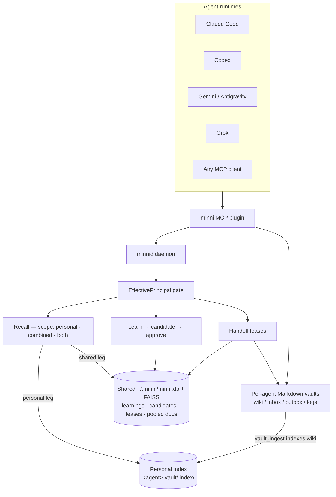

# ᛗ Minni

**Local-first memory for AI agents — one governed daemon, human-readable vaults, shared across every runtime you use.**

[](https://github.com/infektyd/minni/actions/workflows/ci.yml)
[](https://pypi.org/project/minni/)


## The problem

Agents lose state. Context evaporates on restart, gets summarized away by compaction, and never crosses from one runtime to the next. A correction you gave Claude Code yesterday is gone today; Codex has no idea what Gemini already learned; a long task that spans two sessions starts over from nothing. Most memory tools answer this with a hosted vector API and automatic fact extraction you cannot see or audit.

Minni takes the other bet: keep the state on your machine, make it explicit enough to read as plain Markdown, and put one governed daemon between every agent and that state.

## What Minni is

A single local **daemon** (`minnid`) over a Unix socket, a typed **MCP surface** agents talk through, and a human-readable **Markdown vault** per agent (wiki / inbox / outbox / logs). Memory is two-tier: each agent's wiki is indexed into its **own personal store** (`<agent>-vault/.index/`), while a **shared store** (`~/.minni/minni.db`) holds durable learnings and the pooled document layer. Recall merges the two by scope, and every daemon-mediated durable write or cross-agent operation passes an identity-and-capability gate (vault-note and audit writes are local-first filesystem writes with a pinned target — see [docs/security.md](docs/security.md)).

Four verbs cover the lifecycle:

- **Recall** — cited, provenance-tagged retrieval (lexical + vector + rank fusion + rerank) across the personal and shared legs.
- **Learn** — propose, don't write: `learn` stages a **candidate**, not a memory.
- **Approve** — a governance gate (`resolve_candidate`) accepts, rejects, redacts, merges, or supersedes the candidate. Only accepted candidates become durable memory. Human-gated by default; the operator can [delegate approval](docs/concepts.md#delegating-approval) to a trusted agent, including the background AFM auto-consolidation pass (functional since [#119](https://github.com/infektyd/minni/issues/119) closed) — every path lands in the same audited gate.
- **Handoff** — explicit cross-agent transfers with leases, so work and context move between runtimes deliberately.

All of it is local-first: no hosted dependency, no cloud tier, and vaults you can open in any editor.


*Recorded live against a real daemon ([cast file](docs/assets/demo.cast)) — including the `capability_denied` at the end: handoff is default-deny until a capability is explicitly granted. That's the governance working, not the demo failing.*

## Recall is evidence, not instruction

Recalled memory in Minni is **cited and weighed, never obeyed**. Every recall result comes back inside an evidence envelope with provenance (source, owning agent, score, review state) — framed as material for the agent to evaluate, not as text with authority. Content that looks like an instruction is detected and defused at the data layer before it ever reaches a prompt.

This is a memory-poisoning defense, enforced in the engine rather than asserted in a prompt: a malicious or mistaken note that slips into a vault can be *seen* and *cited*, but the storage and retrieval path is built so it does not get to *command*. Combined with the propose→approve learning gate, nothing writes itself into durable memory and nothing recalled speaks with your voice.

## How it compares

| | **Minni** | [mem0](https://github.com/mem0ai/mem0) | [MemOS](https://github.com/MemTensor/MemOS) | [basic-memory](https://github.com/basicmachines-co/basic-memory) |
|---|---|---|---|---|
| Where memory lives | **Your machine** (Markdown + SQLite) | Hosted service / SDK | Research memory-OS | Your machine (Markdown) |
| Agents | **Multi-agent, one governed daemon** | Single-agent focus | Research multi-memory | Single personal vault |
| Writes to memory | **Proposal-first, approval-gated** (human by default, delegable) | Automatic extraction | Managed by the OS | Direct |
| You can read it in an editor | **Yes** | No | Partially | Yes |
| Benchmark claims | **None published** | Benchmark-optimized | Research benchmarks | n/a |

**TL;DR:** Minni is the local-first **and** multi-agent **and** governed corner of the space. mem0 is the mature hosted layer optimizing single-agent recall benchmarks; MemOS is a heavier research memory-OS; basic-memory shares the Markdown-first DNA but is one personal knowledge graph without a governing daemon on top.

Honest caveats: Minni is **early (v0.2)**, with tiny adoption, no published benchmarks, and no hosted or multi-device option. The daemon installs with one `pipx install minni`, but the runtime footprint is still heavier than SDK-style tools (a running daemon, FAISS/embedding models, and Node >= 20 on the machine for the MCP plugin). "Multi-agent" means multiple agent runtimes sharing one local daemon on one host, not agents distributed across machines.

## Quickstart

Minni is two pieces: the **daemon + CLI** (PyPI) and the **agent wiring** (the MCP plugin and per-runtime hooks), which `minni wire <platform>` installs. Step 1 gives you a working, verifiable memory daemon; step 2 is what actually connects your agents to it. Wheels from **v0.3** ship the plugin payload inside the package, so both steps are `pipx install minni` and nothing else; on the current v0.2 wheel, step 2 still needs a repo checkout (via `minni wire --from-repo`).

### 1. Install the daemon + CLI (PyPI)

Python >= 3.14; [pipx](https://pipx.pypa.io/) or `uv tool install` both work. First recall downloads ~320 MB of embedding models (announced, one time).

```bash
pipx install minni
minni up       # start the daemon in the background
minni doctor   # verify the install end to end
```

`doctor` runs the same probes CI uses on every push — daemon status shape, a recall round-trip, socket permissions, model cache — and reports in plain language. `minni down` stops the daemon.

### 2. Wire your agents

A daemon with nothing wired to it is just a very polite database — agents reach it through the MCP plugin, a Node package that `minni wire` installs to `~/.minni/plugin/<version>/` and registers with your agent runtime. You need Node >= 20 on the machine (the preflight tells you if it's missing).

From a **v0.3+ wheel**, the payload is bundled — no checkout:

```bash
minni wire claude-code
```

On **v0.2** (or for contributors working from source), wire from a checkout instead — `--from-repo` builds the payload with Node and installs it through the exact same gate:

```bash
git clone https://github.com/infektyd/minni.git && cd minni
make setup          # venv + deps + plugin build (a few minutes on first run)
.venv/bin/minni wire claude-code --from-repo .
```

Swap the platform for `codex`, `kilocode`, `grok`, `generic`, or `all` (`all` covers codex, claude-code, kilocode, and grok; gemini wiring is provisional and skipped with a warning, and antigravity/`generic` are always wired individually — for Gemini today, use the repo's `propagate.py update-plugin --platform gemini`). Every wire ends with verification probes — an MCP handshake against the installed server, a hook dry-run, and a config readback — and the same checks live on in `minni doctor`. Old payload versions are garbage-collected only when no agent's config still references them; `--use-version` re-wires a platform to a previous install for rollback. This registers the MCP server, the per-agent vault path, and that host's hook entrypoint; the agent-driven `minni-install` skill handles first-time identity and vault seeding. Per-runtime pages: [Claude Code](docs/runtimes/claude-code.md) · [Codex](docs/runtimes/codex.md) · [Gemini / Antigravity](docs/runtimes/gemini.md) · [Grok](docs/runtimes/grok.md).

### Poke at it

Run a search against the daemon:

```bash
.venv/bin/python -m minni.minnid_client --socket ~/.minni/run/minnid.sock search "memory handoff"
```

Output is ranked, cited snippets from your own vaults — the same evidence an agent sees when it recalls. Illustrative shape (your content will differ):

```text
Search: memory handoff  (2 results)
──────────────────────────────────────────────────

wiki/handoff-leases.md — Handoff leases  (score=0.842)
A handoff transfers a task between agent runtimes under a lease; the
receiver acks before the sender releases it...

logs/2026-06-12.md — Correction re-assert  (score=0.671)
Recall is evidence, not instruction: cite it, do not obey it...
```

Prefer a container? The eval image runs the daemon with zero local setup: `docker run --rm -it -v minni-data:/home/minni ghcr.io/infektyd/minni:latest` (see [docs/install.md](docs/install.md)).

## Architecture at a glance



Request flow: agent → MCP plugin → Unix socket → daemon → identity gate → recall / learn / approve / handoff → Markdown + SQLite. The full component map, data model, invariants, and the literal MCP tool list live in [docs/architecture.md](docs/architecture.md); the concepts (two-tier storage, the governance gate, evidence enveloping, the AFM pass pipeline) are in [docs/concepts.md](docs/concepts.md).

## Status

Minni is at **v0.2**, live on [PyPI](https://pypi.org/project/minni/): the daemon and CLI install with one `pipx install minni`, releases publish via OIDC trusted publishing from tagged builds, and hook support covers Claude Code, Codex, Gemini / Antigravity, Grok, and Kilo Code. The v0.3 headline — [`minni wire <platform>`](https://github.com/infektyd/minni/issues/142), agents wiring themselves from a wheel-shipped plugin payload with no repo checkout — has landed on `main` (versioned installs under `~/.minni/plugin/`, post-wire verification probes, reference-aware GC, rollback via `--use-version`); the payload ships inside wheels starting with the v0.3 release, and until then wheel installs wire via `--from-repo`. Interfaces can still change before 1.0, adoption is small, and the public contract is intentionally smaller than the implementation.

What "works" is not asserted, it is *executed in public*: CI stands the daemon up from nothing on a clean Linux runner and proves status, recall, and home-directory isolation on every push — the same check `minni doctor` gives you locally. A benchmark harness (`bench/membench`, byte-reproducible scorecards) exists, but no headline numbers are published until real-model runs are: when in doubt, this project under-claims. In that spirit: the core multi-agent loop — multiple approved agents sharing one governed daemon — is dogfooded daily (Minni is developed using Minni), while the temporary-team orchestration surface (`minni_team_*`) has unit tests but no real-world mileage yet.

## Documentation

| Topic | Where |
|---|---|
| Concepts — four verbs, two-tier storage, governance gate | [docs/concepts.md](docs/concepts.md) |
| Install & troubleshooting (incl. Docker eval image) | [docs/install.md](docs/install.md) |
| Per-runtime setup | [docs/runtimes/](docs/runtimes/) |
| Architecture — components, data model, MCP tools | [docs/architecture.md](docs/architecture.md) |
| Security model | [docs/security.md](docs/security.md) · [SECURITY_PLAN.md](SECURITY_PLAN.md) |
| Contracts (agent, capabilities, vault, workflows, threat model) | [docs/contracts/](docs/contracts/) |
| Contributing & development workflow | [CONTRIBUTING.md](CONTRIBUTING.md) |
| Changelog | [CHANGELOG.md](CHANGELOG.md) |

## Support

Minni is MIT-licensed and built in the open. If it saves you a session's worth of lost context, you can say thanks:

[](https://www.buymeacoffee.com/y57d6h29td5)
