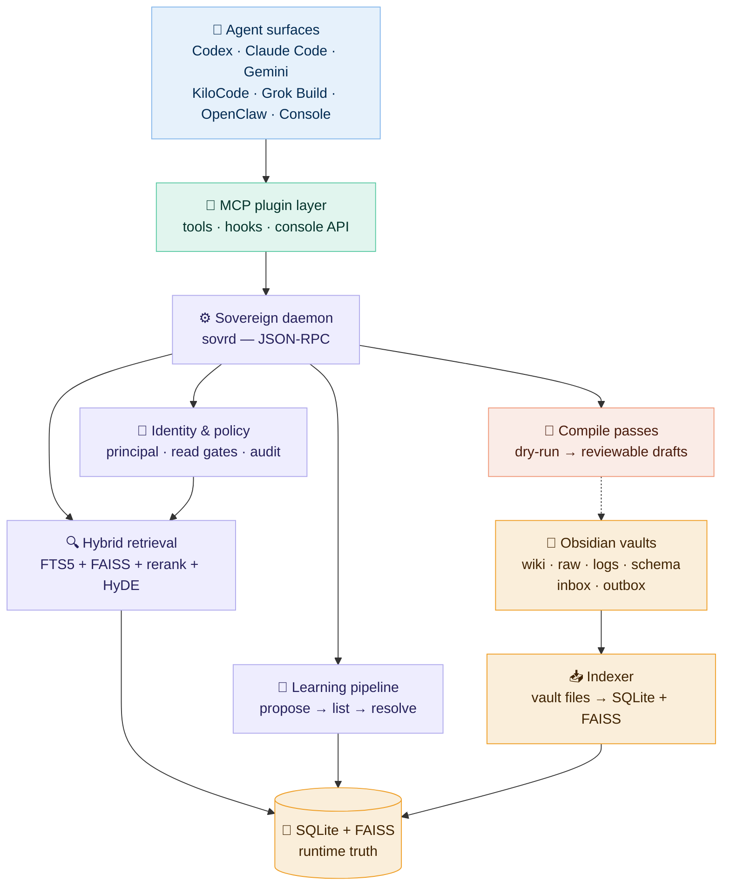

# Sovereign Memory


**Local-first memory and governance layer for AI agents.**

> *Identity loads whole. Knowledge loads chunked.*

Sovereign Memory gives long-running agent work a durable spine — identity,
working state, retrieval, evidence, handoffs, learning proposals, and audit
trails that stay inspectable on the host machine. It sits between chat-history-
as-memory and pure RAG: agents resume with typed state, verified evidence, open
loops, and a clear next action instead of rediscovering context from scratch.

> **Note:** This project is pre-v1. Core subsystems work and are tested, but
> integration depth varies across components. The [status table](#project-status)
> below shows what's solid, what's early, and what's stubbed.

---

### Highlights

| | Feature | What it does |
|---|---|---|
| :recycle: | **Session rehydration** | Resume with verified facts, remembered-but-unverified state, open loops, and a first verification action |
| :jigsaw: | **Agent-agnostic MCP plugin** | One protocol-standard MCP server — works with any agent that speaks MCP. Ships convenience manifests for Codex, Claude Code, Gemini, and KiloCode |
| :lock: | **Proposal-first learning** | No silent writes — learn requests stage candidates; only operator-gated resolution writes durable memory |
| :mag: | **Hybrid retrieval** | FTS5 + FAISS + reranking, query expansion, HyDE, token budgets, and centralized read gates |
| :apple: | **Native AFM support** | Apple Foundation Models through a local JSON helper, with bridge fallback and opt-out modes |
| :notebook: | **Obsidian vaults** | Human-readable wiki pages, logs, raw material, inbox/outbox handoffs per agent |
| :handshake: | **Cross-agent contracts** | Vault-backed ping contracts with explicit approve/deny — no agent reads another's private memory directly |
| :shield: | **Local-first governance** | Stamped identity, read policy, audit trails, threat model, and memory hygiene contracts |

---

## Project status

Sovereign Memory is in active development toward a v1 release. Components are at
different levels of maturity. This table reflects the honest state of each
subsystem — inspired by the
[OpenTelemetry component stability model](https://opentelemetry.io/docs/specs/otel/versioning-and-stability/).

| Component | Status | Notes |
|---|---|---|
| SQLite runtime + migrations |  | 333 engine tests, WAL mode, additive migrations tracked by `PRAGMA user_version` |
| Hybrid retrieval (FTS5 + FAISS) |  | Core pipeline works (FTS5 → FAISS → RRF → rerank); needs comparative eval against baselines |
| MCP plugin server |  | 26 tools, 121 tests; agent-agnostic — any MCP-compatible agent can connect |
| Proposal-first learning |  | Stage → list → resolve pipeline works; operator-gated writes enforced |
| Vault model + wiki indexer |  | Structure stable; WikiIndexer → VaultIndexer → SQLite/FAISS pipeline works |
| Identity + read policy |  | EffectivePrincipal stamps identity, vault roots, capabilities; centralized read gate |
| Handoff (inbox/outbox) |  | Vault-backed handoff pages; ack and await flows work |
| Multi-agent propagation (sm-propagation) |  | Seed-hosted / bootstrap-vault / update-plugin / verify across Codex, Claude Code, Gemini, KiloCode, and Grok; canonical envelope + per-platform install stamping |
| Cross-agent ping contracts |  | Protocol works (request → inbox → decide → status); limited real-world testing |
| AFM provider (native/bridge) |  | macOS-only; bridge is default; native requires Foundation Models framework |
| Compile passes (AFM) |  | 5 passes (session, synthesis, procedure, reorg, pruning); dry-run only by default |
| Team coordination |  | 3 tools registered (runtime, evidence, promotion); multi-agent scenarios untested |
| Memory decay + scoring |  | Exponential decay with access-based reinforcement; needs tuning |
| Qdrant / Lance backends |  | Non-functional placeholders; FAISS is the only active vector backend |
| Comparative eval vs baselines |  | Eval harness exists; no head-to-head comparison against RAG or wiki-only yet |

**What the levels mean:**
**Stable** — tested, relied upon, breaking changes require migration.
**Beta** — works and is tested, but API or behavior may shift before v1.
**Alpha** — functional but early; expect rough edges and limited real-world validation.
**Stub** — interface exists, implementation is placeholder only.

---

## Contents

- [Why this exists](#why-this-exists)
- [How it works](#how-it-works)
- [Getting started](#getting-started)
- [Architecture](#architecture)
- [Plugin surfaces](#plugin-surfaces)
- [Evaluation](#evaluation)
- [Repository map](#repository-map)
- [AFM provider modes](#afm-provider-modes)
- [Vault model](#vault-model)
- [Local-first security](#local-first-security)
- [Verification gate](#verification-gate)

---

<details>
<summary><h2>Why this exists</h2></summary>

Long-running AI work usually falls into one of three brittle patterns:

| Pattern | Limitation |
|---|---|
| **Chat history as memory** | Opaque, bloated, and hard to audit over time |
| **RAG over files** | Useful for lookup, but rediscovers context instead of preserving working state |
| **Markdown/wiki notes** | Human-readable, but weak at provenance, contradiction handling, and session rehydration |

Sovereign Memory combines the strengths: structured runtime state in SQLite,
human-readable vault pages for review, and typed evidence with explicit learning
gates. If a simpler model achieves the same recovery quality, the right move is
to delete complexity.

**The important boundary:** SQLite is runtime truth. Vault pages, graph exports,
FAISS files, context packs, and compile drafts are derived or review surfaces.

</details>

---

<details>
<summary><h2>How it works</h2></summary>

Memory is layered state, not one flat blob:

| Layer | Loading rule | Purpose |
|---|---|---|
| **Identity** | Load whole | Agent identity, role, constraints, standing operating rules |
| **Standing principles** | Load whole / pinned | Durable rules that guide behavior across sessions |
| **Project state** | Compact packet | Active branch, status, blockers, recent decisions, next checks |
| **Evidence** | Retrieve by need | Source-backed facts, artifacts, logs, traces, citations |
| **Knowledge** | Retrieve chunked | Larger wiki/docs/history — cited and validated, never assumed in context |

A resumed session doesn't just retrieve documents. It produces:

```
Verified now:            — facts checked against current artifacts
Remembered (unverified): — plausible memory needing confirmation
Open loops:              — tasks left incomplete
First verification:      — the next concrete check before acting
Do-not-claim:            — stale, contradicted, or unsupported claims
```

The goal is the smallest packet that lets an agent resume safely.

</details>

---

<details>
<summary><h2>Getting started</h2></summary>

### Prerequisites

- Python 3.11+ with pip
- Node.js 18+ with npm

### Install and run

```bash
# Engine (Python)
cd engine
python3 -m pip install -r requirements.txt

# Start the daemon
python3 sovrd.py --socket ~/.sovereign-memory/run/sovrd.sock
```

```bash
# Plugin (TypeScript)
cd plugins/sovereign-memory
npm install
npm test
npm run console        # local console UI
```

### Verify it works

```bash
# From another terminal
cd engine
python3 sovrd_client.py --socket ~/.sovereign-memory/run/sovrd.sock status
python3 sovrd_client.py --socket ~/.sovereign-memory/run/sovrd.sock search "memory handoff"
```

> **Tip:** For reproducible NumPy/FAISS, use a clean venv from the repo root:
> ```bash
> python3.12 -m venv .venv && source .venv/bin/activate
> pip install --upgrade pip && pip install -r engine/requirements.txt
> ```

### Multi-agent install

Per-agent setup — canonical envelope, per-platform plugin install, and
verification — runs through the `sm-propagation` skill. Each hosted agent
receives its own workspace envelope at `~/.sovereign-memory/identities/<agent>/`
and its own vault under `~/.sovereign-memory/<agent>-vault/` — no shared
state between agents.

```bash
# Status check (read-only)
python3 sovereign-memory/skills/sm-propagation/scripts/propagate.py status --agent <agent>

# Full four-step propagation for one hosted agent
python3 sovereign-memory/skills/sm-propagation/scripts/propagate.py seed-hosted --agent <agent> --workspace "$(pwd)"
python3 sovereign-memory/skills/sm-propagation/scripts/propagate.py bootstrap-vault --agent <agent>
python3 sovereign-memory/skills/sm-propagation/scripts/propagate.py update-plugin --platform <platform>
python3 sovereign-memory/skills/sm-propagation/scripts/propagate.py verify --agent <agent> --workspace "$(pwd)"
```

Supported platforms: `codex`, `claude-code`, `kilocode`, `gemini`,
`grok-beta`, `all`, or `generic` (with `--install-root` and `--agent`). See
[`sovereign-memory/skills/sm-propagation/SKILL.md`](sovereign-memory/skills/sm-propagation/SKILL.md)
and
[`sovereign-memory/docs/DESIGN-sovereign-delivery-layer.md`](sovereign-memory/docs/DESIGN-sovereign-delivery-layer.md)
for the full design.

</details>

---

<details>
<summary><h2>Architecture</h2></summary>



> **[View the detailed architecture diagram →](docs/architecture-detailed.svg)**
> ([D2 source](docs/architecture-detailed.d2) ·
> [PNG version](docs/architecture-detailed.png) ·
> [dark mode SVG](docs/architecture-detailed-dark.svg))

</details>

---

<details>
<summary><h2>Plugin surfaces</h2></summary>

The plugin is **agent-agnostic** — it implements the
[Model Context Protocol (MCP)](https://modelcontextprotocol.io/) standard, so
any agent or tool that speaks MCP can connect. The convenience manifests below
are thin wrappers that register the same MCP server with specific agent runtimes:

| Integration | Manifest | Notes |
|---|---|---|
| **Any MCP client** | [`.mcp.json`](plugins/sovereign-memory/.mcp.json) | Direct registration — the canonical entry point |
| Codex | [`.codex-plugin/`](plugins/sovereign-memory/.codex-plugin/) | Codex-specific manifest |
| Claude Code | [`.claude-plugin/`](plugins/sovereign-memory/.claude-plugin/) + [`hooks.json`](plugins/sovereign-memory/hooks/hooks.json) | Includes lifecycle hooks |
| Gemini | [`.gemini-plugin/`](plugins/sovereign-memory/.gemini-plugin/) | Gemini extension format |
| KiloCode | [`.kilocode-plugin/`](plugins/sovereign-memory/.kilocode-plugin/) | KiloCode manifest + hooks |

<details>
<summary><strong>Exposed tools</strong> (26 tools)</summary>

| Tool | Purpose |
|---|---|
| `sovereign_status` | Daemon health and state summary |
| `sovereign_recall` | Query hybrid retrieval |
| `sovereign_drill` | Deep-drill into a specific memory |
| `sovereign_prepare_task` | Build a task context packet |
| `sovereign_prepare_outcome` | Build an outcome context packet |
| `sovereign_route` | Route a request to the right handler |
| `sovereign_export_pack` | Export a portable context pack |
| `sovereign_learning_quality` | Assess learning candidate quality |
| `sovereign_learn` | Stage a candidate learning proposal |
| `sovereign_resolve_candidate` | Approve or reject a staged candidate |
| `sovereign_vault_write` | Write to vault wiki pages |
| `sovereign_audit_report` | Generate an audit report |
| `sovereign_audit_tail` | Tail the audit log |
| `sovereign_compile_vault` | Run compile passes on vault content |
| `sovereign_negotiate_handoff` | Initiate a cross-agent handoff |
| `sovereign_ack_handoff` | Acknowledge a received handoff |
| `sovereign_list_pending_handoffs` | List pending handoff deliveries |
| `sovereign_await_handoff` | Wait for a handoff to complete |
| `sovereign_ping_agent_request` | Create a ping contract for another agent |
| `sovereign_ping_agent_inbox` | Check incoming ping requests |
| `sovereign_ping_agent_decide` | Approve or deny a ping request |
| `sovereign_ping_agent_status` | Check ping contract status |
| `sovereign_subscribe_contradictions` | Subscribe to contradiction alerts |
| `sovereign_team_runtime` | Team runtime coordination |
| `sovereign_team_evidence` | Share evidence across team agents |
| `sovereign_team_promotion` | Promote team profile data |

</details>

**Key behavior:** Automatic behavior is recall-only. Durable learning follows a
proposal-first path — learn requests stage candidates, and only operator-gated
resolution writes permanent memory. Cross-agent info sharing requires explicit
vault-backed ping contracts with approve/deny.

</details>

---

<details>
<summary><h2>Evaluation</h2></summary>

The project should be judged by **recovery quality**, not by how elaborate the
memory machinery looks.

**Baselines to compare against:**

1. No memory — only the new prompt
2. Raw chat summary
3. Plain RAG over repo/docs
4. Wiki-only filesystem memory
5. Sovereign Memory rehydration with typed state and open loops

**Metrics that matter:** correct next action after restart, unsupported claims
made during restart, evidence coverage, token cost of rehydration, time to
resume useful work, and contradiction handling.

> If the wiki-only or plain-RAG baseline matches Sovereign Memory on these
> metrics, the right engineering answer is to delete complexity.

</details>

---

<details>
<summary><h2>Repository map</h2></summary>

| Directory | Contents |
|---|---|
| [`engine/`](engine/) | Python daemon, retrieval, migrations, compile passes, eval harness |
| [`plugins/sovereign-memory/`](plugins/sovereign-memory/) | Agent-agnostic MCP plugin with convenience manifests |
| [`sovereign-memory/`](sovereign-memory/) | Delivery layer — `sm-propagation` skill, generalization workflows, and the [delivery-layer design doc](sovereign-memory/docs/DESIGN-sovereign-delivery-layer.md) |
| [`openclaw-extension/`](openclaw-extension/) | OpenClaw bridge and import tooling |
| [`docs/contracts/`](docs/contracts/) | Policy, threat model, page types, capabilities, workflow contracts |
| [`docs/plans/execution/`](docs/plans/execution/) | Rollout PR specs and resume ledger |
| [`eval/`](eval/) | Recall fixtures and generated evaluation reports |

**Core engine files:**

| File | Role |
|---|---|
| [`engine/sovrd.py`](engine/sovrd.py) | Local JSON-RPC daemon |
| [`engine/sovereign_memory.py`](engine/sovereign_memory.py) | CLI for indexing, stats, hygiene, vector status, compile dry-runs |
| [`engine/db.py`](engine/db.py) | Schema creation and additive migrations (`PRAGMA user_version`) |
| [`engine/principal.py`](engine/principal.py) | Runtime identity, vault roots, capabilities, read authorization |
| [`engine/retrieval.py`](engine/retrieval.py) | FTS5 + semantic vectors, reranking, feedback, query expansion, HyDE, token budgets, read gate |
| [`engine/afm_passes/`](engine/afm_passes/) | Review-only self-organization passes (default dry-run) |
| [`engine/afm_provider.py`](engine/afm_provider.py) | Normalized AFM contracts for query expansion, neighborhood summary, HyDE |

See also: [docs/CANONICAL-PATHS.md](docs/CANONICAL-PATHS.md) (path layout),
[docs/TROUBLESHOOTING.md](docs/TROUBLESHOOTING.md) (daemon/socket/protocol fixes),
[docs/ENGINEERING-REVIEW.md](docs/ENGINEERING-REVIEW.md) (abstraction review),
[docs/OBSERVED-USAGE.md](docs/OBSERVED-USAGE.md) (usage signals).

</details>

---

<details>
<summary><h2>AFM provider modes</h2></summary>

AFM (Apple Foundation Models) calls are optional and local-only.

| Mode | Behavior |
|---|---|
| `off` | Skip AFM calls, use deterministic fallback |
| `bridge` | Use localhost OpenAI-compatible bridge (default) |
| `native` | Use local JSON helper via Foundation Models framework |
| `auto` | Prefer native when available, fall back to bridge |

Configure with `SOVEREIGN_AFM_PROVIDER_MODE` or the per-call `afmProviderMode` option.

```bash
# Run AFM tests
cd plugins/sovereign-memory
SOVEREIGN_AFM_PROVIDER_MODE=auto npm test -- tests/afm.test.mjs
```

```bash
# Run compile passes as review-only dry-runs
cd engine
SOVEREIGN_AFM_LOOP=on python3 -m sovereign_memory compile --pass session_distillation --dry-run
SOVEREIGN_AFM_LOOP=on python3 -m sovereign_memory compile --pass synthesis --dry-run
```

Native provider metadata is sanitized before reaching status reports or model
packets. Adapter configuration is reported as `adapter_configured` /
`adapterConfigured` (boolean only) — private adapter paths are never emitted.

</details>

---

<details>
<summary><h2>Vault model</h2></summary>

Each agent can have its own Obsidian vault while sharing the same daemon and
database. The vault is the readable memory surface:

```
vault/
  index.md
  log.md
  logs/
  raw/
  wiki/
  wiki/handoffs/
  inbox/
  outbox/
  schema/
```

Use short, sourced wiki pages with frontmatter for durable knowledge. Raw session
material and private logs should stay local and out of public git unless
explicitly sanitized.

</details>

---

<details>
<summary><h2>Local-first security</h2></summary>

Sovereign Memory is local-first only when four assumptions hold on the host:

1. **macOS user account** is the security perimeter for a single-user box
2. **FileVault is enabled** — database and vault are encrypted at rest
3. **No cloud sync** — vault and `sovereign_memory.db` (with `-wal`/`-shm`
   sidecars) are not under iCloud, Dropbox, Google Drive, or OneDrive
4. **Local-only transports** — no remote JSON-RPC fallback at v1

Exclude from Time Machine and Spotlight:

```bash
xattr -w com.apple.metadata:com_apple_backup_excludeItem true ~/path/to/sovereign_memory.db
xattr -w com.apple.metadata:com_apple_backup_excludeItem true ~/path/to/codex-vault
```

A sample launchd agent lives at
[`engine/launchd/com.openclaw.sovrd.plist.example`](engine/launchd/com.openclaw.sovrd.plist.example)
with `Umask 077` to keep daemon logs mode `0600`.

</details>

---

<details>
<summary><h2>Verification gate</h2></summary>

Before pushing a release candidate:

```bash
cd engine && pytest -q                          # expect 333 passed
cd ../plugins/sovereign-memory && npm test      # expect 121 passed
npm run smoke:hook
```

Also run a temp-state live smoke:

- Start `sovrd.py` on a temporary Unix socket
- Call plugin helpers for status, recall, compile dry-run, and handoff
- Verify redaction, traceability, and clean SIGTERM shutdown
- Run migration safety on a SQLite backup — never the live DB

</details>

---

<sub>Sovereign Memory is a local-only project. No telemetry, no cloud sync, no remote endpoints.</sub>
