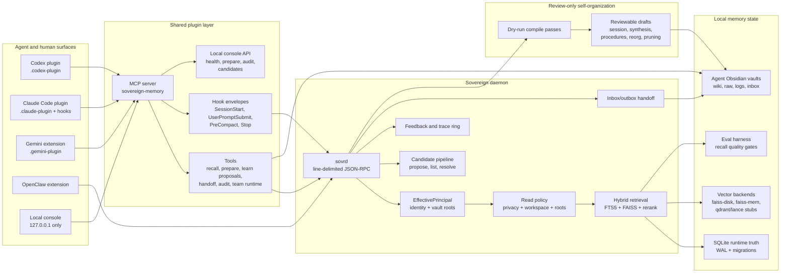

# Sovereign Memory

**Sovereign Memory is a local-first memory and governance layer for AI agents.**

It gives long-running agent work a durable spine: identity, working state,
retrieval, evidence, handoffs, learning proposals, and audit trails that remain
inspectable on the host machine.

The core rule is simple:

> **Identity loads whole. Knowledge loads chunked.**

Small identity and operating-state packets should be explicit enough to load in
full. Large knowledge stores should be retrieved, cited, validated, and revised
without pretending the whole archive is already in context.

## The Problem

Long-running AI work usually falls into one of three brittle patterns:

1. **Chat history as memory**: easy at first, then opaque, bloated, and hard to
   audit.
2. **RAG over files**: useful for lookup, but each query tends to rediscover
   context instead of preserving working state.
3. **Markdown/wiki notes only**: readable by humans, but weak at enforcing
   provenance, open-loop state, contradiction handling, and session rehydration.

Sovereign Memory sits between those approaches. It gives agents a local memory
system with explicit state, typed evidence, reviewable learning, and portable
context packs.

## The Thesis

A useful agent memory layer should do five things well:

| Requirement | Meaning |
| --- | --- |
| **Rehydrate work** | Restart an agent with verified state, remembered-but-unverified state, open loops, and the first verification action. |
| **Separate memory types** | Treat identity, standing principles, project state, evidence, and retrieved knowledge differently. |
| **Keep memory inspectable** | Store durable truth locally in SQLite while exposing readable vault pages for review. |
| **Make learning explicit** | Recall can be automatic, but durable learning, vault writes, and compile passes require explicit approval. |
| **Fail honestly** | Prefer “remembered but not verified” over confident stale claims. |

For a concise engineering review of the abstraction, see
[docs/ENGINEERING-REVIEW.md](docs/ENGINEERING-REVIEW.md).

For practical signals from long-running usage, see
[docs/OBSERVED-USAGE.md](docs/OBSERVED-USAGE.md).

## Current Status

This repo currently contains:

- A Python daemon for local recall, indexing, hybrid retrieval, migrations,
  audit, candidate learning, and review-only compile passes.
- A shared TypeScript MCP plugin surface for Codex, Claude Code, Gemini,
  KiloCode, and direct MCP registration.
- Local vault support for human-readable memory pages, logs, raw material,
  inbox/outbox handoffs, and schema notes.
- Native AFM provider support for Apple Foundation Models through a local JSON
  helper, with bridge fallback and opt-out modes.
- Evaluation scaffolding for recall quality gates and comparison reports.
- Governance contracts for local-first security, stamped principal identity,
  read policy, learning approval, handoffs, policy, threat model, and memory
  hygiene.

Observed usage so far suggests the system is most useful when it recovers
specific operational state, tracks open loops, and forces remembered claims
through verification before acting. Current work has closed the core safety
gaps around identity binding, proposal-first learning, cross-agent consent,
native AFM provider wiring, provider hardening, and read authorization. It
still needs larger comparative evaluation against simpler wiki-only and RAG
workflows.

The important boundary: **SQLite is runtime truth. Vault pages, graph exports,
FAISS files, context packs, and compile drafts are derived or review surfaces.**

## What Makes This Different From “Just RAG?”

RAG answers a query. Sovereign Memory is trying to preserve the working state
that makes the next query safer.

A resumed session should not merely retrieve documents about a project. It should
be able to say:

```text
Verified now:
- These facts were checked against current artifacts.

Remembered but not yet verified:
- These facts are plausible memory but need confirmation.

Open loops:
- These tasks were left incomplete.

First verification action:
- This is the next concrete check before acting.

Do-not-claim:
- These claims are stale, contradicted, or not yet supported.
```

That structure is the sharp edge of the project. If a simpler wiki or filesystem
model can produce the same recovery quality with less machinery, Sovereign
Memory should collapse toward that simpler model.

## Architecture



## Memory Model

Sovereign Memory treats memory as layered state, not one flat blob:

| Layer | Loading rule | Purpose |
| --- | --- | --- |
| Identity | Load whole | Agent identity, role, constraints, standing operating rules. |
| Standing principles | Load whole or pinned | Durable rules that should guide behavior across sessions. |
| Current project state | Compact packet | Active branch, status, blockers, recent decisions, next checks. |
| Evidence | Retrieve by need | Source-backed facts, artifacts, logs, traces, and citations. |
| Knowledge | Retrieve chunked | Larger wiki/docs/history that should be cited and validated. |

The goal is not to maximize recall volume. The goal is to deliver the smallest
packet that lets an agent resume safely.

## Core Runtime

The Python engine lives in [engine/](engine/).

- [engine/sovrd.py](engine/sovrd.py) exposes the local JSON-RPC daemon.
- [engine/sovereign_memory.py](engine/sovereign_memory.py) exposes CLI commands
  for indexing, stats, hygiene, vector status, and AFM compile dry-runs.
- [engine/db.py](engine/db.py) owns schema creation and migrations. Migrations
  are additive and tracked by name plus `PRAGMA user_version`.
- [engine/principal.py](engine/principal.py) stamps runtime identity, vault
  roots, capabilities, and read authorization.
- [engine/retrieval.py](engine/retrieval.py) combines FTS5, semantic vectors,
  reranking, feedback, query expansion, HyDE, token budgets, trace capture, and
  the centralized read gate.
- [engine/afm_passes/](engine/afm_passes/) contains review-only
  self-organization passes. They default to dry-run and degrade cleanly when AFM
  is unavailable.

SQLite is the durable runtime truth. Vault pages, graph exports, FAISS files,
and plugin context packs are derived or review surfaces.

## Plugin Surfaces

The shared plugin lives in [plugins/sovereign-memory/](plugins/sovereign-memory/)
and ships multiple agent-facing manifests from one TypeScript MCP server:

- [plugins/sovereign-memory/.codex-plugin/](plugins/sovereign-memory/.codex-plugin/)
  for Codex.
- [plugins/sovereign-memory/.claude-plugin/](plugins/sovereign-memory/.claude-plugin/)
  plus [plugins/sovereign-memory/hooks/hooks.json](plugins/sovereign-memory/hooks/hooks.json)
  for Claude Code.
- [plugins/sovereign-memory/.gemini-plugin/](plugins/sovereign-memory/.gemini-plugin/)
  for Gemini extension usage.
- [plugins/sovereign-memory/.kilocode-plugin/](plugins/sovereign-memory/.kilocode-plugin/)
  for KiloCode.
- [plugins/sovereign-memory/.mcp.json](plugins/sovereign-memory/.mcp.json)
  for direct MCP registration.

The plugin exposes:

- `sovereign_status`
- `sovereign_recall`
- `sovereign_prepare_task`
- `sovereign_prepare_outcome`
- `sovereign_route`
- `sovereign_learning_quality`
- `sovereign_learn`
- `sovereign_resolve_candidate`
- `sovereign_vault_write`
- `sovereign_audit_report`
- `sovereign_audit_tail`
- `sovereign_compile_vault`
- `sovereign_negotiate_handoff`
- `sovereign_ping_agent_request`
- `sovereign_ping_agent_inbox`
- `sovereign_ping_agent_decide`
- `sovereign_ping_agent_status`
- `sovereign_team_runtime`
- `sovereign_team_evidence`
- `sovereign_team_promotion`

Automatic behavior is recall-only. Durable learning now follows a
proposal-first path: ordinary learn requests stage candidate packets, and only
operator-gated resolution writes durable learnings. Vault writes, handoff syncs,
compile draft acceptance, and team profile promotion remain explicit decisions.

Cross-agent information sharing follows the same explicit-decision rule. A model
cannot directly read another agent's private memory. It can create a
vault-backed ping contract for a named recipient agent, and the recipient must
approve or deny that request while online before any answer is synced back to
the requester.

## Quickstart

Install Python dependencies for the engine:

```bash
cd engine
python3 -m pip install -r requirements.txt
```
For reproducible NumPy/FAISS, use a clean virtual environment with Python 3.11
or 3.12 from the repository root:

```bash
python3.12 -m venv .venv
source .venv/bin/activate
pip install --upgrade pip
pip install -r engine/requirements.txt
# then: python -m pytest -q engine/   (or cd engine && python -m pytest -q .)
```

Run the daemon:

```bash
cd engine
python3 sovrd.py --socket ~/.sovereign-memory/run/sovrd.sock
```

Inspect health and recall from another terminal:

```bash
cd engine
python3 sovrd_client.py --socket ~/.sovereign-memory/run/sovrd.sock status
python3 sovrd_client.py --socket ~/.sovereign-memory/run/sovrd.sock search "memory handoff"
```

Run compile passes as review-only dry-runs:

```bash
cd engine
SOVEREIGN_AFM_LOOP=on python3 -m sovereign_memory compile --pass session_distillation --dry-run
SOVEREIGN_AFM_LOOP=on python3 -m sovereign_memory compile --pass synthesis --dry-run
```

## AFM Provider Modes

AFM calls are optional and local-only. The provider modes are:

| Mode | Behavior |
| --- | --- |
| `off` | Skip AFM calls and use deterministic fallback behavior. |
| `bridge` | Use the existing localhost OpenAI-compatible bridge. This is the default compatibility mode. |
| `native` | Use the local JSON helper at `engine/native_afm_helper`, which calls Apple Foundation Models through the Foundation Models framework when available. |
| `auto` | Prefer native when available, then fall back to the bridge. |

Python retrieval helpers now consume normalized AFM contracts for query
expansion, neighborhood summary, and HyDE generation through
[engine/afm_provider.py](engine/afm_provider.py). The session distillation pass
can also accept structured native compile proposals, but all compile outputs
remain review-only drafts.

The TypeScript plugin uses the same provider concepts for prepare-task and
prepare-outcome packets. Configure behavior with `SOVEREIGN_AFM_PROVIDER_MODE`
or the per-call `afmProviderMode` option.

```bash
cd plugins/sovereign-memory
SOVEREIGN_AFM_PROVIDER_MODE=auto npm test -- tests/afm.test.mjs
```

Native provider metadata is sanitized before it reaches status reports or model
packets. Adapter configuration is reported as boolean metadata only through
`adapter_configured` / `adapterConfigured`; private adapter paths are not emitted.
If Foundation Models are unavailable on a machine, native mode reports a clear
unavailable status and `auto` falls back without blocking recall or compile
dry-runs.

Build and test the plugin:

```bash
cd plugins/sovereign-memory
npm install
npm test
npm run smoke:hook
```

Start the local console:

```bash
cd plugins/sovereign-memory
npm run console
```

The console binds locally and exposes status, audit, prepare-task,
prepare-outcome, candidate listing, and candidate-resolution endpoints. It does
not expose automatic learning or browser-controlled vault paths.

## Vault Model

Each agent can have its own Obsidian vault while sharing the same daemon and
database. The vault is the readable memory surface:

```text
vault/
  index.md
  log.md
  logs/
  raw/
  wiki/
  wiki/handoffs/
  inbox/
  outbox/
  schema/
```

Use short, sourced wiki pages with frontmatter for durable knowledge. Raw session
material and private logs should stay local and out of public git unless they are
explicitly sanitized.

## Evaluation Direction

The project should be judged by recovery quality, not by how elaborate the
memory machinery looks.

Useful comparisons:

1. No memory, only the new prompt.
2. Raw chat summary.
3. Plain RAG over repo/docs.
4. Wiki-only filesystem memory.
5. Sovereign Memory rehydration with typed state, evidence, and open loops.

Useful metrics:

- Correct next action after session restart.
- Unsupported or stale claims made during restart.
- Evidence coverage for claims.
- Token cost of rehydration.
- Time to resume useful work.
- Contradiction handling and supersession behavior.

If the wiki-only or plain-RAG baseline matches Sovereign Memory on these metrics,
the right engineering answer is to delete complexity.

## Local-First Hygiene

Sovereign Memory is local-first only when four assumptions actually hold on the
host machine. If any of them break, the claim breaks with it:

1. The macOS user account is the security perimeter for a single-user box.
2. FileVault is enabled, so the database and vault are encrypted at rest.
3. The vault directory and `sovereign_memory.db` with its `-wal` and `-shm`
   sidecars are **not** under iCloud Drive, Dropbox, Google Drive, or OneDrive
   sync roots. Any of those can silently exfiltrate "local" memory.
4. Agent transports and browser-facing routes remain local-only. There is no
   remote JSON-RPC fallback at v1.

To keep Time Machine and Spotlight from snapshotting the same data, mark the
vault and database with the macOS backup-exclude attribute:

```bash
xattr -w com.apple.metadata:com_apple_backup_excludeItem true ~/path/to/sovereign_memory.db
xattr -w com.apple.metadata:com_apple_backup_excludeItem true ~/path/to/codex-vault
```

Substitute the real paths on your machine. Run the same command on the `-wal`
and `-shm` sidecars if you want belt-and-braces coverage.

A sample launchd agent for the daemon lives at
[engine/launchd/com.openclaw.sovrd.plist.example](engine/launchd/com.openclaw.sovrd.plist.example).
It sets `Umask` to octal `077` decimal `63`, which keeps daemon log files mode
`0600` instead of world-readable `0644`. Daemon stderr can contain learning
excerpts.

`make audit` will run `pip-audit -r engine/requirements.txt` once SEC-009 lands.
Until then, run `pip-audit` manually before cutting a release.

## Verification Gate

Before pushing a release candidate, run:

```bash
cd engine && pytest -q
cd ../plugins/sovereign-memory && npm test
npm run smoke:hook
```

Also run a temp-state live smoke:

- Start [engine/sovrd.py](engine/sovrd.py) on a temporary Unix socket.
- Call plugin helpers for status, recall, compile dry-run, and handoff.
- Verify redaction, traceability, and clean SIGTERM shutdown.
- Run migration safety on a SQLite backup, never directly on the live DB.

The current acceptance baseline is `333 passed` for engine tests and
`121 passed` for plugin tests.

## Repository Map

- [engine/](engine/) - Python daemon, retrieval, migrations, compile passes, and eval harness.
- [plugins/sovereign-memory/](plugins/sovereign-memory/) - shared MCP plugin for Codex, Claude Code, Gemini, and KiloCode.
- [openclaw-extension/](openclaw-extension/) - OpenClaw bridge and import tooling.
- [docs/contracts/](docs/contracts/) - policy, threat model, page types, capabilities, and workflow contracts.
- [docs/plans/execution/](docs/plans/execution/) - rollout PR specs and resume ledger.
- [eval/](eval/) - recall fixtures and generated evaluation reports.

For local path layout and symlink compatibility notes, see
[docs/CANONICAL-PATHS.md](docs/CANONICAL-PATHS.md).

For daemon, socket, plugin-cache, and protocol mismatch fixes, see
[docs/TROUBLESHOOTING.md](docs/TROUBLESHOOTING.md).
