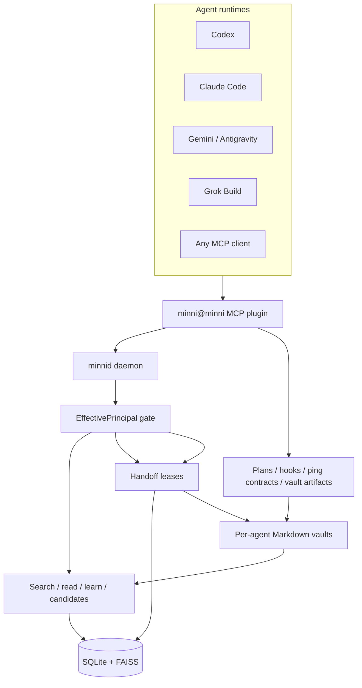

# ᛗ Minni

Minni is local infrastructure for agent continuity.

It combines a daemon, a typed MCP surface, per-agent vaults, retrieval,
learning/candidate flows, durable plans, handoffs, and audit trails into one
local system. The goal is to make agent state explicit enough to inspect and
structured enough to survive common session, compaction, and handoff failures.

## System Model



The daemon owns memory/search/candidate RPCs and the identity gate for those
paths. The plugin also maintains vault-scoped artifacts such as plans, hook
packets, audit logs, and local console views. Vaults are the human-readable
surface. Agents should use the plugin/daemon contracts instead of scraping
another agent's private vault directly.

## Core Invariants

| Invariant | Meaning |
|---|---|
| Identity loads whole | Agent identity and standing rules are not chunked |
| Knowledge loads chunked | Large docs/history are retrieved by need and cited |
| Recall is evidence | Retrieved content is not automatically instruction |
| Learning follows configured policy | Default `learn` can commit after gates; gated mode stages candidates |
| SQLite is daemon storage | Learnings, documents, chunks, candidates, leases, and event tables live in SQLite |
| Vaults are per-agent | Shared daemon, separate human-readable workspaces |
| Local transport first | Daemon defaults to a local Unix socket; provider calls are explicit/gated |

## Runtime Components

| Component | Responsibility |
|---|---|
| `engine/minnid.py` | JSON-RPC daemon, dispatch, policy, storage, status |
| `engine/principal.py` | Identity resolution, vault roots, capabilities, read authorization |
| `engine/retrieval.py` | FTS/FAISS/RRF/rerank retrieval path |
| `engine/db.py` | SQLite schema and migrations |
| `engine/afm_passes/` | Local compile/review passes |
| `plugins/minni/src/server.ts` | MCP tool registration and request shaping |
| `plugins/minni/src/hook-handlers.ts` | Shared hook semantics for runtimes that support hooks |
| `plugins/minni/src/plan.ts` | Durable plan artifacts and state transitions |
| `plugins/minni/src/vault.ts` | Vault writes, inbox/outbox, compile surfaces |

## MCP Surface

The primary surface is organized by tool family:

| Family | Actions |
|---|---|
| `minni_prepare_task` / `minni_prepare_outcome` | task packet; outcome dry-run |
| `minni_recall` | recall, drill, route, export pack |
| `minni_plan` | create, update, status, activate, deactivate, replan, history, diff, restore, scar |
| `minni_learn` | quality review or durable commit; gated mode stages candidates |
| `minni_vault` | write, compile |
| `minni_handoff` | negotiate, ack, list pending, await |
| `minni_ping` | request, inbox, decide, status |
| `minni_team` | runtime, evidence, promotion draft |
| `minni_status` | status, audit, contradictions, health |
| `minni_resolve_candidate` | owner-or-explicit-operator candidate resolution |

Compatibility aliases remain for older workflows. New integrations should use
the family model.

## Data Model

Minni separates runtime storage from human-readable storage:

| Surface | Contents |
|---|---|
| SQLite | learnings, episodic/contradiction events, documents, chunks, candidates, handoff leases, migrations, runtime metadata |
| FAISS | vector index for semantic retrieval |
| Vault wiki | sourced synthesis pages, handoff notes, and vault-first learning notes |
| Vault inbox | candidate drafts, hook packets, handoff requests |
| Vault outbox | outgoing handoffs and requests |
| Vault logs | append-oriented human-readable audit trail |

Searchable indexes are derived from vault pages and durable learnings. Vault
pages are visible working artifacts, not a substitute for identity and policy
checks.

## Platform Integration

The plugin ships thin runtime manifests/adapters. They pin identity, vault path,
socket path, and host-specific hook entrypoints where the host supports hooks.

| Runtime | Surface |
|---|---|
| Generic MCP | `.mcp.json` |
| Claude Code | `.claude-plugin/` plus shared hook entrypoint where installed |
| Codex | `.codex-plugin/` plus Codex hook entrypoint |
| Gemini | `.gemini-plugin/` |
| Antigravity | installer propagation target using the Gemini surface |
| Grok Build | `.grokBuild-plugin/` plus Grok hook entrypoint |

Runtime adapters are thin: they adapt host protocol to the shared daemon/plugin
contract.

## Retrieval And Continuity

A useful resumed session is not a transcript dump. Current continuity surfaces
are concrete:

- startup hooks can inject compact identity, active plan state, correction
  re-assertions, and bounded inbox/candidate state;
- `minni_prepare_task` returns ranked `relevantSources` for task prep and
  `minni_prepare_outcome` returns an `outcomeDraft` for post-task learning review;
- `minni_recall` returns cited snippets/chunks/documents with provenance,
  review state, privacy level, and depth controls.

The retrieval stack combines lexical search, vector search, rank fusion,
reranking, source metadata, review state, privacy level, and budgeted depth.

## Learning Lifecycle

There are two explicit commit paths and one inbox/consolidation path:

1. **Autonomous learn path.** `minni_learn` calls daemon `learn`. In the default
   `learn_mode=autonomous`, the daemon runs contradiction and quality checks,
   then writes a durable learning row, disk note, and semantic index entry.
2. **Gated candidate path.** When `MINNI_LEARN_MODE=gated`, daemon `learn`
   stages a `candidate_packets` row with status `proposed`. A later
   `resolve_candidate` decision accepts, rejects, redacts, logs only, merges,
   supersedes, or marks scope/sensitivity. Only accepted decisions write a
   durable learning.
3. **Hook/inbox path.** Stop hooks can write candidate files to a vault inbox.
   Compile/consolidation can ingest those files into `candidate_packets`, then
   promote, dedupe, or mark for review according to the configured gates.

Raw transcripts, status packets, hook envelopes, test junk, and unverified claims
should route to review or rejection rather than active memory.

## Local-First Boundaries

Code-backed local-first boundaries:

- the plugin defaults to a local Unix socket for daemon RPC;
- vaults and daemon data are local filesystem paths;
- non-loopback model targets require explicit allowlisting and HTTPS;
- `providers.json` rejects inline cloud API keys;
- cloud keys resolve only from environment variables or 0600 files under the
  Minni secrets directory;
- learning, handoff, vault writes, and hooks leave vault audit entries;
  candidate resolution records terminal database status and daemon log output.

## Setup

Python 3.14 in a venv, Node >=20 (see `.nvmrc`). The supported interpreter is
declared in `.python-version`, and the root `Makefile` builds the engine venv
with the system `python3`.

The normal fresh-clone path is:

```bash
make setup
make daemon
```

In another shell, verify the daemon:

```bash
engine/.venv/bin/python engine/minnid_client.py --socket ~/.minni/run/minnid.sock status
engine/.venv/bin/python engine/minnid_client.py --socket ~/.minni/run/minnid.sock search "memory handoff"
```

Node >=20 is required for the plugin (see `.nvmrc` and `plugins/minni/package.json` `engines.node`).

## Development Checks

Run the suites rather than trusting stale README counts:

```bash
cd engine && PYTHONPATH=. .venv/bin/python -m pytest -q
cd ../plugins/minni && npm test
cd ../.. && bash scripts/repro-smoke.sh   # smoke runs from the repo root: it calls engine/minnid.py relative to cwd
```

Or run the whole loop from the repo root in one command with `make check`
(see [Unified commands](#unified-commands) below).

**Note:** `scripts/repro-smoke.sh` uses a temporary `MINNI_HOME` and the engine
venv. It tolerates a pre-existing `~/.minni` directory, but fails if the smoke
run creates or modifies files there.

### Unified commands

A root `Makefile` wraps both surfaces so you do not have to remember the
per-directory commands. Each target calls the same commands documented above.

```bash
make setup        # engine venv + deps, plugin npm ci
make lint         # ruff (engine) + eslint (plugin)
make typecheck    # tsc --noEmit (plugin)
make build        # build the plugin (tsc + vite)
make check        # fast gate: lint + typecheck + plugin build/test + scoped engine pytest
make coverage     # plugin (node built-in) + engine (pytest-cov) coverage with floors
make test         # full engine pytest + plugin test (heavy: loads embedding/FAISS models)
make smoke        # hermetic engine repro smoke
make daemon       # run the minnid daemon on the default socket
make help         # list all targets
```

For branch-level agent compatibility scans, use the committed scanner config so
local scratch/worktree state does not pollute the result:

```bash
npx -y agent-compatibility@latest --config ./agent-compatibility.config.json --json .
```

`make check` is the fast pre-push / CI gate. It runs both surfaces' static
gates plus a NumPy health probe and scoped engine pytest (override the scope
with `make check CHECK_PYTEST="-q"` to run the full Python suite, or use
`make test-engine`). The engine venv is expected at `engine/.venv`; `ruff` runs
from that venv.

### Daemon lifecycle

For foreground development, run `make daemon` from the repo root. A healthy
startup logs the configured socket path (`~/.minni/run/minnid.sock` by default)
and keeps running until interrupted. Check readiness with:

```bash
engine/.venv/bin/python engine/minnid_client.py --socket ~/.minni/run/minnid.sock status
```

If clients report `Socket not found`, start or restart the daemon with
`make daemon`, then rerun the status command. If a daemon crashed and left a
stale socket, `engine/minnid.py` removes that socket during startup before it
binds the new one. For launchd-managed installs, use
`launchctl kickstart -k gui/$UID/com.minni.minnid` to restart and
`launchctl bootout gui/$UID/com.minni.minnid` to stop.

### Local hooks

Enable the repo's git hooks (engine `ruff` + plugin `eslint`/`typecheck` on
commit, `make check` on push) once per clone:

```bash
git config core.hooksPath .githooks
```

See `.githooks/README.md` for details and the `MINNI_SKIP_HOOKS` escape hatch.

## Documentation

| Topic | File |
|---|---|
| Runtime integration | `docs/runtime-integration.md` |
| Agent contract | `docs/contracts/AGENT.md` |
| Capability contract | `docs/contracts/CAPABILITIES.md` |
| Vault contract | `docs/contracts/VAULT.md` |
| Workflow contract | `docs/contracts/WORKFLOWS.md` |
| Threat model | `docs/contracts/THREAT_MODEL.md` |
| Native AFM | `docs/native-afm-implementation-note.md` |

Minni is pre-v1. The architecture is useful now, but the public contract is
intentionally smaller than the implementation until the edges settle.
