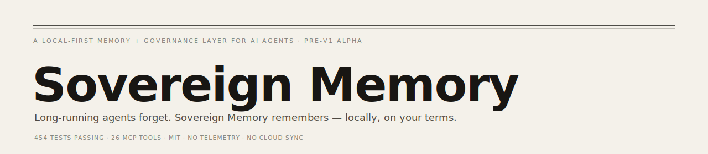
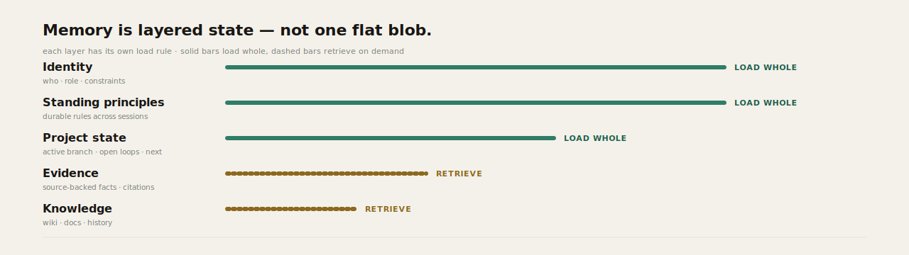
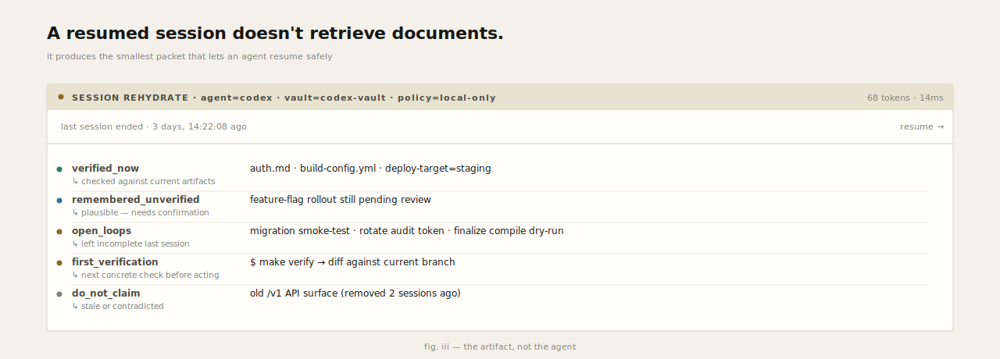
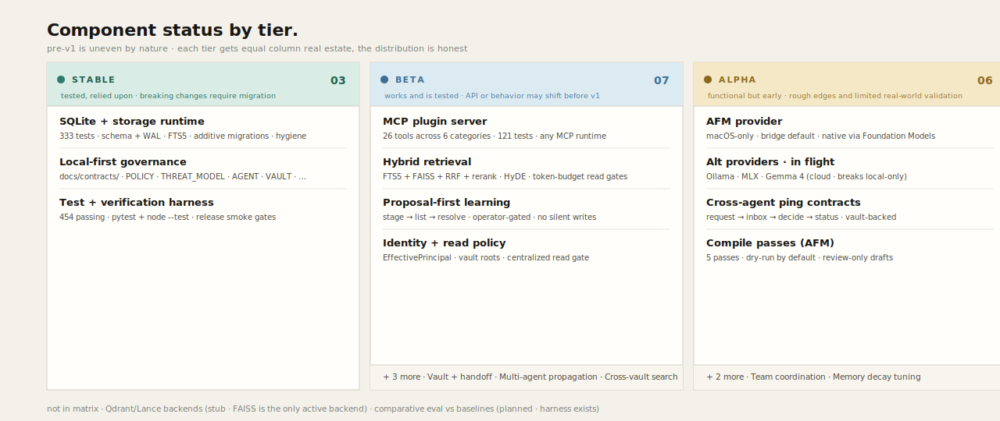

<!-- Sovereign Memory — README
     Narrative direction · DESIGN.md-aligned palette · pre-v1 alpha
     Visuals live in docs/readme-assets/ as light + dark SVG pairs.
     Maker's mark (HA monogram + Frog Scholar) lives in the hero and footer.
     Collapsible sections use native <details>. Mobile-friendly. -->

<picture>
  <source media="(prefers-color-scheme: dark)" srcset="docs/readme-assets/hero-dark.svg">
  
</picture>

<sub>454 tests passing · 26 MCP tools · MIT · no telemetry · no cloud sync</sub>

---

## Contents

- [§ I — The problem](#-i--the-problem)
- [§ II — The bet](#-ii--the-bet)
- [§ III — The proof](#-iii--the-proof)
- [§ 04 — Component status](#-04--component-status)
- [§ 05 — Plugin surfaces](#-05--plugin-surfaces)
- [§ 06 — Getting started](#-06--getting-started)
- [§ 07 — Vault model](#-07--vault-model)
- [§ 08 — Local-first security](#-08--local-first-security)
- [§ 09 — Verification gate](#-09--verification-gate)
- [§ 10 — Repository map](#-10--repository-map)

---

## § I — The problem

**Agent memory keeps failing in three predictable ways.**

Every long-running agent eventually hits the wall of *"what did I learn last session?"* The current answers all break in their own way.

| | Chat history | RAG over files | Wiki / markdown notes |
|---|---|---|---|
| **Works** | simple · works out of the box | useful for lookup | human-readable, durable |
| **Breaks on** | opaque, bloated, hard to audit over time | rediscovers context · loses working state | weak provenance · poor contradiction handling |

---

## § II — The bet

**Memory should be layered state, not one flat blob.**

Each layer carries its own load rule — what comes back every session versus what's retrieved only when needed. Identity is small and always present. Knowledge is large and arrives in chunks, cited.

<picture>
  <source media="(prefers-color-scheme: dark)" srcset="docs/readme-assets/memory-layers-dark.svg">
  
</picture>

---

## § III — The proof

**What a session rehydration actually produces.**

A resumed session doesn't retrieve documents — it produces the smallest packet that lets an agent resume safely. Verified facts, plausible-but-unconfirmed state, open loops, the next concrete check, and an explicit "do not claim" list.

<picture>
  <source media="(prefers-color-scheme: dark)" srcset="docs/readme-assets/rehydration-card-dark.svg">
  
</picture>

<sub><em>fig. iii — the artifact, not the agent</em></sub>

---

<details open>
<summary><strong>§ 04 — Component status</strong></summary>

<br>

Honest maturity by subsystem. **Stable** means tested and relied upon. **Beta** works but the API may shift before v1. **Alpha** is functional with rough edges.

<picture>
  <source media="(prefers-color-scheme: dark)" srcset="docs/readme-assets/status-tiers-dark.svg">
  
</picture>

**Not in matrix** — Qdrant / Lance vector backends (stub · FAISS is the only active backend) · comparative eval vs RAG / wiki-only baselines (planned · harness exists)

</details>

---

<details open>
<summary><strong>§ 05 — Plugin surfaces</strong></summary>

<br>

The plugin implements the **Model Context Protocol** — any MCP-speaking agent can connect via `.mcp.json`. Convenience manifests below register the same server with specific agent runtimes.

<details>
<summary><strong>Compatible agents · 6 runtimes</strong></summary>

| Agent | Manifest |
|---|---|
| Codex | `.codex-plugin/` |
| Claude Code | `.claude-plugin/` |
| Gemini | `.gemini-plugin/` |
| KiloCode | `.kilocode-plugin/` |
| Grok Build | `plugins/grok-sovereign-memory/` |
| Any MCP client | `.mcp.json` |

</details>

<details>
<summary><strong>MCP tool surface · 26 tools</strong></summary>

| Category | Count | Example |
|---|---|---|
| RECALL | 7 | `sovereign_status` |
| LEARNING | 4 | `sovereign_learn` |
| AUDIT | 3 | `sovereign_audit_report` |
| COMPILE | 1 | `sovereign_compile_vault` |
| HANDOFF | 4 | `sovereign_negotiate_handoff` |
| MULTI-AGENT | 7 | `sovereign_ping_agent_request` |

Source: [`plugins/sovereign-memory/src/server.ts`](plugins/sovereign-memory/src/server.ts)

</details>

<details>
<summary><strong>Lifecycle hooks · 4 events</strong> (host-invoked · runs alongside MCP)</summary>

| Event | Runtimes | Purpose |
|---|---|---|
| `SessionStart` | Claude Code · Codex · Grok Build | rehydrate identity + state · inject Layer 1 reminder |
| `UserPromptSubmit` | Claude Code · Codex · Grok Build | intercept · classify intent · record audit |
| `PreCompact` | Claude Code · Codex · Grok Build | snapshot scar tissue before context window compaction |
| `Stop` | Claude Code · Grok Build | end-of-session capture · close audit window |

</details>

<details>
<summary><strong>Slash commands · Grok Build native</strong></summary>

Detected inside `UserPromptSubmit`, each auto-drafts a `prepare_outcome` candidate to the inbox.

| Command | Action |
|---|---|
| `/flush` | Grok-native flush → auto-draft `prepare_outcome` candidate |
| `/compact` | Grok-native compact → auto-draft `prepare_outcome` candidate |
| `/dream` | Grok-native dream → auto-draft `prepare_outcome` candidate |

</details>

> [!NOTE]
> **Behavior.** Automatic activity is recall-only. Durable learning follows a proposal-first path — `sovereign_learn` stages a candidate; only `sovereign_resolve_candidate` (operator-gated) writes permanent memory. Cross-agent info sharing requires explicit vault-backed ping contracts.

</details>

---

<details open>
<summary><strong>§ 06 — Getting started</strong></summary>

<br>

### Prerequisites

| | |
|---|---|
| **python** | 3.11 or 3.12 (3.14 may produce partial installs) |
| **node** | 20 (`package.json` requires `>= 20 < 21`) |
| **platform** | macOS for AFM features · linux for everything else |
| **storage** | ~ 50 MB initial · grows with vault size |
| **network** | none required at runtime |

### Engine · python daemon

```bash
cd engine
python3 -m pip install -r requirements.txt

# start the daemon
python3 sovrd.py --socket ~/.sovereign-memory/run/sovrd.sock
```

### Plugin · typescript MCP server

```bash
cd plugins/sovereign-memory
npm install
npm test

# optional: local console UI
npm run console
```

### Verify · against the running daemon

```bash
cd engine
python3 sovrd_client.py --socket ~/.sovereign-memory/run/sovrd.sock status
python3 sovrd_client.py --socket ~/.sovereign-memory/run/sovrd.sock search "memory handoff"
```

### Multi-agent install · sm-propagation

Per-agent setup runs through the **`sm-propagation`** skill. Each hosted agent gets its own workspace envelope at `~/.sovereign-memory/identities/<agent>/` and its own vault — no shared state between agents.

Supported platforms: `codex` · `claude-code` · `kilocode` · `gemini` · `grok-build` · `grok-beta` (legacy) · `all` · `generic`

```bash
python3 sovereign-memory/skills/sm-propagation/scripts/propagate.py update-plugin --platform grok-build
```

See [`sovereign-memory/skills/sm-propagation/SKILL.md`](sovereign-memory/skills/sm-propagation/SKILL.md) and [`sovereign-memory/docs/DESIGN-sovereign-delivery-layer.md`](sovereign-memory/docs/DESIGN-sovereign-delivery-layer.md) for the full design.

</details>

---

<details>
<summary><strong>§ 07 — Vault model</strong></summary>

<br>

Each agent can have its own Obsidian vault while sharing the same daemon and database. The vault is the human-readable memory surface; **SQLite remains runtime truth**.

```
vault/
  index.md
  log.md
  logs/
  raw/
  wiki/
  wiki/handoffs/
  inbox/
  outbox/
  schema/
```

The `sovereign_vault_write` tool accepts six section types: `raw` · `entities` · `concepts` · `decisions` · `syntheses` · `sessions`.

> Short, sourced wiki pages with frontmatter for durable knowledge. Raw / private logs stay local, out of public git.

</details>

---

<details>
<summary><strong>§ 08 — Local-first security</strong></summary>

<br>

Local-first is real only when four assumptions hold on the host:

1. **User account is the security perimeter** — single-user host model
2. **FileVault is enabled** — database + vault encrypted at rest
3. **No cloud sync over vault or DB** — iCloud · Dropbox · Drive · OneDrive
4. **Local-only transports** — no remote JSON-RPC fallback at v1

### Exclude from Time Machine + Spotlight

```bash
xattr -w com.apple.metadata:com_apple_backup_excludeItem true \
  ~/.sovereign-memory/sovereign_memory.db
xattr -w com.apple.metadata:com_apple_backup_excludeItem true \
  ~/.sovereign-memory/codex-vault
```

> [!WARNING]
> Planned providers — Ollama, MLX, Gemma via Google OAuth — break the local-only posture if enabled. They are opt-in only and will be labeled in-product.

</details>

---

<details>
<summary><strong>§ 09 — Verification gate</strong></summary>

<br>

Before pushing a release candidate, run the full gate:

```bash
cd engine && pytest -q                          # expect 333 passed
cd ../plugins/sovereign-memory && npm test      # expect 121 passed
npm run smoke:hook
```

Then a temp-state live smoke: start `sovrd.py` on a temporary Unix socket, call plugin helpers for status, recall, compile dry-run, and handoff, verify redaction and traceability, and confirm clean `SIGTERM` shutdown. Migration safety is always run on a SQLite backup, **never the live DB**.

</details>

---

<details>
<summary><strong>§ 10 — Repository map</strong></summary>

<br>

### Top-level directories

| Path | Contents |
|---|---|
| [`engine/`](engine/) | python daemon · retrieval · migrations · compile passes · eval harness |
| [`plugins/sovereign-memory/`](plugins/sovereign-memory/) | agent-agnostic MCP plugin · 19 ts modules · 19 test files · console UI |
| [`sovereign-memory/`](sovereign-memory/) | delivery layer · `sm-propagation` skill · workflows · design docs |
| [`openclaw-extension/`](openclaw-extension/) | OpenClaw bridge and import tooling |
| [`docs/contracts/`](docs/contracts/) | AGENT · CAPABILITIES · PAGE_TYPES · POLICY · THREAT_MODEL · VAULT · WORKFLOWS |
| [`eval/`](eval/) | recall fixtures and generated evaluation reports |

### Heavyweight engine files

| File | Size | Role |
|---|---|---|
| [`engine/sovrd.py`](engine/sovrd.py) | 113 KB | local JSON-RPC daemon — the heart of the runtime |
| [`engine/retrieval.py`](engine/retrieval.py) | 86 KB | FTS5 + FAISS · rerank · HyDE · query expansion · token budgets · read gate |
| [`engine/principal.py`](engine/principal.py) | 18 KB | runtime identity · vault roots · capabilities · read authorization |
| [`engine/sovereign_memory.py`](engine/sovereign_memory.py) | 15 KB | CLI · indexing · stats · hygiene · vector status · compile dry-runs |
| [`engine/db.py`](engine/db.py) | 14 KB | schema creation · additive migrations via `PRAGMA user_version` |
| [`engine/afm_provider.py`](engine/afm_provider.py) | 9 KB | normalized AFM contracts · query expansion · neighborhood summary · HyDE |

Also see · [`docs/CANONICAL-PATHS.md`](docs/CANONICAL-PATHS.md) · [`docs/TROUBLESHOOTING.md`](docs/TROUBLESHOOTING.md) · [`docs/ENGINEERING-REVIEW.md`](docs/ENGINEERING-REVIEW.md) · [`docs/OBSERVED-USAGE.md`](docs/OBSERVED-USAGE.md)

</details>

---

<table border="0"><tr>
<td width="92" valign="middle"></td>
<td valign="middle">Built by <strong>Hans Axelsson</strong> — the Frog Scholar.<br>
<sub>The <strong>HA</strong> monogram is a maker's mark, not a product logo. Brand system lives in <a href="assets/brand/">assets/brand/</a>.</sub></td>
</tr></table>

<sub>LOCAL-ONLY · NO TELEMETRY · NO CLOUD SYNC · NO REMOTE ENDPOINTS · EVER</sub>
