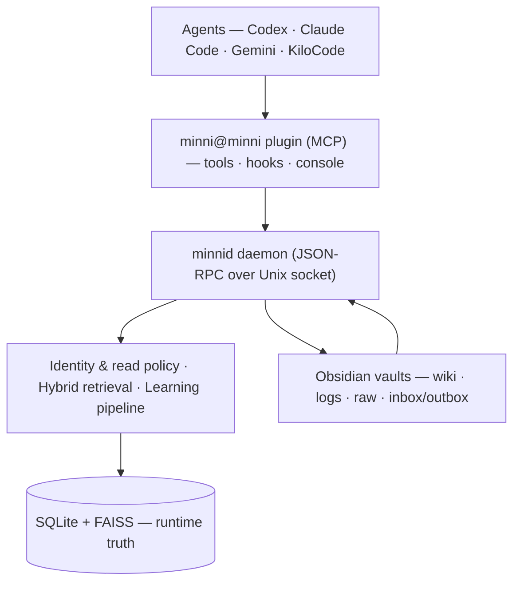

# ᛗ Minni


**Local-first memory and governance layer for AI agents.**

> *Identity loads whole. Knowledge loads chunked.*

Minni gives long-running agent work a durable spine — identity, working state,
retrieval, evidence, handoffs, learning proposals, and audit trails that stay
inspectable on your own machine. It sits between *chat-history-as-memory* and
*pure RAG*: an agent resumes with typed state, verified evidence, open loops,
and a clear next action instead of rediscovering context from scratch.

> **Pre-v1.** Core subsystems work and are tested, but integration depth varies.
> The [status table](#project-status) below is the honest state of each piece.

---

## Highlights

| | Feature | What it does |
|---|---|---|
| ♻️ | **Session rehydration** | Resume with verified facts, remembered-but-unverified state, open loops, and a first verification step |
| 🧩 | **Agent-agnostic MCP plugin** | One standard MCP server (`minni@minni`) — works with any MCP client. Ships manifests for Codex, Claude Code, Gemini, KiloCode, plus native Grok hooks |
| 🔒 | **Proposal-first learning** | No silent writes — `minni_learn` stages candidates; only operator-gated resolution writes durable memory |
| 🔁 | **Correction re-injection** | Belief corrections are first-class memories — re-asserted at session start and after compaction; contradicting a stored correction surfaces the collision instead of silent recall |
| 📐 | **Durable plans** | `minni_plan_*` — proposal-first plans with evidence-gated slices, scars, and replan history that survive across sessions and agents |
| 🔍 | **Hybrid retrieval** | FTS5 + FAISS + reranking, query expansion, HyDE, token budgets, centralized read gates |
| 🍎 | **Model provider chain** | Pluggable `ModelProvider` protocol with Apple Foundation Models as the first provider — health means a verified completion, not a process that responds |
| 📓 | **Obsidian vaults** | Human-readable wiki, logs, raw material, and per-agent inbox/outbox handoffs |
| 🤝 | **Cross-agent contracts** | Vault-backed ping contracts with explicit approve/deny — no agent reads another's private memory directly |
| 🛡️ | **Local-first governance** | Server-stamped identity, read policy, audit trails, and memory-hygiene contracts |

---

## Project status

Minni is in active development toward v1. Components sit at different maturity
levels; this table is the honest picture, not a roadmap.

<details>
<summary><strong>Component status table</strong> — 17 components, stable → stub</summary>

| Component | Status | Notes |
|---|---|---|
| SQLite runtime + migrations | **stable** | WAL mode, additive migrations tracked by `PRAGMA user_version` |
| MCP plugin server | **beta** | 37 `minni_*` tools, agent-agnostic; any MCP client can connect |
| Hybrid retrieval (FTS5 + FAISS) | **beta** | FTS5 → FAISS → RRF → rerank works; needs comparative eval vs baselines |
| Proposal-first learning | **beta** | Stage → list → resolve; operator-gated writes enforced |
| Correction re-injection | **beta** | Corrections carry their own salience; re-asserted at session start and post-compaction; `stale_beliefs` matches contradicting prompts |
| Plan framework (`minni_plan_*`) | **beta** | 11 tools; evidence-gated slices, scars, replan history; active plan injected by all four platform hooks |
| Lifecycle hooks (4 platforms) | **beta** | Claude Code, Codex, Grok, KiloCode; shared factory owns Minni semantics, thin per-platform adapters own host protocol |
| Vault model + wiki indexer | **beta** | Structure stable; vault files → SQLite/FAISS pipeline works |
| Identity + read policy | **beta** | `EffectivePrincipal` stamps identity, vault roots, capabilities; one read gate; privacy floor enforced in note frontmatter |
| Handoff (inbox/outbox) | **beta** | Vault-backed handoff pages; ack/await flows; lease-aware TTL expiry and drain-on-resolution |
| Cross-agent ping contracts | **alpha** | Protocol works (request → inbox → decide → status); limited real-world use |
| Model providers (AFM first) | **beta** | `ModelProvider`/`ProviderChain` protocol, `providers.json` config; health requires a verified completion; macOS-only for AFM |
| Compile passes (AFM) | **alpha** | 8 passes incl. inbox ingest/archive; dry-run only by default |
| Team coordination | **alpha** | 3 tools registered; multi-agent scenarios largely untested |
| Per-agent vault isolation | **alpha** | Enforcement engine built + tested; hardening tracked separately |
| Qdrant / Lance backends | **stub** | Planned — Minni targets solo dev and enterprise scale; the backend seam is kept clean so proven at-scale stores slot in. FAISS is the only active backend today |
| Comparative eval vs baselines | **not started** | Harness exists; no head-to-head against RAG / wiki-only yet |

*Stable* = relied upon, breaking changes need migration · *Beta* = works + tested, API may shift ·
*Alpha* = functional but early · *Stub* = interface only.

</details>

---

## How it works

Memory is layered state, not one flat blob:

| Layer | Loading rule | Purpose |
|---|---|---|
| **Identity** | load whole | who the agent is, role, constraints, standing rules |
| **Project state** | compact packet | active branch, status, blockers, recent decisions, next checks |
| **Evidence** | retrieve by need | source-backed facts, artifacts, logs, traces, citations |
| **Knowledge** | retrieve chunked | larger wiki/docs/history — cited and validated, never assumed |

A resumed session doesn't just return documents — it produces a small packet:

```
Verified now:            facts checked against current artifacts
Remembered (unverified): plausible memory needing confirmation
Open loops:              tasks left incomplete
First verification:      the next concrete check before acting
Do-not-claim:            stale, contradicted, or unsupported claims
```

The goal is the *smallest* packet that lets an agent resume safely. **SQLite is
runtime truth; vault pages, FAISS files, and compile drafts are derived surfaces.**
If a simpler model achieves the same recovery quality, the right move is to
delete complexity.

---

## Getting started

**Prerequisites:** Python 3.11+ (3.11/3.12 recommended for reproducible numpy/FAISS wheels), Node.js 20+.

<details>
<summary><strong>Setup steps</strong> — engine daemon, plugin, smoke check</summary>

```bash
# 1. Engine (Python daemon)
cd engine
python3 -m pip install -r requirements.txt
python3 minnid.py --socket ~/.minni/run/minnid.sock

# 2. Plugin (TypeScript) — in another terminal
cd plugins/minni
npm install && npm test

# 3. Verify the daemon answers
cd engine
python3 minnid_client.py --socket ~/.minni/run/minnid.sock status
python3 minnid_client.py --socket ~/.minni/run/minnid.sock search "memory handoff"
```

> **Tip:** for reproducible NumPy/FAISS, use a clean venv:
> `python3 -m venv .venv && source .venv/bin/activate && pip install -r engine/requirements.txt`

</details>

---

## Architecture



Each agent is its own pipeline into the plugin; the plugin alone talks to
`minnid`, which is the single gatekeeper to the vault. Agents never touch the
filesystem directly — they ask `minnid`, which applies the caller's identity and
read policy and returns only what that agent is allowed to see.

---

## Plugin surfaces

The plugin implements the [Model Context Protocol](https://modelcontextprotocol.io/),
so any MCP client can connect. Per-agent manifests are thin wrappers that
register the same server with a pinned identity and vault:

| Integration | Manifest |
|---|---|
| Any MCP client | [`.mcp.json`](plugins/minni/.mcp.json) |
| Claude Code | [`.claude-plugin/`](plugins/minni/.claude-plugin/) + hooks |
| Codex | [`.codex-plugin/`](plugins/minni/.codex-plugin/) |
| Gemini | [`.gemini-plugin/`](plugins/minni/.gemini-plugin/) |
| KiloCode | [`.kilocode-plugin/`](plugins/minni/.kilocode-plugin/) |
| Grok CLI | native hooks ([`src/grok-hook.ts`](plugins/minni/src/grok-hook.ts)), registered via the `minni-install` skill |

**Automatic behavior is recall-only.** Durable learning is proposal-first
(`minni_learn` stages → `minni_resolve_candidate` writes), and cross-agent
sharing requires an explicit vault-backed ping contract.

<details>
<summary><strong>All 37 tools</strong></summary>

`minni_status` · `minni_recall` · `minni_drill` · `minni_prepare_task` ·
`minni_prepare_outcome` · `minni_route` · `minni_export_pack` ·
`minni_learning_quality` · `minni_learn` · `minni_resolve_candidate` ·
`minni_vault_write` · `minni_audit_report` · `minni_audit_tail` ·
`minni_compile_vault` · `minni_negotiate_handoff` · `minni_ack_handoff` ·
`minni_list_pending_handoffs` · `minni_await_handoff` ·
`minni_ping_agent_request` · `minni_ping_agent_inbox` ·
`minni_ping_agent_decide` · `minni_ping_agent_status` ·
`minni_subscribe_contradictions` · `minni_team_runtime` ·
`minni_team_evidence` · `minni_team_promotion` ·
`minni_plan_create` · `minni_plan_update` · `minni_plan_status` ·
`minni_plan_activate` · `minni_plan_deactivate` · `minni_plan_replan` ·
`minni_plan_diff` · `minni_plan_history` · `minni_plan_revision` ·
`minni_plan_restore` · `minni_plan_scar`

</details>

---

## AFM provider modes

Apple Foundation Models calls are optional and local-only. Set
`MINNI_AFM_PROVIDER_MODE`:

<details>
<summary><strong>Modes & provider config</strong> — off / bridge / native / auto, <code>providers.json</code></summary>

| Mode | Behavior |
|---|---|
| `off` | skip AFM, use deterministic fallback |
| `bridge` | localhost OpenAI-compatible bridge (**default**) |
| `native` | local helper via the Foundation Models framework |
| `auto` | native when available, else bridge |

Adapter configuration is reported as a boolean only — private adapter paths are
never emitted.

Beyond AFM, `~/.minni/providers.json` configures the provider chain and
per-operation routing behind the `ModelProvider` protocol. Secrets never live in
the config file — cloud credentials come only from env vars or key files, and
resolved keys are never written to disk or logs. A provider only reports healthy
after a verified completion.

</details>

---

## Vault model

Each agent has its own Obsidian vault under `~/.minni/<agent>-vault`, sharing the
same daemon and database:

<details>
<summary><strong>Vault layout & conventions</strong></summary>

```
<agent>-vault/
  index.md   log.md   logs/   raw/
  wiki/   wiki/handoffs/   inbox/   outbox/   schema/
```

Use short, sourced wiki pages with frontmatter for durable knowledge. Raw
session material and private logs stay local and out of public git unless
explicitly sanitized.

</details>

---

## Local-first security

Minni is local-first only when these hold on the host:

<details>
<summary><strong>The four host conditions</strong> — perimeter, FileVault, no cloud sync, local transport</summary>

1. The **macOS user account** is the security perimeter (single-user box).
2. **FileVault on** — database and vault encrypted at rest.
3. **No cloud sync** — `~/.minni/` (incl. `minni.db` + `-wal`/`-shm`) is not under
   iCloud / Dropbox / Drive / OneDrive.
4. **Local-only transport** — JSON-RPC over a Unix socket; no remote fallback at v1.

The daemon ships as a launchd agent (`com.minni.minnid`) with `Umask 077` so logs
stay `0600`.

</details>

---

## Repository map

<details>
<summary><strong>Paths & key engine files</strong></summary>

| Path | Contents |
|---|---|
| [`engine/`](engine/) | Python daemon (`minnid.py`), retrieval, migrations, compile passes, eval harness |
| [`plugins/minni/`](plugins/minni/) | Agent-agnostic MCP plugin + per-agent manifests |
| [`openclaw-extension/`](openclaw-extension/) | OpenClaw bridge and import tooling |
| [`docs/`](docs/) | Contracts, canonical paths, troubleshooting, design specs |

**Key engine files:** `minnid.py` (JSON-RPC daemon) · `principal.py` (identity,
vault roots, read authorization) · `retrieval.py` (hybrid retrieval + read gate)
· `db.py` (schema + migrations) · `sovereign_memory.py` (indexing/stats CLI).

</details>

---

## Verification

Before cutting a release candidate:

```bash
cd engine && PYTHONPATH=. pytest -q                 # expect 538 passed, 5 skipped
cd ../plugins/minni && npm run build && npm test    # expect 327 passed
bash scripts/repro-smoke.sh                         # hermetic daemon: status + recall + isolation
```

---

<sub>Minni is local-first — no telemetry, no remote endpoints, no cloud required. It can run on synced or cloud storage, but only stays passively secure (encrypted at rest, no exfil surface) when kept local.</sub>
