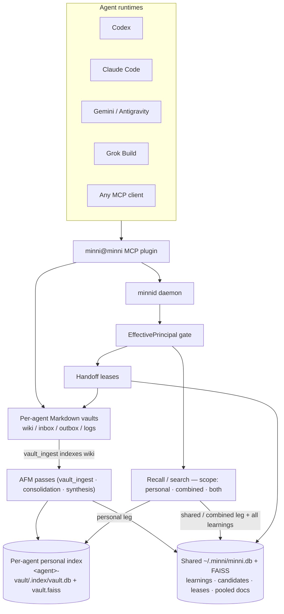

# ᛗ Minni

**Local-first memory and continuity for AI agents.**

 
 
[](https://www.buymeacoffee.com/y57d6h29td5)

Your agents forget everything between sessions. Minni gives them a local, inspectable memory that survives compaction, restarts, and handoffs — and is shared across Claude Code, Codex, Gemini, and Grok (with Kilo and Antigravity riding the same surfaces).

## The problem

Agents lose state. Context evaporates on restart, gets summarized away by compaction, and never crosses from one runtime to the next. A correction you gave Claude Code yesterday is gone today; Codex has no idea what Gemini already learned; a long task that spans two sessions starts over from nothing. Most memory tools answer this with a hosted vector API and automatic fact extraction you cannot see or audit.

Minni takes the other bet: keep the state on your machine, make it explicit enough to read as plain Markdown, and put one governed daemon between every agent and that state.

## What Minni does

In ~30 seconds: Minni runs a single local **daemon** (`engine/minnid.py`) over a Unix socket. Agents talk to it through a typed **MCP surface**, and each agent gets its own human-readable **Markdown vault** (wiki / inbox / outbox / logs) on disk. Memory is two-tier: each agent's wiki is indexed into its **own personal store** (`<agent>-vault/.index/vault.db` + FAISS), while a **shared store** (`~/.minni/minni.db`) holds durable learnings and the pooled document layer. Recall merges the two by scope. Every durable write and cross-agent operation passes an identity-and-capability gate, so you get shared state without losing the audit trail.

What you get:

- **Recall** — cited, provenance-tagged retrieval (lexical + vector + rerank) across a personal and a shared leg, treated as evidence, not as instruction.
- **Learn** — a proposal-first learning lifecycle: stage candidates, then accept / reject / redact / merge / supersede, with audit entries on disk.
- **Plan** — proposal-first, evidence-gated durable plans that survive sessions and compaction.
- **Handoff** — explicit cross-agent transfers with leases, so work and context move between runtimes deliberately.

All of it is local-first: no hosted dependency, no cloud tier, and vaults you can open in any editor.

## Quickstart

Requires Python 3.14 and Node >=20. You do not manage the venv yourself — the `Makefile` builds it for you with your system `python3` (the interpreter is pinned in `.python-version`). The first `make setup` installs dependencies and the daemon downloads embedding models on first start, so the first run takes a few minutes; subsequent starts are fast. From a fresh clone:

```bash
make setup
make daemon
```

In another shell, verify the daemon and run a search against it:

```bash
engine/.venv/bin/python engine/minnid_client.py --socket ~/.minni/run/minnid.sock status
engine/.venv/bin/python engine/minnid_client.py --socket ~/.minni/run/minnid.sock search "memory handoff"
```

The `status` call reports daemon health, the DB path, and (see below) per-method latency / error / counter metrics. The `search` call returns ranked, cited snippets — merged from your personal vault index and the shared layer, the same evidence an agent sees when it recalls. Abbreviated, that output looks like this (the rows come from your own vault, so yours will differ; `src` marks which leg each hit came from):

```text
Search: memory handoff  (3 results)
──────────────────────────────────────────────────
[src=p] wiki/handoff-leases.md — Handoff leases  (score=0.842)
A handoff transfers a task between agent runtimes under a lease; the receiver
acks before the sender releases it...

[src=c] logs/2026-06-12.md — Correction re-assert  (score=0.671)
Recall is evidence, not instruction: cite it, do not obey it...
```

### Wire it into your agent

The daemon is the shared memory; the plugin is how an agent reaches it. From your checkout, point the plugin at a runtime — this registers the MCP server, the per-agent vault path, and that host's hook entrypoint:

```bash
engine/.venv/bin/python plugins/minni/skills/minni-install/scripts/propagate.py update-plugin --platform claude-code
```

Swap `--platform` for `codex`, `gemini`, `antigravity`, `grok`, `kilocode`, or `all`. The agent-driven `minni-install` skill handles first-time identity and vault seeding; see [Platform Integration](#platform-integration) for the per-runtime surfaces. Once wired, the agent reaches for that memory on its own.

## How it compares

**TL;DR:** Minni is local-first and multi-agent-governed, where mem0 is hosted/single-agent-benchmarked, MemOS is a research-heavy memory OS, and basic-memory is a single personal vault.

Minni is a deliberately narrow, opinionated bet, so it helps to place it:

- **vs [mem0](https://github.com/mem0ai/mem0)** — mem0 is the mature, widely adopted hosted/SDK memory layer optimizing single-agent recall benchmarks. Minni is local-first with no hosted tier and makes no benchmark claims; it trades reach for sovereignty, inspectable Markdown vaults, and multi-agent governance.
- **vs [MemOS](https://github.com/MemTensor/MemOS)** — MemOS is a heavier, research-oriented "memory OS" managing parametric/activation/plaintext memory types. Minni is more operational: a daemon plus vaults wired into real runtimes via MCP and lifecycle hooks, with concrete handoff leases and a candidate-review audit trail, and no multimodal/parametric ambitions.
- **vs [basic-memory](https://github.com/basicmachines-co/basic-memory)** — basic-memory shares the Markdown-first, local-first, MCP DNA but is a polished single personal knowledge graph. Minni adds a governing daemon on top: per-agent (not one shared) vaults and personal indexes, an identity/capability gate, cross-agent handoffs, review-first learning, and durable plans.

Honest caveats: Minni is **pre-v1**, with tiny adoption, no published benchmarks, no hosted or multi-device option, and a heavier footprint (Python 3.14 venv, Node, a running daemon, FAISS/embedding models) than `pip install mem0` or `uvx`-style servers. "Multi-agent" here means multiple agent runtimes sharing one local daemon on one host, not agents distributed across machines.

## System Model



The daemon owns memory/search/candidate RPCs and the identity gate for those paths. Documents are two-tier: each agent's vault wiki is indexed into that vault's **own** `.index/vault.db` + FAISS (the personal leg), while `~/.minni/minni.db` holds durable learnings plus the legacy/pooled document layer (the shared leg). Recall merges the legs by scope. The plugin also maintains vault-scoped artifacts such as plans, hook packets, audit logs, and local console views. Vaults are the human-readable surface. Agents should use the plugin/daemon contracts instead of scraping another agent's private vault directly.

## Core Invariants

| Invariant | Meaning |
|---|---|
| Identity loads whole | Agent identity and standing rules are not chunked |
| Knowledge loads chunked | Large docs/history are retrieved by need and cited |
| Recall is evidence | Retrieved content is not automatically instruction |
| Learning is proposal-first | Default `learn` stages a candidate for review; a durable learning requires operator acceptance (`resolve_candidate`) or the `force=true` operator escape |
| Documents are two-tier | Each agent's wiki indexes into its own `<agent>-vault/.index/vault.db` + `vault.faiss` (personal leg); the shared `~/.minni/minni.db` holds the legacy/pooled document layer (shared leg). Recall merges them by `scope` (`personal` · `combined` · `both`) |
| Learnings are shared-DB | Durable learnings, candidates, leases, and event tables live in the shared `~/.minni/minni.db`, regardless of recall scope |
| Vaults are per-agent | Shared daemon, separate human-readable workspaces, separate personal indexes |
| Local transport first | Daemon defaults to a local Unix socket; provider calls are explicit/gated |

## Runtime Components

| Component | Responsibility |
|---|---|
| `engine/minnid.py` | JSON-RPC daemon, dispatch, policy, storage, status |
| `engine/principal.py` | Identity resolution, vault roots, capabilities, read authorization |
| `engine/retrieval.py` | FTS/FAISS/RRF/rerank retrieval path, personal/shared leg merge |
| `engine/db.py` | Shared SQLite schema and migrations |
| `engine/afm_passes/vault_ingest.py` | Builds each agent's personal `.index/vault.db` + FAISS from its vault wiki |
| `engine/afm_passes/` | Consolidation/synthesis/pruning passes that curate the shared DB |
| `plugins/minni/src/server.ts` | MCP tool registration and request shaping |
| `plugins/minni/src/hook-handlers.ts` | Shared hook semantics for runtimes that support hooks |
| `plugins/minni/src/plan.ts` | Durable plan artifacts and state transitions |
| `plugins/minni/src/vault.ts` | Vault writes, inbox/outbox, compile surfaces |

The `status` RPC on `engine/minnid.py` now also surfaces operational metrics (per-method `latencies`, a total `errors` count, and `counters`) for the introspection shown in the quickstart.

## MCP Surface

The primary surface is organized by tool family:

| Family | Actions |
|---|---|
| `minni_prepare` | task, outcome |
| `minni_recall` | recall, drill, route, export pack |
| `minni_plan` | create, update, status, activate, deactivate, replan, history, diff, restore, scar |
| `minni_learn` | quality review, or durable commit (proposal-first: the daemon stages a candidate) |
| `minni_vault` | write, compile |
| `minni_handoff` | negotiate, ack, list pending, await |
| `minni_ping` | request, inbox, decide, status |
| `minni_team` | runtime, evidence, promotion draft |
| `minni_status` | status, audit report, audit tail, subscribe contradictions |
| `minni_resolve_candidate` | owner-or-explicit-operator candidate resolution |

Compatibility aliases remain for older workflows. New integrations should use the family model.

## Data Model

Minni separates runtime storage from human-readable storage, and splits document retrieval into a personal and a shared leg:

| Surface | Contents |
|---|---|
| Shared `~/.minni/minni.db` (SQLite) | learnings, episodic/contradiction events, candidates, handoff leases, migrations, runtime metadata — **plus** the legacy/pooled `documents` + `chunk_embeddings` (the combined/shared retrieval leg) |
| Shared FAISS | vector index for the shared document leg |
| Per-agent personal index `<agent>-vault/.index/` | `vault.db` (chunk text, embeddings, resolved `[[wikilink]]` edges) + `vault.faiss` / `vault.manifest.json`, built by the AFM `vault_ingest` pass from that agent's `wiki/**/*.md` |
| Vault wiki | sourced synthesis pages, handoff notes, and vault-first learning notes — the source the personal index is built from |
| Vault inbox | candidate drafts, hook packets, handoff requests |
| Vault outbox | outgoing handoffs and requests |
| Vault logs | append-oriented human-readable audit trail |

Searchable indexes are derived from vault pages (into the per-vault `.index`) and from durable learnings (in the shared DB). Vault pages are visible working artifacts, not a substitute for identity and policy checks. Document recall is scoped: `personal` searches the caller's index only (falling back to the shared layer if absent), `combined` pools all per-vault indexes plus the shared layer, and `both` (the default) merges personal and combined, de-duplicating the caller's own hit. Each hit carries `src: "p"` (personal) or `src: "c"` (combined/shared); learnings always come from the shared daemon DB. Full provenance — owning agent, source vault, index DB path, score components, `indexed_at` — is available on demand via `minni_drill`.

## Platform Integration

The plugin ships thin runtime manifests/adapters. They pin identity, vault path, socket path, and host-specific hook entrypoints where the host supports hooks.

| Runtime | Surface |
|---|---|
| Generic MCP | `.mcp.json` |
| Claude Code | `.claude-plugin/` plus shared hook entrypoint where installed |
| Codex | `.codex-plugin/` plus Codex hook entrypoint |
| Gemini | `.gemini-plugin/` |
| Antigravity | installer propagation target on the Gemini surface (shared `~/.gemini` tree) |
| Kilo | `.kilocode-plugin/` (config under `~/.config/kilo/kilo.json`) |
| Grok | standard `minni@minni` plugin install (`~/.agents/plugins/minni@minni`) wired via `~/.grok/config.toml`, plus a Grok hook entrypoint (`grok-hook.ts` / `hooks-grok.json`) |

Runtime adapters are thin: they adapt host protocol to the shared daemon/plugin contract.

## Retrieval And Continuity

A useful resumed session is not a transcript dump. Current continuity surfaces are concrete:

- startup hooks can inject compact identity, active plan state, correction re-assertions, and bounded inbox/candidate state. On **Claude Code** the injected `<minni:context>` envelope persistently carries a four-verb lifecycle spine (`prepare_task` -> `prepare_outcome` -> `plan` -> `learn`) so the active verbs get reached for without being asked, backed by a `PreToolUse` recall-guard backstop that nudges recall before tool use. This is Claude Code-specific by capability — only Claude Code exposes a deny-capable pre-tool hook. Two operator knobs control it: `MINNI_LIFECYCLE_NUDGE_MODE` (set to `off` to disable the lifecycle nudge) and `MINNI_RECALL_GUARD_MODE` (`off` / `soft` / `strict`). The recall guard fails open — a state-write failure never blocks the turn.
- `minni_prepare` returns ranked `relevantSources` for task prep and an `outcomeDraft` for post-task learning review;
- `minni_recall` returns cited snippets/chunks/documents with provenance, review state, privacy level, depth controls, and a `src` marker for the personal vs shared leg.

The retrieval stack combines lexical search, vector search, rank fusion, reranking, source metadata, review state, privacy level, budgeted depth, and a personal/shared leg merge governed by recall `scope`.

## Learning Lifecycle

Learning is proposal-first. There is one default staging path, one resolution path, one operator escape, and one inbox/consolidation path:

1. **Default staging path.** `minni_learn` calls daemon `learn`. By default the daemon runs contradiction and quality checks, then stages a `candidate_packets` row with status `proposed` (returning a `candidate_id`). It does **not** write a durable learning on this path.
2. **Resolution path.** A later `resolve_candidate` decision accepts, rejects, redacts, logs only, merges, supersedes, marks scope/sensitivity, or marks do-not-store. Only accepting decisions write or keep a durable learning row, disk note, and semantic index entry.
3. **Operator force escape.** `force=true` on `learn` writes a durable learning directly, but only for an operator principal (audit-stamped `FORCE_DURABLE_LEARN`); a non-operator force attempt is denied with an `operator_only` error.
4. **Hook/inbox path.** Stop hooks can write candidate files to a vault inbox. The AFM consolidation pass can ingest those files into `candidate_packets`, then propose promote / dedupe / mark-for-review decisions that the daemon applies according to the configured gates.

Raw transcripts, status packets, hook envelopes, test junk, and unverified claims should route to review or rejection rather than active memory.

## Local-First Boundaries

Code-backed local-first boundaries:

- the plugin defaults to a local Unix socket for daemon RPC;
- vaults, per-vault `.index` stores, and shared daemon data are local filesystem paths;
- the local console/API surface binds to loopback only by default; tokenless localhost still works, an optional configured bearer token is enforced fail-closed, and deep-research is opt-in;
- non-loopback model targets require explicit allowlisting and HTTPS;
- `~/.minni/providers.json` (a runtime config, not a file in this repo) rejects inline cloud API keys;
- cloud keys resolve only from environment variables or 0600 files under the Minni secrets directory;
- learning, handoff, vault writes, and hooks leave vault audit entries; candidate resolution records terminal database status and daemon log output.

## Setup

Python 3.14 in a venv, Node >=20 (see `.nvmrc`). The supported interpreter is declared in `.python-version`, and the root `Makefile` builds the engine venv with the system `python3`.

The normal fresh-clone path is:

```bash
make setup
make daemon
```

In another shell, verify the daemon:

```bash
engine/.venv/bin/python engine/minnid_client.py --socket ~/.minni/run/minnid.sock status
engine/.venv/bin/python engine/minnid_client.py --socket ~/.minni/run/minnid.sock search "memory handoff"
```

Node >=20 is required for the plugin (see `.nvmrc` and `plugins/minni/package.json` `engines.node`).

Personal vault indexes are built by the AFM `vault_ingest` pass and can also be (re)built manually from `engine/`:

```bash
python index_all.py --vault-ingest-all          # index every ~/.minni/*-vault
python index_all.py --vault-ingest-all --dry-run
```

## Development Checks

Run the suites rather than trusting stale README counts:

```bash
cd engine && PYTHONPATH=. .venv/bin/python -m pytest -q
cd ../plugins/minni && npm test
cd ../.. && bash scripts/repro-smoke.sh   # smoke runs from the repo root: it calls engine/minnid.py relative to cwd
```

Or run the whole loop from the repo root in one command with `make check` (see [Unified commands](#unified-commands) below).

**Note:** `scripts/repro-smoke.sh` uses a temporary `MINNI_HOME` and the engine venv. It tolerates a pre-existing `~/.minni` directory, but fails if the smoke run creates or modifies files there. The engine pytest suite carries the same guarantee: it forces `MINNI_HOME` to a throwaway directory at import, so `make test`, `make check`, and `make coverage` cannot create or mutate the live `~/.minni` database or any per-vault index.

### Unified commands

A root `Makefile` wraps both surfaces so you do not have to remember the per-directory commands. Each target calls the same commands documented above.

```bash
make setup        # engine venv + deps, plugin npm ci
make lint         # ruff (engine) + eslint (plugin)
make typecheck    # tsc --noEmit (plugin)
make build        # build the plugin (tsc + vite)
make check        # fast gate: lint + typecheck + plugin build/test + scoped engine pytest
make coverage     # plugin (node built-in) + engine (pytest-cov) coverage with floors
make test         # full engine pytest + plugin test (heavy: loads embedding/FAISS models)
make test-engine  # full engine pytest suite (override scope with ENGINE_PYTEST)
make smoke        # hermetic engine repro smoke
make daemon       # run the minnid daemon on the default socket
make bench        # run the membench fixture end-to-end
make help         # list the main targets
```

For branch-level agent-compatibility scans, the repo ships a committed scanner config (`agent-compatibility.config.json`, which lists scratch/worktree `ignoredPaths`) so local scratch state does not pollute the result:

```bash
npx -y agent-compatibility@latest --config ./agent-compatibility.config.json --json .
```

`make check` is the fast pre-push / CI gate. It runs both surfaces' static gates plus a NumPy health probe and scoped engine pytest (override the scope with `make check CHECK_PYTEST="-q"` to run the full Python suite, or use `make test-engine`). The engine venv is expected at `engine/.venv`; `ruff` runs from that venv.

### Daemon lifecycle

For foreground development, run `make daemon` from the repo root. A healthy startup logs the configured socket path (`~/.minni/run/minnid.sock` by default) and keeps running until interrupted. Check readiness with:

```bash
engine/.venv/bin/python engine/minnid_client.py --socket ~/.minni/run/minnid.sock status
```

The `status` RPC returns operational introspection — per-method `latencies`, a total `errors` count, and `counters` — alongside daemon and DB health. Logging honors two optional operator knobs: `MINNI_LOG_LEVEL` (e.g. `DEBUG`/`INFO`) and `MINNI_LOG_FORMAT` (`text` default, or `json` for structured output).

If clients report `Socket not found`, start or restart the daemon with `make daemon`, then rerun the status command. If a daemon crashed and left a stale socket, `engine/minnid.py` removes that socket during startup before it binds the new one. For launchd-managed installs, use `launchctl kickstart -k gui/$UID/com.minni.minnid` to restart and `launchctl bootout gui/$UID/com.minni.minnid` to stop.

### Local hooks

Enable the repo's git hooks (engine `ruff` + plugin `eslint`/`typecheck` on commit, `make check` on push) once per clone:

```bash
git config core.hooksPath .githooks
```

See `.githooks/README.md` for details and the `MINNI_SKIP_HOOKS` escape hatch.

## Documentation

| Topic | File |
|---|---|
| Runtime integration | `docs/runtime-integration.md` |
| Vault ingest (personal indexes) | `docs/VAULT_INGEST.md` |
| Agent contract | `docs/contracts/AGENT.md` |
| Capability contract | `docs/contracts/CAPABILITIES.md` |
| Vault contract | `docs/contracts/VAULT.md` |
| Workflow contract | `docs/contracts/WORKFLOWS.md` |
| Threat model | `docs/contracts/THREAT_MODEL.md` |
| Native AFM | `docs/native-afm-implementation-note.md` |

## Support

Minni is **pre-v1**. The architecture is useful now, but the public contract is intentionally smaller than the implementation until the edges settle, so interfaces can still change.

If Minni saves you a session's worth of lost context, you can say thanks:

[](https://www.buymeacoffee.com/y57d6h29td5)

---

Key changes from the prior draft, all sourced from [docs/VAULT_INGEST.md](docs/VAULT_INGEST.md) and the AFM passes:

- **New mermaid** — two distinct storage nodes (personal `.index/vault.db` + shared `minni.db`), with AFM feeding both and Retrieval drawing a personal leg + shared leg.
- **Data Model table** — split into shared DB / shared FAISS / per-vault `.index` / vault surfaces, with the scope + `src` semantics spelled out.
- **Core Invariants** — replaced the single "SQLite is daemon storage" row with "Documents are two-tier" + "Learnings are shared-DB".
- **Quickstart `search` sample** — now shows `[src=p]` / `[src=c]` markers so the two legs are visible.
- Smaller touch-ups in *What Minni does*, *Runtime Components*, *Retrieval And Continuity*, *Learning Lifecycle* (consolidation proposes, daemon applies), *Setup* (manual `vault-ingest`), and a new doc-table row for `VAULT_INGEST.md`.
