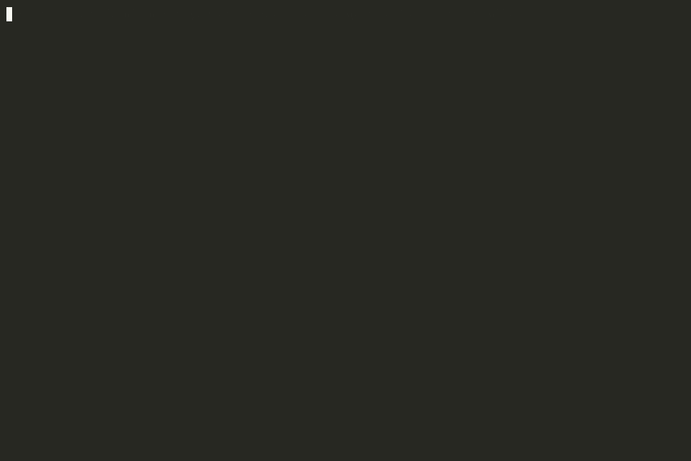
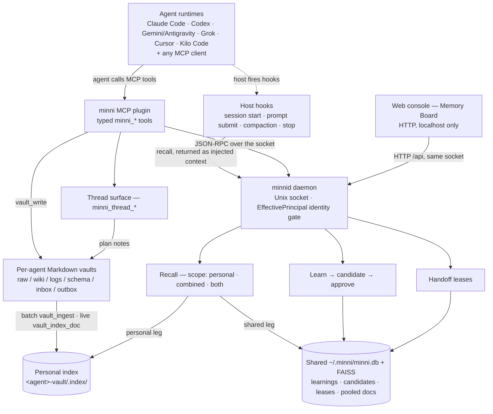

# ᛗ Minni

**Local-first memory for AI agents — one governed daemon, human-readable vaults, shared across every runtime you use. Recall arrives as cited evidence, never as instruction.**

[](https://github.com/infektyd/minni/actions/workflows/ci.yml)
[](https://pypi.org/project/minni/)


## The problem

Agents lose state. Context evaporates on restart, gets summarized away by compaction, and never crosses from one runtime to the next. A correction you gave Claude Code yesterday is gone today; Codex has no idea what Gemini already learned; a long task that spans two sessions starts over from nothing. Most memory tools answer this with a hosted vector API and automatic fact extraction you cannot see or audit.

Minni takes the other bet: keep the state on your machine, make it explicit enough to read as plain Markdown, and put one governed daemon between every agent and that state.

## What Minni is

A single local **daemon** (`minnid`) over a Unix socket, a typed **MCP surface** agents talk through, and a human-readable **Markdown vault** per agent. Memory is two-tier: each agent's wiki is indexed into its **own personal store** (`<agent>-vault/.index/`), while a **shared store** (`~/.minni/minni.db`) holds durable learnings and the pooled document layer. Recall merges the two by scope, and every daemon-mediated durable write or cross-agent operation passes an identity-and-capability gate (vault-note and audit writes are local-first filesystem writes with a pinned target — see [docs/security.md](docs/security.md)).

Four verbs cover the lifecycle:

- **Recall** — cited, provenance-tagged retrieval (lexical + vector + rank fusion + rerank) across the personal and shared legs.
- **Learn** — propose, don't write: `learn` stages a **candidate**, not a memory.
- **Approve** — a governance gate (`resolve_candidate`) accepts, rejects, redacts, merges, or supersedes the candidate. Only accepted candidates become durable memory. Human-gated by default; the operator can [delegate approval](docs/concepts.md#delegating-approval) to a trusted agent, including the background AFM auto-consolidation pass (functional since [#119](https://github.com/infektyd/minni/issues/119) closed) — every path lands in the same audited gate.
- **Handoff** — explicit cross-agent transfers with leases, so work and context move between runtimes deliberately.

Compaction is not a loss event either: platform compaction summaries are harvested at the hook into the agent's vault inbox, then distilled into review candidates ([details](docs/concepts.md#compaction-summary-harvest)).

All of it is local-first: no hosted dependency, no cloud tier, and vaults you can open in any editor.



*Recorded live against a real daemon ([cast file](docs/assets/demo.cast)) — including the `capability_denied` at the end: handoff is default-deny until a capability is explicitly granted. That's the governance working, not the demo failing.*

## Recall is evidence, not instruction

Recalled memory in Minni is **cited and weighed, never obeyed**. Every result arrives in an evidence envelope with provenance (source, owning agent, score, review state): material to evaluate, not text with authority. Instruction-shaped content is detected and defused at the data layer, before it reaches a prompt.

This is a memory-poisoning defense enforced in the engine, not asserted in a prompt: a note that reaches a vault can be *seen* and *cited*, but never gets to *command*. The write side is filtered too — the learn gate blocks credential-shaped values, with an AFM tier, fail-open when AFM is off, for the unquoted passphrases regex cannot judge. Combined with the propose→approve gate, nothing writes itself into durable memory and nothing recalled speaks with your voice.

## How it compares

| | **Minni** | [mem0](https://github.com/mem0ai/mem0) | [MemOS](https://github.com/MemTensor/MemOS) | [basic-memory](https://github.com/basicmachines-co/basic-memory) |
|---|---|---|---|---|
| Where memory lives | **Your machine** (Markdown + SQLite) | Hosted service / SDK | Research memory-OS | Your machine (Markdown) |
| Agents | **Multi-agent, one governed daemon** | Single-agent focus | Research multi-memory | Single personal vault |
| Writes to memory | **Proposal-first, approval-gated** (human by default, delegable) | Automatic extraction | Managed by the OS | Direct |
| You can read it in an editor | **Yes** | No | Partially | Yes |
| Benchmark claims | **None published** | Benchmark-optimized | Research benchmarks | n/a |

**TL;DR:** Minni is the local-first **and** multi-agent **and** governed corner of the space. mem0 is the mature hosted layer optimizing single-agent recall benchmarks; MemOS is a heavier research memory-OS; basic-memory shares the Markdown-first DNA but is one personal knowledge graph without a governing daemon on top.

Honest caveats: Minni is **early (v0.5)**, with tiny adoption, no published benchmarks, and no hosted or multi-device option. The daemon installs with one `pipx install minni`, but the runtime footprint is still heavier than SDK-style tools (a running daemon, FAISS/embedding models, and Node >= 20 on the machine for the MCP plugin). "Multi-agent" means multiple agent runtimes sharing one local daemon on one host, not agents distributed across machines.

## Quickstart

Minni is two pieces: the **daemon + CLI** (PyPI) and the **agent wiring** (the MCP plugin and per-runtime hooks), which `minni wire <platform>` installs. Step 1 gives you a working, verifiable memory daemon; step 2 is what actually connects your agents to it. Wheels have shipped the plugin payload bundled inside the package since **v0.3**. This tree is stamped **v0.5.0** (changelog ready); **PyPI still serves the last tagged release until `v0.5.0` is tagged and the release workflow publishes** — check [pypi.org/project/minni](https://pypi.org/project/minni/) for what `pipx install minni` installs today. A source checkout (`--from-repo`) is only needed for contributors working from `main`.

### 1. Install the daemon + CLI (PyPI)

Python >= 3.14; [pipx](https://pipx.pypa.io/) or `uv tool install` both work. First recall downloads ~320 MB of embedding models (announced, one time).

```bash
pipx install minni
minni up       # start the daemon in the background
minni doctor   # verify the install end to end
```

`doctor` checks the local install subset: interpreter floor, socket presence/permissions, daemon `status` shape, a recall round-trip, and model-cache presence. It does **not** run wire verify probes (MCP handshake, hook dry-run, config readback — those belong to `minni wire` re-run) and does **not** assert the CI hermetic smoke's throwaway-`MINNI_HOME` isolation. `minni down` stops the daemon.

### 2. Wire your agents

A daemon with nothing wired to it is just a very polite database — agents reach it through the MCP plugin, a Node package that `minni wire` installs to `~/.minni/plugin/<version>/` and registers with your agent runtime. You need Node >= 20 on the machine (the preflight tells you if it's missing).

From a **v0.3+ wheel**, the payload is bundled — no checkout:

```bash
minni wire claude-code
```

For contributors working from a source checkout (no published wheel yet, or local plugin changes), wire from a checkout instead — `--from-repo` builds the payload with Node and installs it through the exact same gate:

```bash
git clone https://github.com/infektyd/minni.git && cd minni
make setup          # venv + deps + plugin build (a few minutes on first run)
.venv/bin/minni wire claude-code --from-repo .
```

Swap the platform for any of these:

| Platform | `minni wire` | Notes |
|---|---|---|
| `claude-code` · `codex` · `kilocode` · `grok` | yes | exactly what `wire all` expands to |
| `antigravity` · `generic` | yes, individually | not covered by `wire all` |
| `gemini` | provisional | `wire all` skips it with a warning — see [docs/runtimes/gemini.md](docs/runtimes/gemini.md) |
| `cursor` | fleet-known, skip | in `VALID_PLATFORMS` but wire expands to skip; install via `propagate.py` / `make sync-root` — [docs/runtimes/cursor.md](docs/runtimes/cursor.md) |

Every wire ends with verification probes — an MCP handshake against the installed server, a hook dry-run, and a config readback. Re-run `minni wire <platform>` to repeat those probes; `minni doctor` is interpreter/socket/status/recall/models only and never substitutes for wire verify. Old payload versions are garbage-collected only when no agent's config still references them; `--use-version` re-wires a platform to a previous install for rollback. This registers the MCP server, the per-agent vault path, and that host's hook entrypoint; the agent-driven `minni-install` skill handles first-time identity and vault seeding. Per-runtime pages: [Claude Code](docs/runtimes/claude-code.md) · [Codex](docs/runtimes/codex.md) · [Gemini / Antigravity](docs/runtimes/gemini.md) · [Grok](docs/runtimes/grok.md) · [Kilo Code](docs/runtimes/kilocode.md) · [Cursor](docs/runtimes/cursor.md).

### Poke at it

Run a search against the daemon:

```bash
.venv/bin/python -m minni.minnid_client --socket ~/.minni/run/minnid.sock search "memory handoff"
```

Output is ranked, cited snippets from your own vaults — the same evidence an agent sees when it recalls. Illustrative shape (your content will differ):

```text
Search: memory handoff  (2 results)
──────────────────────────────────────────

wiki/handoff-leases.md — Handoff leases  (score=0.842)
A handoff transfers a task between agent runtimes under a lease;
the receiver acks before the sender releases it...
```

Prefer a container? The eval image runs the daemon with zero local setup: `docker run --rm -it -v minni-data:/home/minni ghcr.io/infektyd/minni:latest` (see [docs/install.md](docs/install.md)).

Want proof agents are actually using memory? `minni watch` tails every recall, learn, and guard decision live in the terminal ([docs](docs/runtime-integration.md#observability-minni-watch)), and the web console (`npm run console` in `plugins/minni`) serves the Memory Board — an infinite canvas over live daemon data: staged learnings, session receipts, traffic pulses ([docs](docs/runtime-integration.md#console-observability)).

### Keep the live install current

**Keep hosts current:** after `pipx upgrade minni` or a `git pull` on a dogfood checkout, run **`minni sync`** so every wired agent (Claude / Codex / Grok / Kilo + cursor/antigravity) reloads the plugin payload — otherwise the daemon can move while hosts still run last week's `server.js`. See [docs/install.md](docs/install.md#keep-every-agent-host-current-minni-sync).

If you run Minni from a source checkout (editable engine + wire-managed plugin tree), **`minni sync --full`** (or **`make sync-root`**) is the full refresh path: fast-forward to `origin/main`, reinstall, rebuild the plugin, redeploy with the D7 fleet partition, then **restart when launchd is loaded** (`launchctl kickstart`); without launchd it only probes the socket — bounce minnid yourself (`minni down && minni up` / systemd) if `deploy.stale` stays true. Watch `minni status` for the `deploy` block — top-level `deploy.stale` includes nested `plugin_dist.stale`. **`minni wire all` ≠ `propagate --platform all`**: wire covers codex/claude-code/kilocode/grok; propagate's `all` is only antigravity + cursor (and post-wire propagate of codex/kilo/grok rewrites MCP onto legacy trees). Full story: [deploy/README.md](deploy/README.md).

## Architecture at a glance


```mermaid
%% Budget: 18 nodes / 16 edges. Dashed = host-fired; solid = someone calls.
%% Tool names re-verified 2026-08-04: the thread surface ships as minni_thread_*;
%% the pre-rename minni_plan_* aliases are removed.
flowchart TD
    Agents["Agent runtimes<br/>Claude Code · Codex · Gemini/Antigravity · Grok · Cursor · Kilo Code<br/>+ any MCP client"]
    Hooks["Host hooks<br/>session start · prompt submit · compaction · stop"]
    Plugin["minni MCP plugin<br/>typed minni_* tools"]
    Console["Web console — Memory Board<br/>HTTP, localhost only"]
    Daemon["minnid daemon<br/>Unix socket · EffectivePrincipal identity gate"]

    Retrieval["Recall — scope: personal · combined · both"]
    Governance["Learn → candidate → approve"]
    Handoff["Handoff leases"]
    Plans["Thread surface — minni_thread_*"]
    Vaults["Per-agent Markdown vaults<br/>raw / wiki / logs / schema / inbox / outbox"]
    Personal[("Personal index<br/>&lt;agent&gt;-vault/.index/")]
    Shared[("Shared ~/.minni/minni.db + FAISS<br/>learnings · candidates · leases · pooled docs")]

    Agents -.->|host fires hooks| Hooks
    Agents -->|agent calls MCP tools| Plugin
    Hooks -->|recall, returned as injected context| Daemon
    Plugin -->|JSON-RPC over the socket| Daemon
    Console -->|HTTP /api, same socket| Daemon

    Daemon --> Retrieval
    Daemon --> Governance
    Daemon --> Handoff

    Plugin --> Plans
    Plugin -->|vault_write| Vaults
    Plans -->|plan notes| Vaults
    Vaults -->|batch vault_ingest · live vault_index_doc| Personal

    Retrieval -->|personal leg| Personal
    Retrieval -->|shared leg| Shared
    Governance --> Shared
    Handoff --> Shared
```

Two things reach the daemon that are not the same thing. **Agents call** MCP tools; **hosts fire** hooks (dashed) on session start, prompt submit, and compaction, and the recall they return is injected as context. The console is a third surface — HTTP, localhost — over that one socket. Plans and vault notes are plugin-local writes the daemon then indexes. The remaining surfaces (CLI, teams, and the compaction-harvest ingestion path) are mapped in [docs/architecture.md](docs/architecture.md); concepts in [docs/concepts.md](docs/concepts.md).

## Status

Minni's **repo tip is stamped v0.5.0** ([CHANGELOG.md](CHANGELOG.md)) — the close of the 2026-08 audit remediation campaign (81 findings worked off; the release's theme is honesty: health that derives from state, memory that is actually reachable, queues that drain, and branch rules that bind admins too). **PyPI lags until a `v0.5.0` GitHub tag triggers OIDC trusted publishing** — the badge above and [pypi.org/project/minni](https://pypi.org/project/minni/) show what installs today (currently the last published tag, often still 0.4.1). After publish, the daemon and CLI install with one `pipx install minni`. Hook support covers Claude Code, Codex, Gemini / Antigravity, Grok, Cursor, and Kilo Code. Interfaces can still change before 1.0, adoption is small, and the public contract is intentionally smaller than the implementation.

What "works" is not asserted, it is *executed in public*: CI stands the daemon up from nothing on a clean Linux runner and proves status, recall, and home-directory isolation under a throwaway `MINNI_HOME` on every push. Locally, `minni doctor` covers a related subset (interpreter, socket, status, recall, models) without the home-isolation assert. A benchmark harness (`bench/membench`, byte-reproducible scorecards) exists, but no headline numbers are published until real-model runs are: when in doubt, this project under-claims. In that spirit: the core multi-agent loop — multiple approved agents sharing one governed daemon — is dogfooded daily (Minni is developed using Minni), while the temporary-team orchestration surface (`minni_team_*`) has unit tests but no real-world mileage yet.

## Documentation

| Topic | Where |
|---|---|
| Concepts — four verbs, two-tier storage, governance gate | [docs/concepts.md](docs/concepts.md) |
| Install & troubleshooting (incl. Docker eval image) | [docs/install.md](docs/install.md) |
| Keep live checkout current (`make sync-root`, fleet partition) | [deploy/README.md](deploy/README.md) |
| Per-runtime setup | [docs/runtimes/](docs/runtimes/) |
| Architecture — components, data model, MCP tools | [docs/architecture.md](docs/architecture.md) |
| Security model | [docs/security.md](docs/security.md) · [SECURITY_PLAN.md](docs/archive/SECURITY_PLAN.md) |
| Contracts (agent, capabilities, vault, workflows, threat model) | [docs/contracts/](docs/contracts/) |
| Contributing & development workflow | [CONTRIBUTING.md](CONTRIBUTING.md) |
| Changelog | [CHANGELOG.md](CHANGELOG.md) |

## Support

Minni is MIT-licensed and built in the open. If it saves you a session's worth of lost context, you can say thanks:

[](https://www.buymeacoffee.com/y57d6h29td5)
