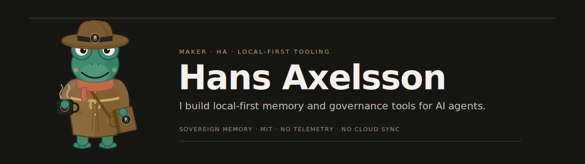

<!-- GitHub profile README — drop into your `<username>/<username>` repo.
     Banner is a self-contained dark SVG; it reads on light or dark GitHub themes. -->

### Hi, I'm Hans — HA 🐸

I build **local-first** tooling for AI agents: software that runs on your machine, keeps your data on your machine, and is honest about what it can and can't do yet.

The main one is **[Sovereign Memory](https://github.com/infektyd/sovereign-memory)** — a memory and governance layer that gives long-running agents durable, auditable memory with no cloud sync and no telemetry. Identity loads whole; knowledge loads chunked, cited; nothing reaches permanent memory without an explicit, operator-gated proposal.

**What I optimize for**

- **Honest maturity** — alpha is labeled alpha, stable means tested and relied upon.
- **No silent writes** — durable learning is proposal-first, never automatic.
- **Evidence over vibes** — a claim without a source is a guess.
- **Delete complexity** — if a simpler model achieves the same recovery quality, the complex one goes.

The frog scholar is my maker's mark — a reminder that real software is built by a real person who reads the code and runs the tests. The product carries the **HA** monogram; the frog carries the personality.

Local-first · no telemetry · MIT · building in the open.
