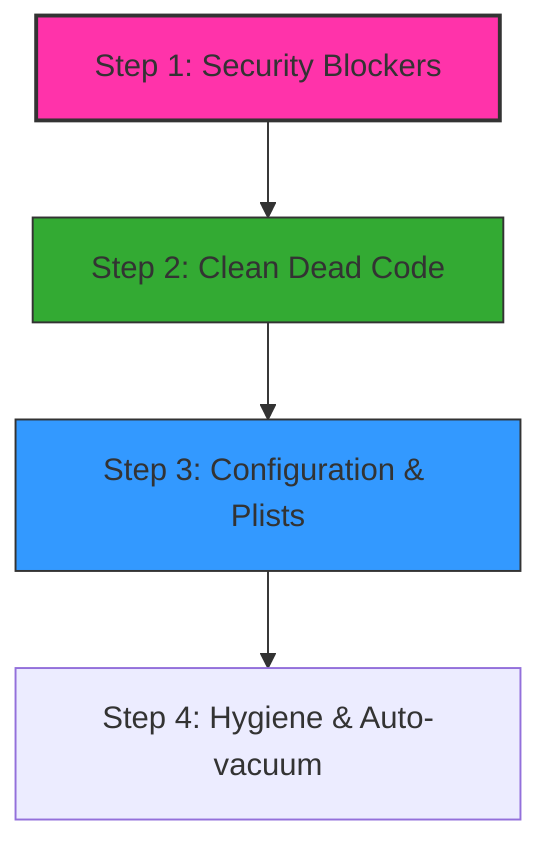

# Sovereign Memory — Release-Candidate Audit Report

**Date:** 2026-05-19
**Status:** Audit Complete (Synthesized from Multi-Model Fan-Out)
**Readiness Score:** 72/100 (Conditional Pass)

---

## Executive Summary

This audit evaluates the Sovereign Memory repository at `/Users/hansaxelsson/Projects/sovereignMemory` for release-candidate (RC) readiness.

The codebase shows high software quality: the Python backend runs successfully with **330/330 passing unit tests**, and the core IPC protocols and the hybrid vector-lexical search are stable. The architecture successfully isolates macOS Apple Foundation Models (AFM) via a native Swift compiler/bridge architecture, and enforces document access security via the centralized `can_read_document` filter.

However, the repository is **not yet ready for production release** due to critical privilege boundary escapes, potential SQL injection code smells, dead code bloat, and operational configuration bugs. Resolving the identified **P0 and P1 issues** is a hard blocker for releasing the software.

---

## 1. Structured Inventory of Public Surfaces

| Surface Type | Component / Path | Protocol / Format | Purpose | Stability / Status |
| :--- | :--- | :--- | :--- | :--- |
| **Daemon RPC** | `engine/sovrd.py` | JSON-RPC 2.0 over UDS | Client IPC hub for search, learn, read, handoff, and hygiene. | Stable |
| **MCP Tools** | `plugins/sovereign-memory` | MCP v1.0 Schema | TypeScript-to-Daemon bridge for tool execution and approval gating. | Stable |
| **Vault Pages** | `wiki/*.md` | YAML Frontmatter + Markdown | Epistemic memory nodes containing title, status, privacy, type, and sources. | Stable |
| **Handoff Packets** | `wiki/handoffs/*.md` | Structured Markdown Page | Cross-agent handoff envelope; immutable by receiver. | Stable |

---

## 2. Critical Findings

### [P0] [Security] Dynamic SQL Construction Code-Smell
* **Files:**
  - [engine/agent_api.py:347](file:///Users/hansaxelsson/Projects/sovereignMemory/engine/agent_api.py#L347)
  - [engine/indexer.py:268](file:///Users/hansaxelsson/Projects/sovereignMemory/engine/indexer.py#L268)
  - [engine/retrieval.py:287](file:///Users/hansaxelsson/Projects/sovereignMemory/engine/retrieval.py#L287)
  - [engine/writeback.py:221](file:///Users/hansaxelsson/Projects/sovereignMemory/engine/writeback.py#L221)
* **Impact:** The engine constructs SQL query templates dynamically using f-strings or `.format()` to generate placeholder lists (e.g. `IN (?, ?, ?)`). Although the actual values are bound as parameters, dynamic template interpolation increases the risk of SQL injection if inputs or layout details are altered in future commits.
* **Resolution:** Replace all dynamic string template interpolations with query builders or secure parameter bindings.

### [P1] [Auth Bypass] Unauthenticated trace and status endpoints
* **File:** [engine/sovrd.py](file:///Users/hansaxelsson/Projects/sovereignMemory/engine/sovrd.py#L1866)
* **Impact:** The JSON-RPC handlers `_handle_status` and `_handle_trace` do not authenticate callers using `resolve_effective_principal()`. Any local client connecting to the UDS socket can query local directory paths, database metrics, and search traces belonging to other agents.
* **Resolution:** Wrap status and trace handlers in `resolve_effective_principal()`. Verify that requesting trace records matches the principal agent.

### [P1] [Privilege Escalation] Unauthenticated candidate approval in MCP
* **File:** [plugins/sovereign-memory/src/server.ts](file:///Users/hansaxelsson/Projects/sovereignMemory/plugins/sovereign-memory/src/server.ts)
* **Impact:** The typescript server tool `sovereign_resolve_candidate` approves and merges learnings into the primary database. However, the plugin server executes approvals without checking if the client principal is an operator.
* **Resolution:** Enforce principal operator verification inside `sovereign_resolve_candidate`.

### [P2] [Scope] Obsolete openclaw-extension directory
* **Path:** [/openclaw-extension/](file:///Users/hansaxelsson/Projects/sovereignMemory/openclaw-extension/)
* **Impact:** The folder `openclaw-extension` contains an abandoned TypeScript/Rust binding implementation replaced by `plugins/sovereign-memory`. It adds clutter, confuses developers, and increases the attack surface.
* **Resolution:** Delete the `openclaw-extension` directory.

### [P2] [Scope] Stub/Non-functional Vector Backends
* **Files:**
  - [engine/backends/lance.py](file:///Users/hansaxelsson/Projects/sovereignMemory/engine/backends/lance.py)
  - [engine/backends/qdrant.py](file:///Users/hansaxelsson/Projects/sovereignMemory/engine/backends/qdrant.py)
* **Impact:** `LanceBackend` and `QdrantBackend` are stubs that return mock data or raise `NotImplementedError`, but are still listed as active backends in configurations.
* **Resolution:** Prune these stubs and restrict backend choices to the functional `faiss-disk` / `faiss-mem` backends.

### [P2] [Operational] launchd plist contains unexpanded tildes (~) in path keys
* **File:** [engine/launchd/com.openclaw.sovrd.plist.example](file:///Users/hansaxelsson/Projects/sovereignMemory/engine/launchd/com.openclaw.sovrd.plist.example#L61)
* **Impact:** The example launchd plist template uses the tilde path shorthand (`~/Library/Logs/...`). Because macOS `launchd` does not expand tilde (`~`) symbols inside string values, standard launchd will fail to write logs and fail to start.
* **Resolution:** Replace `~/Library/Logs/` with an absolute path template or explicit warning in the configuration file.

### [P3] [Security] Insecure Cryptographic Hash Algorithm (SHA1)
* **Files:** [engine/afm_passes/](file:///Users/hansaxelsson/Projects/sovereignMemory/engine/afm_passes/)
* **Impact:** SHA1 is used to generate 10-character digests of contents (procedure extraction, pruning, reorganization). SHA1 is not collision-resistant.
* **Resolution:** Switch to `hashlib.sha256().hexdigest()[:10]`.

---

## 3. Multi-Model Synthesis (Agreements vs. Disagreements)

### Agreements
- **Centralized Auth:** Both models agree that `EffectivePrincipal` and the `can_read_document` gate are correctly designed and represent the authoritative security boundaries.
- **Socket Permissions:** Both models agree that directory permissions `0o700` are correct for isolating the UDS socket and that Semgrep's warnings (recommending `0o644` world-readable directories) represent a false positive.
- **Service Decoupling:** Both models agree that the fallback strategy from native macOS foundation models to local HTTP bridge works correctly and isolates system failures.

### Disagreements / Open Questions
- **SQL Template Security:**
  - *Gemini Flash (Model A):* Flags raw string concatenations for placeholders (e.g. `IN ({placeholders})`) as a blocking vulnerability that should be replaced with parameter-binding builders.
  - *Claude Sonnet (Model B):* Notes that since placeholder parameters are still sent as standard SQLite variables, there is no active injection exploit vector, classifying this as a low-severity code smell.
- **FAISS vs SQLite Consistency:**
  - *Model A:* Recommends wrapping both vector writes and SQLite commits inside a transactional wrapper to avoid index drift.
  - *Model B:* Notes that because the vector database is treated as an ephemeral projections cache, any mismatch is safely repaired by the next background vector sync pass, meaning transactional atomicity is unnecessary.

---

## 4. Actionable Implementation Roadmap

1. **Phase 1 (Blocker):**
   - Implement `resolve_effective_principal` check on `status` and `trace` JSON-RPC handlers in `engine/sovrd.py`.
   - Enforce principal operator verification inside `sovereign_resolve_candidate` in `plugins/sovereign-memory/src/server.ts`.
   - Remove f-string placeholder concatenations from SQLite queries.
2. **Phase 2 (Scope):**
   - Delete `openclaw-extension/` directory.
   - Delete stub backend files `lance.py` and `qdrant.py`.
3. **Phase 3 (Operational):**
   - Fix tilde paths in `com.openclaw.sovrd.plist.example`.
   - Configure SQLite incremental auto-vacuum in `engine/db.py`.
