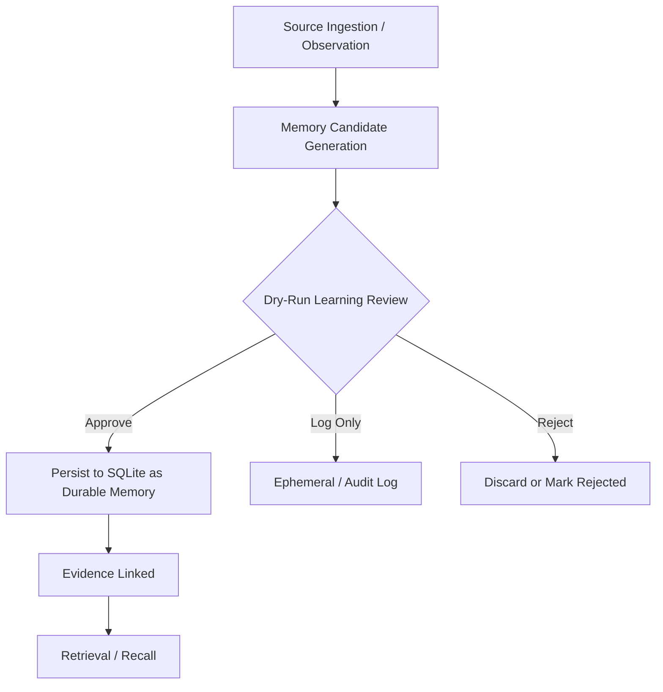

# Sovereign Memory Architectural Review and Staged Roadmap

**Historical review based on repo inspection (commit ~4f7e1fb).** The current
public docs supersede stale status claims in this note.

## SECTION 1 — CURRENT STATE ASSESSMENT

**Architectural Strengths:**
- Strong local-first philosophy with SQLite as single source of truth (WAL mode, migrations via db.py).
- Hybrid retrieval (FTS5 + FAISS + rerank) in retrieval.py.
- Layered memory model (identity whole, knowledge chunked) clearly articulated in docs.
- Daemon (sovrd.py) with JSON-RPC, plugin MCP surface for multiple agents.
- Human-readable Obsidian vaults as derived surface.
- Dry-run AFM passes for self-organization, now backed by explicit AFM provider
  modes including native Apple Foundation Models where available.
- Detailed security planning and engineering review docs.

**Risks and Gaps:**
- Earlier security findings covered incomplete principal binding, caller-controlled
  params, prompt-injection fencing, and socket permissions. Current public docs
  describe the closed core gaps; this roadmap remains a historical reference.
- Human approval workflow and review UI remain areas for continued product polish.
- Redaction/privacy boundaries should continue to be regression-tested as new
  providers and surfaces are added.
- Evaluation harness present but needs expansion for regression on governance flows.

(Continuing with other sections...)

## Memory Lifecycle (Mermaid)

## Recommended Next Steps
See full roadmap in subsequent sections.
