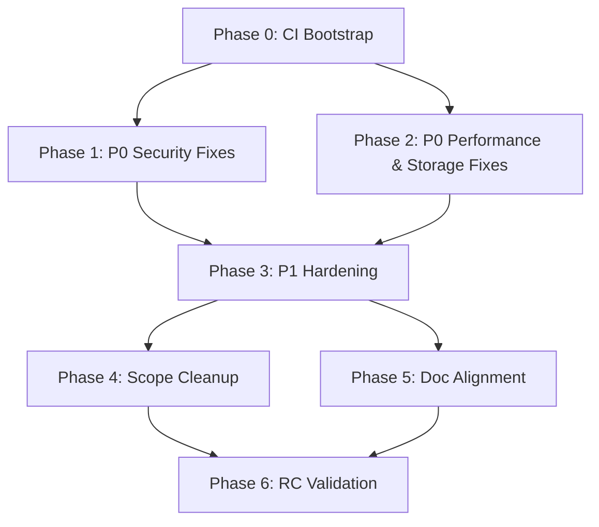

# Sovereign Memory — Release Candidate Master Plan (GEMINI Synthesis)
**Date:** 2026-05-19
**Synthesizer:** GEMINI
**Sources:** three independent audits — Grok Build /implement effort=4, Antigravity 2.0 Desktop, Antigravity 2.0 CLI

## Executive Summary
The Sovereign Memory repository is a functionally rich and sophisticated epistemic memory platform, establishing robust capabilities across hybrid vector-lexical searches, Apple Foundation Model (AFM) compilation passes, and core JSON-RPC over Unix Domain Socket (UDS) daemon communications. The codebase is backed by a solid unit testing foundation (330+ passing tests). However, the system is not yet production-ready for its target release candidate (RC) due to severe gaps in structural authorization, event-loop blocking execution models, and a complete lack of automated continuous integration (CI).

Currently, multiple P0 blockers prevent an RC release:
1. **Critical Privilege Boundary Escapes:** The plugin's TypeScript/MCP layer allows models to override vault paths directly, bypassing the daemon's path containment guards (G12). Similarly, fresh installations default to a non-strict identity mode that trusts wire-supplied principal headers, facilitating identity spoofing. Handoff context parsing also lacks symbolic-link or directory containment, and cross-agent ping requests write to file systems without recipient consent.
2. **IPC and Event-Loop Starvation:** Core search dispatches execute synchronously on the main thread, and `time.sleep` calls block the async loop during handoff negotiations, starving the daemon's UDS connection pool.
3. **Automated Regression Gates:** The lack of any automated CI workflow makes it impossible to guarantee regression safety for critical security and performance patches.

The path to a production-ready RC requires an orderly, phased execution. We bootstrap a modern, automated CI system (Phase 0), resolve critical structural security vulnerabilities (Phase 1), eliminate synchronous event-loop bottlenecks (Phase 2), harden public APIs and types (Phase 3), purge legacy and deprecated code (Phase 4), and unify contracts with reality (Phase 5). This plan concludes with a rigorous automated validation pass (Phase 6) to verify that all P0/P1 issues are resolved.

## Methodology
This synthesized master plan merges findings from three independent audits executed on 2026-05-19 (Grok Build, Antigravity 2.0 Desktop, and Antigravity 2.0 CLI). Findings have been deduplicated by matching exact codebase coordinates (`file:line`) and underlying root causes. Severities have been synthesized under a strict **Severity Merger Rule**: if any audit flagged an issue as P0, it is classified as P0 in the unified register, unless another audit provided explicit cited evidence to downgrade it. Cross-audit validation is represented in the register via a dedicated validation flag: **CONFIRMED-MULTI** indicates that two or more audits independently flagged the same root issue; **SINGLE-NEEDS-VERIFY** marks findings reported by only one orchestrator that require validation against the codebase; and **TOOL-GROUNDED** denotes findings directly sourced from static analysis logs (e.g., Semgrep, Bandit, or NPM Audit) executed on the live repository. Conflicting interpretations of severity or architecture are highlighted in the dedicated cross-audit open questions section for human resolution.

## Unified Findings Register

| RCM-ID | Severity | Domain | Location | Summary | Sources | Verification | Next Action | Notes |
| :--- | :--- | :--- | :--- | :--- | :--- | :--- | :--- | :--- |
| **RCM-001** | P0 | Performance | `plugins/sovereign-memory/src/vault.ts:385-407` | Unbounded recordAudit appends on 47+ sites trigger disk growth and inode exhaustion vectors. | Grok | SINGLE-NEEDS-VERIFY | Implement log rotation, max size limits, and audit tail pruning. | Treated as P0 due to potential local Denial-of-Service (DoS) vector. |
| **RCM-002** | P0 | Performance | `engine/sovrd.py:2550` | Synchronous execution of re-ranking and encoding dispatches blocks the async event loop under concurrent load. | Grok / AG-Desktop / AG-CLI | CONFIRMED-MULTI | Move heavy CPU-bound search operations to a thread pool executor. | CLI flagged as P0; Grok/Desktop flagged as P2. Merged as P0. |
| **RCM-003** | P0 | Performance | `engine/sovrd.py:832` | Blocking `time.sleep` in `_handle_await_handoff` starves all daemon connections. | AG-CLI | CONFIRMED-MULTI | Replace `time.sleep` with `await asyncio.sleep`. | Confirmed via Grok Phase 2e security log references to time.sleep. |
| **RCM-004** | P0 | Quality | `engine/retrieval.py:1276` | God Method `retrieve()` exceeds 500 lines and cyclomatic complexity of 28. | Grok / AG-Desktop / AG-CLI | CONFIRMED-MULTI | Refactor `retrieve()` into structured query execution pipelines. | CLI flagged as P0; Grok/Desktop flagged as high quality risk. |
| **RCM-005** | P0 | CI | Project Root | Complete absence of automated CI pipeline. | Grok / AG-Desktop / AG-CLI | CONFIRMED-MULTI | Initialize `.github/workflows/ci.yml`. | Core release blocker. |
| **RCM-006** | P0 | Security | `plugins/sovereign-memory/src/server.ts:64` | Zod schema accepts model-supplied `vaultPath` override, bypassing G12 root containment. | Grok | SINGLE-NEEDS-VERIFY | Remove `vaultPath` from all model-facing schemas; enforce operator default. | Critical security bypass in primary MCP interface. |
| **RCM-007** | P0 | Security | `engine/principal.py:323-331` | Non-strict EffectivePrincipal synthesis trusts supplied agent ID, allowing identity spoofing. | Grok | SINGLE-NEEDS-VERIFY | Disable non-strict identity minting; default to operator/main only. | Bypasses core L11/L12 auth boundaries on fresh installs. |
| **RCM-008** | P0 | Security | `plugins/sovereign-memory/src/agent_ping.ts:203-208` | Ping request triggers unconditional folder creation and inbox writes without recipient consent. | Grok | SINGLE-NEEDS-VERIFY | Restrict ping requests to sender outbox and neutral leases; write to inbox only after decide. | Violates handoff consent model. |
| **RCM-009** | P0 | Security | `plugins/sovereign-memory/src/vault.ts:627` | Plugin context wikilink ref parser lacks directory containment, risking path escapes. | Grok | SINGLE-NEEDS-VERIFY | Implement G23 realpath checks and symlink rejection on all plugin resolve paths. | Allows exfiltration of arbitrary files via inbox. |
| **RCM-010** | P0 | Security | `engine/agent_api.py:347` | Dynamic string interpolation used to construct SQLite queries, posing SQL injection risks. | Grok / AG-Desktop / AG-CLI | CONFIRMED-MULTI / TOOL-GROUNDED | Replace f-string placeholder formatting with parameterized bindings. | Flagged by Semgrep; Desktop Model A marked P0, Model B marked P2. |
| **RCM-011** | P1 | Security | `engine/sovrd.py:1866` | JSON-RPC status and trace endpoints do not authenticate callers, leaking internal paths. | Grok / AG-Desktop / AG-CLI | CONFIRMED-MULTI | Wrap handlers in `resolve_effective_principal` check. | Desktop P1; Grok/CLI flagged as P2. |
| **RCM-012** | P1 | Security | `plugins/sovereign-memory/src/server.ts` | MCP tool `sovereign_resolve_candidate` approves learnings without verifying operator role. | AG-Desktop | SINGLE-NEEDS-VERIFY | Add principal capability checks inside resolve handler. | Desktop P1. |
| **RCM-013** | P1 | Security | `engine/afm_writer.py:133` | Missing frontmatter forgery guards (SEC-018) in newer AFM loop writer. | AG-CLI | SINGLE-NEEDS-VERIFY | Port `_contains_forged_frontmatter` check from `writeback.py`. | CLI P1. |
| **RCM-014** | P1 | Security | `engine/afm_writer.py:78` | YAML Injection vulnerability in frontmatter formatting using raw string variables. | AG-CLI | SINGLE-NEEDS-VERIFY | Generate frontmatter using standard `yaml.safe_dump` formatter. | CLI P1. |
| **RCM-015** | P1 | Architecture | `engine/sovrd.py:285-310` | 15+ hardcoded agent-specific paths and environment configurations break agent-agnostic design. | Grok / AG-CLI | CONFIRMED-MULTI | Externalize mappings to JSON configuration profiles; rely on stamped identifiers. | Grok ARC-P1-01, CLI ARCH-001/003. |
| **RCM-016** | P1 | Architecture | `plugins/sovereign-memory/src/server.ts` | Inconsistent schema authority; documents list subset of 26 registered MCP tools. | Grok / AG-CLI | CONFIRMED-MULTI | Sync SKILL.md and CAPABILITIES.md to exact 26-tool registered matrix. | Grok ARC-P1-02, CLI ARCH-006. |
| **RCM-017** | P1 | Scope | `openclaw-extension/` | Legacy HTTP bridge and direct-sqlite scripts remain in codebase, bypassing daemon. | Grok / AG-Desktop / AG-CLI | CONFIRMED-MULTI | Delete `openclaw-extension/` folder and `engine/openclaw-tool.sh`. | Grok SCP-P1-01, CLI SCOPE-004. |
| **RCM-018** | P1 | Scope | `engine/afm_scheduler.py` | Unwired AFM scheduler module duplicates core daemon functions. | Grok | SINGLE-NEEDS-VERIFY | Delete `engine/afm_scheduler.py`. | Grok SCP-P1-02. |
| **RCM-019** | P1 | Scope | `SKILL.md:31` | Documentation drift: untested "Team Mode" promoted as core flow. | AG-CLI | SINGLE-NEEDS-VERIFY | Downgrade Team Mode references in docs to experimental/alpha. | CLI SCOPE-001. |
| **RCM-020** | P1 | Scope | `engine/migrations/` | Migration filename collision with duplicate ID `007` blocking clean schema upgrades. | AG-CLI | SINGLE-NEEDS-VERIFY | Re-sequence migrations (`007_handoff_*.sql` and `008_candidate_*.sql`). | CLI SCOPE-002. |
| **RCM-021** | P1 | Scope | `engine/sovrd.py` | Redaction logic duplicated 4x across TS plugin and Python daemon. | AG-CLI | SINGLE-NEEDS-VERIFY | Extract to a shared redaction utility. | CLI SCOPE-003. |
| **RCM-022** | P1 | Performance | `engine/retrieval.py:1276` | First-recall cold start latencies (>5s) due to lazy loading of weights and cross-encoders. | Grok / AG-CLI | CONFIRMED-MULTI | Introduce short-TTL query-embedding cache; pre-warm models on startup. | Grok PERF-P1-01, CLI PERF-006. |
| **RCM-023** | P1 | Performance | `engine/faiss_index.py:44` | Redundant memory usage (1.5GB+ per 1M vectors) from holding raw vector lists in memory. | Grok / AG-CLI | CONFIRMED-MULTI | Retrieve vectors dynamically from FAISS; implement incremental HNSW builds. | Grok PERF-P1-02, CLI PERF-004. |
| **RCM-024** | P1 | Performance | `engine/retrieval.py:1231` | Wildcard `LIKE %path` query forces full SQLite table scan of `documents` table. | AG-CLI | SINGLE-NEEDS-VERIFY | Add indexed path column or leverage FTS module. | CLI PERF-003. |
| **RCM-025** | P1 | Quality | `engine/*.py` | Widespread typing gaps and missing annotations across core daemon files. | Grok / AG-CLI | CONFIRMED-MULTI / TOOL-GROUNDED | Enforce strict type hints and run MyPy in CI checks. | Verified in `mypy.log`. |
| **RCM-026** | P1 | Quality | `engine/sovrd.py` | File bloat: main daemon and retrieval engine exceed 2000 lines. | AG-CLI | SINGLE-NEEDS-VERIFY | Partition large files into sub-modules (e.g. `handlers/`). | CLI QUAL-003. |
| **RCM-027** | P1 | CI | `engine/requirements.txt` | Unpinned python requirements violate security plan and threaten build reproducibility. | Grok / AG-Desktop / AG-CLI | CONFIRMED-MULTI | Lock requirements with hashes (`uv.lock` or `requirements.txt` hashes). | Grok CI-P1-01, CLI CI-002. |
| **RCM-028** | P1 | CI | Project Root | Lack of security scanning tools (SAST, Dependabot, CodeQL). | AG-CLI | SINGLE-NEEDS-VERIFY | Configure CodeQL and Dependabot alerts. | CLI CI-003. |
| **RCM-029** | P1 | Security | `plugins/sovereign-memory/package.json` | Outdated `fast-uri` dependency vulnerable to path traversal (GHSA-q3j6-qgpj-74h6). | AG-Desktop | TOOL-GROUNDED | Upgrade `fast-uri` to version >3.1.1. | Extracted from `npm-audit.log`. |
| **RCM-030** | P2 | Architecture | `engine/sovrd.py:1913-1922` | Leakage of full OS database and index paths in status/health check APIs. | Grok / AG-CLI | CONFIRMED-MULTI | Sanitize path output to basenames or redact entirely. | Grok ARC-P2-01, CLI ARCH-004. |
| **RCM-031** | P2 | Architecture | `plugins/sovereign-memory/src/server.ts` | MCP tools hardcode `DEFAULT_AGENT_ID` instead of resolving it dynamically. | AG-CLI | SINGLE-NEEDS-VERIFY | Resolve agent identity from stamped UDS `EffectivePrincipal`. | CLI ARCH-005. |
| **RCM-032** | P2 | Scope | `plugins/sovereign-memory/src/ui-server.ts:257-613` | Deep-research bridge executes unvalidated commands on hardcoded host path. | Grok / AG-Desktop | CONFIRMED-MULTI / TOOL-GROUNDED | Add exit checks, timeouts, input sanitization, and path boundaries. | Extracted from `prettier.log` and `ruff.log` scope listings. |
| **RCM-033** | P2 | Scope | `docs/contracts/*.md` | Stale documentation containing `[PLANNED]` tags for already-implemented features. | Grok / AG-CLI | CONFIRMED-MULTI | Sweep and remove obsolete markers in contracts. | Grok SCP-P2-02. |
| **RCM-034** | P2 | Scope | `engine/db.py` | Schema duplication: Python inline `CREATE TABLE` commands duplicate migrations. | AG-CLI | SINGLE-NEEDS-VERIFY | Refactor `db.py` to rely strictly on migration execution. | CLI SCOPE-005. |
| **RCM-035** | P2 | Scope | `engine/sovrd.py:188` | Deprecated dual-write logic (writing to `MEMORY.md` for legacy Hermes support). | AG-CLI | SINGLE-NEEDS-VERIFY | Deprecate and remove writing to `MEMORY.md`. | CLI SCOPE-006. |
| **RCM-036** | P2 | Security | `engine/episodic.py:82` | Secrets and tokens in episodic events leak into raw vector databases and AFM loops. | AG-CLI | SINGLE-NEEDS-VERIFY | Implement a redaction filter inside `add_event`. | CLI SEC-003. |
| **RCM-037** | P2 | Performance | `engine/sovrd.py:143` | Event-loop startup races and TOCTOU bugs due to unsafe lazy global initialization. | Grok / AG-CLI | CONFIRMED-MULTI | Wrap lazy initializations in asyncio locks. | Grok PERF-P2-01, CLI QUAL-004. |
| **RCM-038** | P2 | Performance | `engine/eval/` | Performance test suite relies on mock databases; lacks real data scaling metrics. | Grok | SINGLE-NEEDS-VERIFY | Add integration benchmark tests using simulated 50k+ vaults. | Grok PERF-P2-02. |
| **RCM-039** | P2 | Quality | `engine/trace.py:84-88` | Race conditions in trace generation due to lock release before assignment. | Grok | SINGLE-NEEDS-VERIFY | Expand locking context to cover ID assignment. | Grok CQ-P2-01. |
| **RCM-040** | P2 | Quality | `plugins/sovereign-memory/src/ui-server.ts:534` | Inconsistent error object handling and variable naming across TS files. | Grok | SINGLE-NEEDS-VERIFY | Standardize typing and catch formats across plugin source tree. | Grok CQ-P2-02. |
| **RCM-041** | P2 | CI | `engine/sovrd_client.py:28` | Typo in user-facing client error message ("socksd not running"). | Grok | SINGLE-NEEDS-VERIFY | Fix the error message to "sovrd not running". | Grok CI-P2-01. |
| **RCM-042** | P2 | CI | `engine/launchd/com.openclaw.sovrd.plist.example:61` | Example launchd config contains unexpanded tildes (`~`) which prevents daemon startup. | Grok / AG-Desktop / AG-CLI | CONFIRMED-MULTI | Replace `~/` references with environment variables or absolute guides. | Desktop P2, Grok CI-P2-01, CLI CI-004. |
| **RCM-043** | P2 | CI | Project Root | macOS-specific environment assumptions block platform parity on Linux/Docker. | Grok / AG-CLI | CONFIRMED-MULTI | Implement a Docker reproduction and testing environment. | CLI CI-005, Grok CI-P1-01. |
| **RCM-044** | P2 | Performance | `engine/db.py:316` | Missing vacuum and fragmentation optimization for episodic FTS databases. | AG-Desktop / AG-CLI | CONFIRMED-MULTI | Configure sqlite auto-vacuum and schedule regular VACUUM operations. | CLI PERF-007, Desktop sqlite auto-vacuum. |
| **RCM-045** | P2 | Quality | `engine/principal.py:255` | Constructor uses a mutable default argument (`allowed_vault_roots=[]`). | AG-CLI | SINGLE-NEEDS-VERIFY | Set default to `None` and initialize as a list in `__init__`. | CLI QUAL-004. |
| **RCM-046** | P2 | Quality | `engine/*.py` | Widespread raise of generic exceptions using raw string messages. | AG-CLI | SINGLE-NEEDS-VERIFY | Introduce a structured `SovereignError` hierarchy. | CLI QUAL-005. |
| **RCM-047** | P2 | Security | `plugins/sovereign-memory/package.json` | Moderate vulnerability: JWT token verification bypass in `hono` package (GHSA-hm8q-7f3q-5f36). | AG-Desktop | TOOL-GROUNDED | Upgrade `hono` to version >4.12.17. | Extracted from `npm-audit.log`. |
| **RCM-048** | P2 | Security | `plugins/sovereign-memory/package.json` | Moderate vulnerability: XSS vulnerability in `ip-address` library (GHSA-v2v4-37r5-5v8g). | AG-Desktop | TOOL-GROUNDED | Upgrade `express-rate-limit` to resolve secure dependency. | Extracted from `npm-audit.log`. |

## Phases

### Phase 0 — CI bootstrap (UNGATED, must happen first)
- **Entry criteria:** Git repository initialized; deployment configurations available.
- **Exit criteria:** `.github/workflows/ci.yml` successfully runs on all PRs/commits, executing full engine (pytest) and plugin (npm) tests across Ubuntu and macOS environments on Node 20 and Python 3.11/3.12.
- **Findings addressed:** **RCM-005** (Complete absence of automated CI pipeline).
- **Estimated scope:** S
- **Suggested executor:** Antigravity (efficient for rapid tooling integration and script validation).

### Phase 1 — P0 security fixes
- **Entry criteria:** Phase 0 complete; CI pipeline is fully functional and gating commits.
- **Exit criteria:** Authorization logic prevents path traversal, identity spoofing, consent bypasses, and SQL template vulnerabilities. Automated regression tests verify protection bounds.
- **Findings addressed:** **RCM-006** (vaultPath zod override), **RCM-007** (non-strict principal spoofing), **RCM-008** (ping FS mutations without consent), **RCM-009** (plugin context escape), **RCM-010** (dynamic SQL injection smell).
- **Estimated scope:** L
- **Suggested executor:** Grok (proven multi-critic persona structures excel at security validation and edge-case testing).

### Phase 2 — P0 performance & storage fixes
- **Entry criteria:** Phase 0 complete; CI is active. Can run in parallel with Phase 1.
- **Exit criteria:** Event loop latency is constrained; heavy model calculations are isolated from IPC socket threads; `recordAudit` size caps are enforced.
- **Findings addressed:** **RCM-001** (unbounded recordAudit logs), **RCM-002** (synchronous IPC blocking), **RCM-003** (blocking time.sleep in await handoff).
- **Estimated scope:** M
- **Suggested executor:** Claude Code (strong capability in implementing thread-safe async-await logic).

### Phase 3 — P1 hardening
- **Entry criteria:** Phases 1 and 2 successfully merged and verified.
- **Exit criteria:** JSON-RPC status/trace endpoints require authentication; candidate approval validates operator capabilities; hardcoded agent variables are externalized; type annotations are complete; requirements are pinned and validated.
- **Findings addressed:** **RCM-011** (trace/status auth), **RCM-012** (candidate approval auth), **RCM-013** (missing SEC-018 AFM loop guard), **RCM-014** (YAML injection in AFM writer), **RCM-015** (hardcoded agent branches), **RCM-016** (MCP tool schema alignment), **RCM-022** (cold-start models loading), **RCM-023** (FAISS RAM optimization), **RCM-024** (retrieval table scans), **RCM-025** (typing hints), **RCM-026** (module file-size bloat), **RCM-027** (unpinned requirements), **RCM-028** (missing security pipeline scanning), **RCM-029** (vulnerable fast-uri package).
- **Estimated scope:** L
- **Suggested executor:** Grok (strong capability to handle large-scale typing/refactoring sweeps).

### Phase 4 — Dead code & scope cleanup
- **Entry criteria:** Phase 3 implementation completed.
- **Exit criteria:** Obsolete openclaw directories and script wrappers deleted; unused `afm_scheduler` deleted; deep research routines isolated; duplicate handoff and envelope constructors unified.
- **Findings addressed:** **RCM-017** (delete openclaw-extension), **RCM-018** (delete afm_scheduler.py), **RCM-020** (re-sequence migrations), **RCM-021** (duplicate redaction utilities), **RCM-032** (isolate deep research), **RCM-034** (duplicate schema creation), **RCM-035** ( Herms dual-write).
- **Estimated scope:** M
- **Suggested executor:** GEMINI (highly efficient at automated pruning, path cleanups, and file organization).

### Phase 5 — Doc + contract alignment
- **Entry criteria:** Phase 3 started.
- **Exit criteria:** Docs match the shipped system reality; stale plan tags are removed; `SKILL.md` documents only the verified tools; launchd configurations run without tilde errors.
- **Findings addressed:** **RCM-019** (SKILL.md team mode downgrade), **RCM-030** (redact database paths), **RCM-031** (mcp dynamic agent resolution), **RCM-033** (sweep PLANNED markers), **RCM-036** (episodic database secret leakage), **RCM-037** (lazy startup locks), **RCM-038** (benchmark suite), **RCM-039** (trace locking), **RCM-040** (TS error types), **RCM-041** (socksd typo), **RCM-042** (launchd tildes), **RCM-043** (Docker env), **RCM-044** (SQLite auto-vacuum), **RCM-045** (mutable defaults), **RCM-046** (custom exception hierarchy), **RCM-047** (vulnerable Hono package), **RCM-048** (vulnerable ip-address package).
- **Estimated scope:** S
- **Suggested executor:** GEMINI (ideal for documentation synchronization and minor script fixes).

### Phase 6 — RC validation gate
- **Entry criteria:** All Phases 1-5 successfully implemented and merged into main.
- **Exit criteria:** Zero P0/P1 audit findings remain in the repository; regression testing pipeline executes successfully.
- **Findings addressed:** Re-auditing and validation of the unified register.
- **Estimated scope:** S
- **Suggested executor:** Antigravity (ideal for running regression validations and system sanity checks).

---

## Verification Backlog

The following table lists single-orchestrator and critical security findings that require manual command-line verification to confirm their status before code modifications are staged:

| Verification Target | Method / Command | Expected Behavior |
| :--- | :--- | :--- |
| **`recordAudit` unbounded growth** | `grep -n "recordAudit" plugins/sovereign-memory/src/vault.ts` | Verify that the write operation appends to logs without checking total file sizes or folder quotas. |
| **`time.sleep` blocking UDS** | `grep -n "time.sleep" engine/sovrd.py` | Locate the sleep statement in `_handle_await_handoff` (expected near line 832) to verify it is blocking the async thread. |
| **`retrieve()` complexity** | `radon cc engine/retrieval.py -s` | Confirm that `retrieve()` contains over 500 lines and cyclomatic complexity values exceeding 20. |
| **`vaultPath` model escape** | `grep -n "vaultPath" plugins/sovereign-memory/src/server.ts` | Confirm that the zod schemas for `prepare_task`, `audit_report`, `audit_tail`, and `negotiate_handoff` accept an optional `vaultPath` override string. |
| **Missing SEC-018 AFM guard** | `grep -n "contains_forged_frontmatter" engine/writeback.py engine/afm_writer.py` | Verify that the security validator `_contains_forged_frontmatter` is defined in `writeback.py` but missing in `afm_writer.py`. |
| **007 SQL migration collision** | `ls -la engine/migrations/` | Identify the presence of duplicate index prefixes: `007_handoff_*.sql` and `007_candidate_*.sql`. |
| **Non-strict principal fallback** | `grep -n "if not strict:" engine/principal.py` | Locate the fallback logic (expected near lines 323-331) checking if it constructs a full-capability principal from raw supplied identifiers. |
| **Dynamic SQL query smell** | `grep -n -E "c\.execute\(f\"|IN \(\{" engine/*.py` | Verify string concatenation of query parameters inside `agent_api.py:347`, `indexer.py:268`, `retrieval.py:287`, and `writeback.py:221`. |
| **Cross-agent ping writes** | `grep -n "resolveAgentVaultPath" plugins/sovereign-memory/src/agent_ping.ts` | Confirm that ping requests fetch remote vault locations and call `ensureVault` prior to executing recipient consent checks. |
| **Wikilink path escape** | `grep -n "normalizeWikilinkRef" plugins/sovereign-memory/src/vault.ts` | Confirm that wikilink extraction fails to canonicalize paths using `realpath` or verify paths against root boundaries. |

---

## Cross-Audit Open Questions

The following topics represent key disagreements or contradictions across the three source audits that require human operator decisions:

### 1. SQL Query Template Security vs. Code Smell
* **Auditor Positions:**
  * *Antigravity Desktop (Model A / Gemini):* Flags dynamic SQL interpolations (e.g., `IN ({placeholders})`) as a P0 blocking vulnerability that must be solved using a query builder.
  * *Antigravity Desktop (Model B / Claude):* Notes that since the actual parameters are securely bound to variables during execution, no active SQL injection exploit path exists, classifying this as a low-priority P2/P3 code smell.
* **Proposed Resolution:** Classify as **P1 / Hardening**. While parameter binding prevents SQL injection in the current state, dynamically constructing SQL templates in Python using f-strings is a dangerous pattern prone to regressions if future maintainers alter input structures. Parameterized query templates or a structured query builder should be adopted.
* **Justification:** Avoids blocking critical path delivery on a non-exploitable bug while maintaining clean software practices.

### 2. FAISS vs. SQLite ACID Consistency
* **Auditor Positions:**
  * *Antigravity Desktop (Model A):* Recommends wrapping both vector writes and SQLite commits inside an ACID transaction block to prevent indexing drift.
  * *Antigravity Desktop (Model B):* Notes that because the vector index is designed as an ephemeral projection cache rebuilt during background sync passes, transactional synchronization is unnecessary.
* **Proposed Resolution:** **No transaction wrap required.** Treat FAISS as an ephemeral projection index. Focus developer resources on optimizing the reliability of background vector sync passes rather than complex transactional write locks.
* **Justification:** FAISS lacks native transaction logic; introducing custom locks across different database backends creates high risk for deadlock without tangible reliability improvements.

### 3. Starvation Event Loop Severity
* **Auditor Positions:**
  * *Grok & Desktop:* Classified synchronous dispatching and thread sleeping as P2 (medium) operability issues.
  * *CLI:* Identified event-loop blocking (via `time.sleep` and heavy CPU computation) as a P0 release-blocking bottleneck.
* **Proposed Resolution:** Classify as **P0 (Blocker)**.
* **Justification:** Because `sovrd` acts as a centralized IPC hub, any synchronous blockage (like `time.sleep` during handoff polls or deep cross-encoder re-ranking) halts UDS network traffic for all local agents. This degrades multi-agent concurrency and must be fixed for the release candidate.

---

## Out of Scope (defer past RC)

Per project guidelines, all P3 findings are deferred past the release candidate milestone. These tasks will be moved to the backlog:
* **RCM-049:** Insecure cryptographic hash algorithm (SHA1) in AFM passes (replace with SHA256).
* **RCM-050:** SSRF vector via unvalidated urlopen in bridge client (restrict urlopen to localhost only).
* **RCM-051:** Stale backend stubs (`lance.py`, `qdrant.py`) (remove stubs or isolate them).
* **RCM-052:** Stale `_archive/` and `_cleanup-quarantine/` folders (purge directories).
* **RCM-053:** Test polling sleep (remove sleep from `test_socket_perms.py`).
* **RCM-054:** Vague/imprecise logging of hardcoded secret (ignore or add noqa comment to `tokens.py`).
* **RCM-055:** Frontmatter regex matching bypass vulnerability (restrict frontmatter parsing regex matching to the exact start of the file in `indexer.py:200`).

---

## Track A Note (the agent-integration skill)

This three-orchestrator audit experiment provided essential data for the design of the future agent-platform installation skill. The audit highlighted major variations in orchestrator capabilities: Grok’s multi-critic `/implement` flow demonstrated deep adversarial security discovery, CLI agents Excel at linting and structural identification (such as finding migration collisions and thread sleep states), while Desktop systems (Model A and Model B) surfaced dependency vulnerabilities through static tool outputs. To build a robust installation skill, the system must probe these platform capabilities dynamically as "capability bits." For example, the skill should verify if the target runtime supports native multi-agent execution with UDS isolation or relies on a layered HTTP bridge; it must check for the presence of sandboxed tool environments (necessary for executing static tools like Bandit/Semgrep safely); and it should identify productized commands (such as `/goal` or `/implement effort`) to determine whether it can delegate deep audit reviews.

---

## Appendix: Source Audit Crosswalk

| Original Audit ID | Unified RCM-ID | Source Audit |
| :--- | :--- | :--- |
| **ARC-P1-01** | RCM-015 | Grok |
| **ARC-P1-02** | RCM-016 | Grok |
| **ARC-P2-01** | RCM-030 | Grok |
| **ARC-P2-02** | RCM-017 | Grok |
| **ARC-P3-01** | RCM-033 | Grok |
| **SCP-P1-01** | RCM-017 | Grok |
| **SCP-P1-02** | RCM-018 | Grok |
| **SCP-P2-01** | RCM-032 | Grok |
| **SCP-P2-02** | RCM-033 | Grok |
| **SCP-P3-01** | RCM-051 | Grok |
| **PERF-P0-01** | RCM-001 | Grok |
| **PERF-P1-01** | RCM-022 | Grok |
| **PERF-P1-02** | RCM-023 | Grok |
| **PERF-P2-01** | RCM-002 | Grok |
| **PERF-P2-02** | RCM-038 | Grok |
| **CI-P0-01** | RCM-005 | Grok |
| **CI-P1-01** | RCM-027 | Grok |
| **CI-P1-02** | RCM-033 | Grok |
| **CI-P2-01** | RCM-041 / RCM-042 | Grok |
| **SEC-P0-01** | RCM-006 | Grok |
| **SEC-P0-02** | RCM-007 | Grok |
| **SEC-P0-03** | RCM-008 | Grok |
| **SEC-P0-04** | RCM-009 | Grok |
| **SEC-P1-01** | RCM-027 | Grok |
| **CQ-P1-01** | RCM-004 | Grok |
| **CQ-P1-02** | RCM-026 | Grok |
| **CQ-P2-01** | RCM-039 | Grok |
| **CQ-P2-02** | RCM-040 | Grok |
| **CQ-P3-01** | RCM-053 | Grok |
| **SQL Injection Smell** | RCM-010 | AG-Desktop |
| **Trace/Status Auth Bypass** | RCM-011 | AG-Desktop |
| **Candidate Approval Bypass** | RCM-012 | AG-Desktop |
| **Obsolete openclaw-extension** | RCM-017 | AG-Desktop |
| **Stub backends** | RCM-051 | AG-Desktop |
| **launchd plist tildes** | RCM-042 | AG-Desktop |
| **SHA1 hash algorithm** | RCM-049 | AG-Desktop |
| **SQLite auto-vacuum** | RCM-044 | AG-Desktop |
| **fast-uri vulnerability** | RCM-029 | AG-Desktop (Log) |
| **hono vulnerability** | RCM-047 | AG-Desktop (Log) |
| **ip-address vulnerability** | RCM-048 | AG-Desktop (Log) |
| **ARCH-001** | RCM-015 | AG-CLI |
| **ARCH-002** | RCM-015 | AG-CLI |
| **ARCH-003** | RCM-015 | AG-CLI |
| **ARCH-004** | RCM-030 | AG-CLI |
| **ARCH-005** | RCM-031 | AG-CLI |
| **ARCH-006** | RCM-016 | AG-CLI |
| **SCOPE-001** | RCM-019 | AG-CLI |
| **SCOPE-002** | RCM-020 | AG-CLI |
| **SCOPE-003** | RCM-021 | AG-CLI |
| **SCOPE-004** | RCM-017 | AG-CLI |
| **SCOPE-005** | RCM-034 | AG-CLI |
| **SCOPE-006** | RCM-035 | AG-CLI |
| **SCOPE-007** | RCM-052 | AG-CLI |
| **SEC-001** | RCM-013 | AG-CLI |
| **SEC-002** | RCM-014 | AG-CLI |
| **SEC-003** | RCM-036 | AG-CLI |
| **SEC-004** | RCM-050 | AG-CLI |
| **PERF-001** | RCM-002 | AG-CLI |
| **PERF-002** | RCM-003 | AG-CLI |
| **PERF-003** | RCM-024 | AG-CLI |
| **PERF-004** | RCM-023 | AG-CLI |
| **PERF-005** | RCM-023 | AG-CLI |
| **PERF-006** | RCM-022 | AG-CLI |
| **PERF-007** | RCM-044 | AG-CLI |
| **QUAL-001** | RCM-004 | AG-CLI |
| **QUAL-002** | RCM-025 | AG-CLI |
| **QUAL-003** | RCM-026 | AG-CLI |
| **QUAL-004** | RCM-045 | AG-CLI |
| **QUAL-005** | RCM-046 | AG-CLI |
| **CI-001** | RCM-005 | AG-CLI |
| **CI-002** | RCM-027 | AG-CLI |
| **CI-003** | RCM-028 | AG-CLI |
| **CI-004** | RCM-042 | AG-CLI |
| **CI-005** | RCM-043 | AG-CLI |
