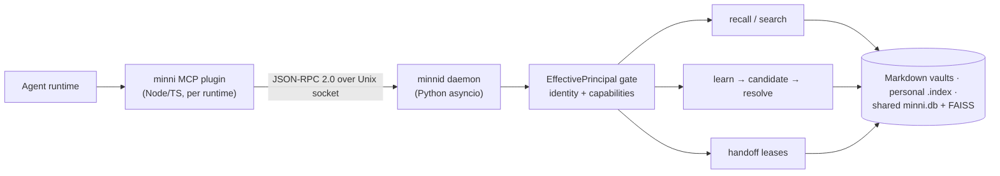

# Architecture

## Request flow

One daemon per host; one plugin process per agent runtime; for daemon-mediated
operations, identity is stamped server-side (`EffectivePrincipal`, the single
source of identity) — callers cannot claim capabilities. Plugin-local vault and
audit writes do not cross this boundary; see
[security](security.md#identity-and-capability-gating).

## Components

| Component | Responsibility |
|---|---|
| `src/minni/minnid.py` | JSON-RPC daemon, dispatch, policy, storage, status |
| `src/minni/principal.py` | Identity resolution, vault roots, capabilities, read authorization |
| `src/minni/retrieval.py` | FTS/FAISS/RRF/rerank retrieval path, personal/shared leg merge |
| `src/minni/db.py` | Shared SQLite schema and migrations |
| `src/minni/afm_passes/` | Background curation passes (see [concepts](concepts.md#the-afm-pass-pipeline)) |
| `src/minni/minni_cli.py` | Newcomer lifecycle CLI: `up` / `down` / `status` / `doctor` |
| `plugins/minni/src/server.ts` | MCP tool registration and request shaping |
| `plugins/minni/src/hook-handlers.ts` | Shared hook semantics for runtimes that support hooks |
| `plugins/minni/src/plan.ts` | Durable plan artifacts and state transitions |
| `plugins/minni/src/vault.ts` | Vault writes, inbox/outbox, compile surfaces |

## Data model

| Surface | Contents |
|---|---|
| Shared `~/.minni/minni.db` (SQLite, FTS5, WAL) | learnings, episodic/contradiction events, candidates, handoff leases, migrations, runtime metadata — plus the pooled `documents` + `chunk_embeddings` (the shared retrieval leg) |
| Shared FAISS | vector index for the shared document leg |
| Per-agent `<agent>-vault/.index/` | `vault.db` (chunk text, embeddings, resolved `[[wikilink]]` edges) + `vault.faiss` + `vault.manifest.json`, built by `vault_ingest` from that agent's `wiki/**/*.md` |
| Vault wiki / inbox / outbox / logs | the human-readable surfaces: synthesis pages and notes; candidate drafts and hook packets; outgoing handoffs; append-oriented audit trail |

Recall scope semantics and provenance are covered in
[concepts — two-tier storage](concepts.md#two-tier-storage).

## MCP tools (literal names)

These are the registered tool names in `plugins/minni/src/server.ts` — call
them exactly as written (there is no family/action dispatch layer):

| Area | Tools |
|---|---|
| Session lifecycle | `minni_prepare_task`, `minni_prepare_outcome` |
| Recall | `minni_recall`, `minni_drill`, `minni_route`, `minni_export_pack` |
| Learning | `minni_learn`, `minni_learning_quality`, `minni_resolve_candidate` |
| Vault | `minni_vault_write`, `minni_compile_vault` |
| Plans | `minni_plan_create`, `minni_plan_update`, `minni_plan_status`, `minni_plan_activate`, `minni_plan_deactivate`, `minni_plan_replan`, `minni_plan_history`, `minni_plan_revision`, `minni_plan_diff`, `minni_plan_restore`, `minni_plan_scar` |
| Handoff | `minni_negotiate_handoff`, `minni_ack_handoff`, `minni_list_pending_handoffs`, `minni_await_handoff` |
| Agent ping | `minni_ping_agent_request`, `minni_ping_agent_inbox`, `minni_ping_agent_decide`, `minni_ping_agent_status` |
| Team mode | `minni_team_runtime`, `minni_team_evidence`, `minni_team_promotion` |
| Ops & audit | `minni_status`, `minni_audit_report`, `minni_audit_tail`, `minni_subscribe_contradictions` |

## Observability

The `status` RPC returns daemon and engine health plus operational metrics
(per-method `latencies`, an `errors` count, `counters`) in its JSON payload;
`health_report` adds deeper diagnostics (stale docs, never-recalled docs,
contradicting learnings, vector-backend sync lag), redacted to aggregate
counts unless the caller is a stamped operator. The `minni status` CLI and
`minni_status` MCP tool render human-readable summaries of the same data.

## Continuity

Startup hooks inject compact identity, active plan state, correction
re-assertions, and bounded inbox/candidate state. On Claude Code, the
`<minni:context>` envelope carries the lifecycle spine
(`prepare_task → prepare_outcome → plan → learn`), backed by a deny-capable
`PreToolUse` recall-guard backstop (Claude Code is currently the only host
exposing one). Operator knobs: `MINNI_LIFECYCLE_NUDGE_MODE` (`off` disables)
and `MINNI_RECALL_GUARD_MODE` (`off` / `soft` / `strict`); the guard fails
open — a state-write failure never blocks the turn.
