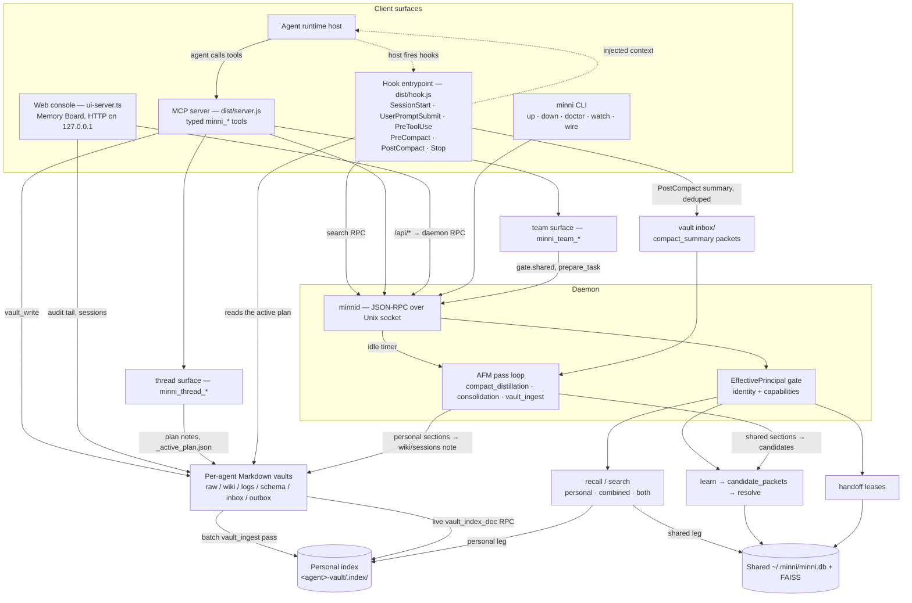

# Architecture

## Surfaces and request flow

The README's [architecture diagram](../README.md#architecture-at-a-glance) is
the control plane in summary — the three ingresses, the gate, the four verbs,
the two stores. This one is the full surface map: the same control plane plus
the operator surfaces and the ingestion paths that feed it. Dashed edges are
**host-mediated** — the platform fires the hook and consumes what it returns;
solid edges are somebody **calling**.

```mermaid
flowchart TD
    subgraph Clients["Client surfaces"]
      Host["Agent runtime host"]
      Hooks["Hook entrypoint — dist/hook.js<br/>SessionStart · UserPromptSubmit · PreToolUse<br/>PreCompact · PostCompact · Stop"]
      Plugin["MCP server — dist/server.js<br/>typed minni_* tools"]
      Console["Web console — ui-server.ts<br/>Memory Board, HTTP on 127.0.0.1"]
      CLI["minni CLI<br/>up · down · doctor · watch · wire"]
    end

    subgraph Core["Daemon"]
      Daemon["minnid — JSON-RPC over Unix socket"]
      Gate["EffectivePrincipal gate<br/>identity + capabilities"]
      AFM["AFM pass loop<br/>compact_distillation · consolidation · vault_ingest"]
    end

    Retrieval["recall / search<br/>personal · combined · both"]
    Governance["learn → candidate_packets → resolve"]
    Handoff["handoff leases"]
    Plans["thread surface — minni_thread_*"]
    Team["team surface — minni_team_*"]

    Vaults["Per-agent Markdown vaults<br/>raw / wiki / logs / schema / inbox / outbox"]
    Inbox["vault inbox/<br/>compact_summary packets"]
    Personal[("Personal index<br/>&lt;agent&gt;-vault/.index/")]
    Shared[("Shared ~/.minni/minni.db + FAISS")]

    Host -.->|host fires hooks| Hooks
    Host -->|agent calls tools| Plugin
    Hooks -->|search RPC| Daemon
    Hooks -.->|injected context| Host
    Hooks -->|PostCompact summary, deduped| Inbox
    Plugin --> Daemon
    Plugin --> Plans
    Plugin --> Team
    Plugin -->|vault_write| Vaults
    Console -->|/api/* → daemon RPC| Daemon
    Console -->|audit tail, sessions| Vaults
    CLI --> Daemon
    Team -->|gate.shared, prepare_task| Daemon
    Plans -->|plan notes, _active_plan.json| Vaults
    Hooks -->|reads the active plan| Vaults

    Daemon --> Gate
    Gate --> Retrieval
    Gate --> Governance
    Gate --> Handoff
    Daemon -->|idle timer| AFM
    Inbox --> AFM
    AFM -->|shared sections → candidates| Governance
    AFM -->|personal sections → wiki/sessions note| Vaults

    Vaults -->|batch vault_ingest pass| Personal
    Vaults -->|live vault_index_doc RPC| Personal
    Retrieval -->|personal leg| Personal
    Retrieval -->|shared leg| Shared
    Governance --> Shared
    Handoff --> Shared
```

One daemon per host; one plugin process per agent runtime; for daemon-mediated
operations, identity is stamped server-side (`EffectivePrincipal`, the single
source of identity) — callers cannot claim capabilities. Plugin-local vault and
audit writes do not cross this boundary; see
[security](security.md#identity-and-capability-gating).

## Components

| Component | Responsibility |
|---|---|
| `src/minni/minnid.py` | JSON-RPC daemon, dispatch, policy, storage, status |
| `src/minni/principal.py` | Identity resolution, vault roots, capabilities, read authorization |
| `src/minni/retrieval.py` | FTS/FAISS/RRF/rerank retrieval path, personal/shared leg merge |
| `src/minni/db.py` | Shared SQLite schema and migrations |
| `src/minni/afm_passes/` | Background curation passes (see [concepts](concepts.md#the-afm-pass-pipeline)) |
| `src/minni/minni_cli.py` | Newcomer lifecycle CLI: `up` / `down` / `status` / `doctor` |
| `plugins/minni/src/server.ts` | MCP tool registration and request shaping |
| `plugins/minni/src/hook-handlers.ts` | Shared hook semantics for runtimes that support hooks |
| `plugins/minni/src/plan.ts` | Durable plan artifacts and state transitions |
| `plugins/minni/src/vault.ts` | Vault writes, inbox/outbox, compile surfaces |

## Data model

| Surface | Contents |
|---|---|
| Shared `~/.minni/minni.db` (SQLite, FTS5, WAL) | learnings, episodic/contradiction events, candidates, handoff leases, migrations, runtime metadata — plus the pooled `documents` + `chunk_embeddings` (the shared retrieval leg) |
| Shared FAISS | vector index for the shared document leg |
| Per-agent `<agent>-vault/.index/` | `vault.db` (chunk text, embeddings, resolved `[[wikilink]]` edges) + `vault.faiss` + `vault.manifest.json`, built by `vault_ingest` from that agent's `wiki/**/*.md` |
| Vault `raw` / `wiki` / `logs` / `schema` / `inbox` / `outbox` (`wire/writers.py:576`) | the human-readable surfaces: synthesis pages and notes; candidate drafts and hook packets; outgoing handoffs; append-oriented audit trail |

Recall scope semantics and provenance are covered in
[concepts — two-tier storage](concepts.md#two-tier-storage).

## MCP tools (literal names)

These are the registered tool names in `plugins/minni/src/server.ts` — call
them exactly as written (there is no family/action dispatch layer):

| Area | Tools |
|---|---|
| Session lifecycle | `minni_prepare_task`, `minni_prepare_outcome` |
| Recall | `minni_recall`, `minni_drill`, `minni_route`, `minni_export_pack` |
| Learning | `minni_learn`, `minni_learning_quality`, `minni_list_candidates`, `minni_resolve_candidate` |
| Vault | `minni_vault_write`, `minni_compile_vault` |
| Threads | `minni_thread_create`, `minni_thread_update`, `minni_thread_scar`, `minni_thread_status`, `minni_thread_replan`, `minni_thread_history`, `minni_thread_revision`, `minni_thread_diff`, `minni_thread_restore`, `minni_thread_activate`, `minni_thread_deactivate`, `minni_thread_ready`, `minni_thread_assign`, `minni_thread_claim`, `minni_thread_worker_update`, `minni_thread_events` (16 tools — the pre-rename `minni_plan_*` aliases have been removed; only the `minni_thread_*` names are registered) |
| Handoff | `minni_negotiate_handoff`, `minni_ack_handoff`, `minni_list_pending_handoffs`, `minni_await_handoff` |
| Agent ping | `minni_ping_agent_request`, `minni_ping_agent_inbox`, `minni_ping_agent_decide`, `minni_ping_agent_status` |
| Team mode | `minni_team_runtime`, `minni_team_evidence`, `minni_team_promotion` |
| Ops & audit | `minni_status`, `minni_audit_report`, `minni_audit_tail`, `minni_subscribe_contradictions` |

### Thread tool separation & execution boundaries

- **Team projection**: `minni_team_runtime` projects one vault Thread (`plan_id` + `rev` + `readySlices` after the expiry sweep). `plan_id` present reads that Thread and fails if it is missing. `plan_id` absent creates one Thread. Leftover `taskLedger` is a view of `ready`. `ledgerFor` and the compat invented-ready chain are gone. The coordinator id is stamped server-side (G11).
- **Orchestrator tools**: `minni_thread_create`, `minni_thread_replan`, `minni_thread_assign` (passes `worker_agent_id`, setting durable slice field `assigned_to`), `minni_thread_ready`, `minni_thread_events`, `minni_thread_update`, `minni_thread_status`, `minni_thread_scar`, `minni_thread_history`, `minni_thread_revision`, `minni_thread_diff`, `minni_thread_restore`, `minni_thread_activate`, `minni_thread_deactivate`. The orchestrator manages graph topology, assigns slices, checks ready work units (`pending`, `in_progress`, `blocked` with satisfied dependencies and no live claim), and polls the journal.
- **Worker tools & packet**: `minni_thread_claim` (acquires lease and returns lease `token`), `minni_thread_worker_update` (mutates claimed slice state; proposes expansions/contractions via `propose_structure`). After assign → claim, the library adapter `buildWorkerPacketAfterClaim` copies `ThreadClaimResponse` (`plan_id`, `slice_id`, `generation`, `token` as `claim_token`) plus that slice, thread goal/constraints, completed-dep evidence refs, bounded `prepare_task` recall (G11: `DEFAULT_AGENT_ID`), and the allowed mutations. The packet is not built inside `minni_team_runtime`, not before claim, and is not a new MCP tool. Workers interact via `minni_thread_worker_update` only. Action `start` transitions any claimed non-terminal worker-updatable slice (`pending`, `in_progress`, or `blocked`) to `in_progress` (slice statuses are `pending`, `in_progress`, `done`, `blocked`, `superseded`; there is no `assigned` status).
- **Ordered event cursors**: `minni_thread_events(plan_id?, since_seq?, limit?)` reads append-only events from `plan-*.log.md` starting after `since_seq` for polling, state catch-up, and crash recovery. A prefix drop or a cursor-path tail bound is a `journal_truncated` / `cursor_gap` event with `last_dropped_seq` + `first_kept_seq`. An unmarked hole is `THREAD_CURSOR_GAP`, not a silent jump. Seq is never renumbered. The cursor reads a byte-bounded tail; if that tail cannot name those bounds, or bounding would hide a hole, it full-parses instead of inventing a gap. Mutation still full-parses.
- **Authority boundary & honest limits**: Same-platform workers share `EffectivePrincipal`; no current host adapter yet implements structural-tool hiding, so structural-tool restriction depends on host tool exposure/scoping. Claim scope (`plan_id`, `slice_id`, `generation`, `worker_agent_id`, `claim_token`, idempotency identity) is strictly enforced by the Thread engine regardless of caller principal. Wave 3 `dispatchWorkerPacket` is honesty-only (library, not MCP): grok worker-start is MISSING, default agy allowlist is CANNOT, Codex is UNPROVEN, and `spawned` is always false. Completion is `minni_thread_worker_update`. The named agy worker allowlist exists as `minni_thread_worker_update` only; default dispatch stays CANNOT and `spawned` stays false. G3 is a notification relay, not a second graph: the plugin writes delivery cursors / pending attention to `.runtime/thread-relay/cursors.json` on journal append and rebuilds the queue from journal seq. SQLite `thread_delivery_cursors` (020) is unused; minnid does not ingest. Cursor advances monotonically on successful delivery only (fail-closed). Hooks are fallback readers of pending attention and do not poll `minni_thread_events`. Immediate wake is unsupported (not wet-tested); agy/grok deferred via existing wire (agy SessionStart + PreInvocation injectSteps, Stop rejects; grok SessionStart/UPS ignored, Stop injects, boot `~/.grok/rules`); Codex SessionStart + UPS, Stop cannot, UNPROVEN; Cursor is out. G2 in-session complete is not a spawn. Automatic spawning and grok worker-start are not implemented. `GROK_WORKER_START` stays null.

## Observability

The `status` RPC returns daemon and engine health plus operational metrics
(per-method `latencies`, an `errors` count, `counters`) in its JSON payload;
`health_report` adds deeper diagnostics (stale docs, never-recalled docs,
contradicting learnings, vector-backend sync lag), redacted to aggregate
counts unless the caller is a stamped operator. The `minni status` CLI and
`minni_status` MCP tool render human-readable summaries of the same data.

## Continuity

Startup hooks inject compact identity, active **thread** state
(`active_thread` / `active_thread_ref`; on-disk `_active_plan.json` remains
the frozen pointer filename), correction re-assertions, and bounded
inbox/candidate state. On Claude Code, the `<minni:context>` envelope carries
the lifecycle spine (`prepare_task → prepare_outcome → thread → learn`), backed
by a deny-capable `PreToolUse` recall-guard backstop. Several hosts expose
pre-tool **deny capability** (Claude, Kilo, Cursor, Grok, Antigravity/agy;
Codex is Bash-only). **Live Minni s6 cold-tool guard** (file-backed
recall-state + adapter/tool map that actually denies Grep/Read/Glob-class
calls) is complete on Claude Code, Cursor, agy, Kilo, and Grok Build (Grok
via `grok-adapter.ts`). Registration or host deny alone is not enough — Codex
registers PreToolUse but cannot gate cold-file tools. Full matrix:
[docs/contracts/hook-platforms.md](contracts/hook-platforms.md). Operator
knobs: `MINNI_LIFECYCLE_NUDGE_MODE` (`off` disables) and
`MINNI_RECALL_GUARD_MODE` (`off` / `soft` / `strict`); the guard fails open —
a state-write failure never blocks the turn.
