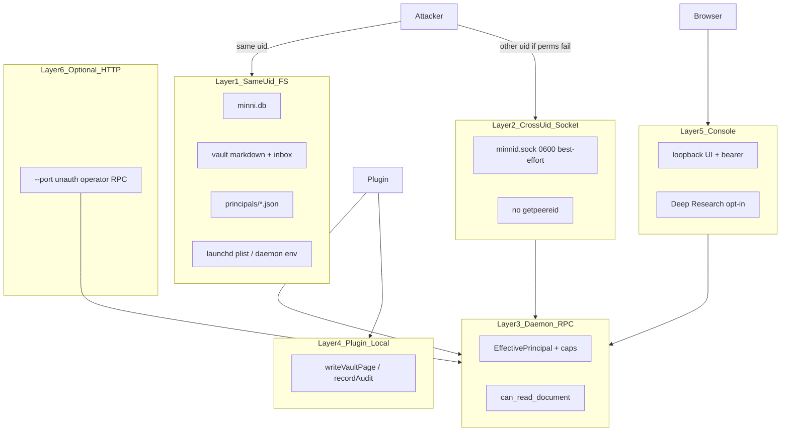

# Minni Threat Model

This document names the trust layers, default risks, residual stories, and
criticality calibration for Minni (legacy name: Sovereign Memory). It keeps
recall useful without making memory authoritative, and it does not collapse
filesystem, socket, daemon-RPC, plugin-local, console, and optional HTTP
boundaries into one “local process” story.

**PR / cloud security scanners:** use the dense operational skeleton in
[`THREAT_MODEL_SCANNER.md`](THREAT_MODEL_SCANNER.md) (same findings, original
four-section layout optimized for diff review prompts).

**Code anchors:** engine `src/minni/minnid.py` and `src/minni/*`; plugin
`plugins/minni`; home `$MINNI_HOME` / `~/.minni`; socket
`~/.minni/run/minnid.sock`. `openclaw-extension/` is not on `main` — treat any
still-installed copy as a separate legacy surface. `src/minni/openclaw-tool.sh`
remains an in-tree helper.

## 1. Overview

Minni is a local-first memory system for AI coding agents. The Python engine
stores runtime truth in SQLite (`~/.minni/minni.db`), indexes vault Markdown into
FTS5/embeddings/FAISS, and exposes recall, learning, handoff, candidate review,
status, and AFM compile over JSON-RPC. The TypeScript plugin exposes MCP tools,
hooks, a loopback console, vault helpers, handoff/task packets, and AFM bridge
calls.

**Production boundary:** the local macOS user account — not an internet-facing
multi-tenant service.

**Primary assets:** SQLite DB; vaults (`raw/`, `wiki/`, `inbox/`, logs);
principal files under `$MINNI_HOME/principals`; AFM/hook context packets;
candidate learnings; derived indexes/exports/graph dumps.

**Impact axes:** confidentiality of private memory; integrity of durable memory;
agent identity/provenance; preventing untrusted recalled text from becoming
instructions; preventing unattended promotion of hostile content into durable
learnings.

**Design intent visible in code (do not over-credit):**

- UDS under `~/.minni/run` with intended 0600/0700 (best-effort)
- Wire `agent_id` replaced by server-stamped `EffectivePrincipal` on
  daemon-mediated paths
- Recall wrapped as evidence; `instruction_like` flagged;
  `privacy_level=blocked` always excluded
- Default `learn` stages candidates; `force=true` / cross-principal resolve are
  operator-gated
- AFM drafts are review-oriented; non-loopback model targets need allowlist +
  HTTPS
- Console binds loopback, Host/Origin/Sec-Fetch checks, bearer by default
- Audit/frontmatter parsing hardened (leading YAML only; writeback rejects
  forged `---`)

## 2. Trust layers (do not collapse)

1. **Same-uid filesystem plane** — Any process under the same UID can
   read/write the DB, vault, principals, and (often) the launchd/env that starts
   the daemon. `EffectivePrincipal` / `can_read_document` / privacy filters
   **do not apply**. This is an inherent residual of local-first same-uid
   storage; state it explicitly. Escalation channel: edit daemon env / set
   `MINNI_LOCAL_OPERATOR` to re-open wildcard `main` even in strict mode.
2. **Cross-uid / socket plane** — Intended boundary is owner-only socket + run
   dir. There is **no peer-credential check**. `chmod` failures warn and
   continue (`minnid.py`). Socket bind before chmod + `mkdir` without mode
   creates a TOCTOU window. If modes fail or the FS does not honor POSIX perms,
   any local UID gets wildcard-operator RPC.
3. **Daemon-mediated RPC** — Provenance gate + capability table. Zero-config:
   synthesized `main` with `capabilities=["*"]`, empty `allowed_vault_roots`
   (path gates vacuous). Strict mode (`principals/*.json`) constrains;
   `MINNI_LOCAL_OPERATOR` re-opens wildcard.
4. **Plugin-local FS writes** — `writeVaultPage` / `recordAudit` never hit
   `EffectivePrincipal`; safety is schema-pinned vault path (SEC-003/G12).
   `gate.shared` is **attribution, not authorization**. Daemon-down: gated tools
   fail closed; local vault writes proceed. See `docs/security.md`.
5. **Console** — Loopback-only bind; Host/Origin/Sec-Fetch; bearer default
   (auto-gen if unset). Residuals: token printed into URL query string
   (history/scrollback leak); `/api/health` unauthenticated;
   `MINNI_CONSOLE_NO_AUTH=1` disables auth on local bind.
6. **Optional HTTP (`--port`)** — No auth, no body limit, same `_dispatch` as
   UDS, default `transport="uds"` → local operator stamp. `--host` can be
   non-loopback. **Critical when enabled** — not mere configuration theater.
7. **AFM / derived** — Target allowlist (loopback or allowlisted HTTPS).
   `0.0.0.0` treated as loopback in allowlist helpers (quirk). Consolidation
   loop (`MINNI_AFM_LOOP`, default off) can auto-promote *trusted* safe
   candidates into durable learnings — vault `inbox/` ingest and
   operator/govern `stage_candidate` stamps. Learn-only RPC staging clamps
   caller `privacy_level` to `review` so it cannot self-mark auto-promotable.
   Content-semantic gate is primarily `is_instruction_like` (regex floor),
   plus privacy/quality/dedup filters — not a human endorsement.
8. **Deep Research (console, opt-in)** — `MINNI_CONSOLE_DEEP_RESEARCH=1` +
   bearer + local bind. Can exec external CLI/Python and egress to the internet
   (`google_search`, `url_context`, `code_execution`); `local-docs`/`hybrid` can
   ship vault material to cloud. Contradicts “no internet clients” unless this
   gate stays off. Rate **High** if token leaks; otherwise **Medium** gated
   residual.
9. **Recall / privacy** — Evidence envelopes + `instruction_like`. `blocked`
   always dropped. Missing privacy → **`safe` (fail-open)** in code, schema, and
   this document. Fail-closed behavior requires an explicit `private`,
   `local-only`, or `blocked` stamp.

## 3. Attacker / operator / developer inputs

**Attacker-controlled:** JSON-RPC params from any peer that can reach the UDS
(same-uid always; cross-uid if perms fail) or optional HTTP; MCP tool args
influenced by model/user prompts; vault Markdown/frontmatter/wikilinks;
inbox/handoff JSON packets; AFM/generated summaries; intentionally large
payloads; local webpages driving the loopback console (Host/Origin mitigated;
token still required); same-uid direct FS access to DB/vault (bypasses all of
the above).

**Operator-controlled:** `MINNI_*` / legacy `SOVEREIGN_*` env; principal files;
allowed vault roots; launchd/socket config; console token / `NO_AUTH` / Deep
Research enable; AFM allowlists and loop enable; manual candidate/AFM
endorsement. Deliberately pointing vault/DB/AFM at unsafe locations remains
configuration risk — **except** enabling HTTP fallback or Deep Research, which
create new Critical/High technical surfaces and must be treated as such.

**Developer-controlled:** tests, fixtures, migrations, CLI (`agent_api`, graph
export). These become security-relevant if wired to a model/UI/network without
daemon gates. Graph export has **no privacy filter** (operator CLI →
`~/.minni/graphs/graph.json`); do not serve that file to lesser-privileged
surfaces.

**Assumptions:** OS FS permissions protect the home directory *when chmod
succeeds*; single-user local software; no untrusted internet clients **unless
Deep Research or non-loopback AFM/HTTP is enabled**; recalled memory is
evidence/citation never system/developer/user instruction.

## 4. Threats, mitigations, and residual stories

| Threat | Risk | Control | Residual |
|---|---|---|---|
| Prompt injection via recalled content | Hostile note tries to override agent/system instructions. | Evidence envelopes + `instruction_like`; never promoted to command authority. | AFM-loop auto-promote of plausible false facts that are not instruction-shaped. |
| Same-uid direct DB/vault access | Exfil or tamper of private/blocked material. | None at daemon layer (inherent same-uid storage). | Accepted Critical residual of local-first design. |
| Daemon socket / cross-uid RPC | Unexpected JSON-RPC as wildcard operator. | Intended 0600/0700 under `~/.minni/run`; UDS 1 MiB body cap. | No `getpeereid`; chmod warn-and-continue; TOCTOU on mkdir/bind. |
| Optional HTTP fallback | Unauth operator RPC remotely or cross-uid. | Default `--port=0` (off). | No auth, unbounded body, stamped as local/UDS operator — Critical when enabled. |
| Zero-config principal binding | Any UDS peer is wildcard `main` with `*`. | Strict mode via `principals/*.json`. | Empty `allowed_vault_roots` makes path gates vacuous; `MINNI_LOCAL_OPERATOR` re-opens wildcard. |
| Vault path traversal | Read/write outside configured vault. | Daemon vault-root guard + TS `assertUnder` / realpath. | Vacuous under zero-config empty roots; symlink/race; legacy OpenClaw installs. |
| AFM provider / SSRF | Context to nonlocal endpoint; confused summaries. | Allowlist + HTTPS for non-loopback; draft/review oriented. | `0.0.0.0` loopback quirk; consolidation auto-accept when loop on. |
| Vector / learnings leakage | Private/blocked via semantic or learning search. | Retrieval filters `privacy_level`/`lifecycle`; FAISS post-filters via SQLite. | Missing privacy → `safe`; `handle_read` hardcodes safe meta; `search_learnings` has no privacy dimension; frontmatter `page_type`/`agent` substring cross-share. |
| Console / Deep Research | Local browser or process drives privileged actions; vault→cloud. | Loopback bind, Host/Origin/Sec-Fetch, bearer by default; Deep Research opt-in. | Token-in-URL leak; `/api/health` unauth; `NO_AUTH=1`; Deep Research egress/exec when enabled. |
| Plugin-local vault writes | Durable notes without daemon gate. | Schema-pinned vault path (SEC-003/G12). | `gate.shared` attribution only; proceeds when daemon down. |
| Secret redaction gaps | Tokens leave process in audit/status/ping/DR output. | Label-oriented redaction (`key: value`, PEM). | JSON-quoted and bare high-entropy secrets often missed — incomplete Medium control. |

**Daemon IPC / identity — residual stories to test:** same-uid peer via mediated
APIs; cross-uid if chmod fails; HTTP enabled; zero-config wildcard main;
`MINNI_LOCAL_OPERATOR` env reopen; methods that omit or weaken read gates.

**Retrieval / privacy — residual stories:**

- `handle_read` prior-context hardcodes `"privacy_level": "safe"` before the gate
  (`minnid_runtime/recall.py`) — metadata leak for `unknown`/`wiki:*` rows that
  are actually private
- Cross-share if attacker-writable
  `page_type ∈ {wiki,handoff,synthesis,decision,session}` or `agent` contains
  `wiki`/`handoff` (`principal.py`)
- `search_learnings`: no privacy column; agent-scope only; `cross_agent`
  capability returns all learnings
- Hook vault search uses frontmatter/heuristics (`filterSafeVaultResults`), not
  the daemon gate
- Prompt injection is Critical only when it changes authority (auto durable
  learn, shell, secret export, cross-agent handoff without consent)

**Writes / learning — residual stories:** AFM consolidation auto-accept of
trusted safe packets (inbox / operator-staged); learn-only stage clamps to review;
writeback frontmatter forge rejected on disk path but DB learn may still
succeed; plugin vault writes without gate. Credit the strong control:
`explicitly_allowed_operator` does **not** treat bare `*` as cross-principal
resolve.

**Availability:** caps on UDS/learn/UI; HTTP body uncapped when enabled;
embedding/AFM/Deep Research remain local DoS/egress targets.

## 5. Criticality calibration

**Critical**

- Remote or cross-account/cross-uid access to full operator RPC (HTTP enabled,
  or socket perms fail with no peercred)
- Same-uid direct exfil/tamper of private/blocked DB or vault material
  (inherent; accepted residual of the architecture)
- Identity/principal bypass that commits durable memory as another agent (HTTP
  stamp, or wildcard main abused for force/learn where gates allow)
- Path traversal / helper / Deep Research / AFM misconfig that reads secrets or
  ships them off-box without operator intent
- Prompt injection / inbox poisoning that causes **automatic durable writes**
  (AFM loop on), shell execution, or secret export

**High**

- Same-uid abuse of socket/console mediated APIs (when not using direct FS —
  still useful for staging, resolve attempts, AFM prep)
- `can_read_document` / privacy bypasses (hardcoded safe meta, frontmatter
  cross-share, learnings without privacy, hook vault channel)
- Vault/handoff traversal outside intended roots **in strict mode**
  (zero-config roots are already open)
- AFM SSRF to non-allowlisted endpoint, or allowlisted nonlocal endpoint
  receiving private context
- Deep Research enabled + console token available → vault→cloud exfil /
  external exec
- Oversized HTTP/AFM payload exhaustion when those surfaces are on (DoS axis of
  the same Critical HTTP surface)

**Medium**

- Audit/frontmatter injection that misleads review without granting authority
- Incomplete secret redaction; path/filename disclosures; console token-in-URL;
  `/api/health` info leak
- UI CSRF requiring local browser quirks despite Host/Origin checks
- Incorrect lifecycle handling; contract/doc drift
- Supply-chain / broad dependency ranges; graph/FAISS exports leaking metadata
  when shared
- Deep Research feature existing behind opt-in (document even when off)

**Low**

- Dev/test-only failures; cosmetic local status disclosures; DoS requiring
  deliberate operator misconfiguration; malformed vault pages safely ignored;
  quality-heuristic false positives still requiring manual review; HyDE
  default-off query-harvest residual

## 6. Controls that are actually strong

- Cross-principal candidate resolve gate (`explicitly_allowed_operator` — not
  bare `*`)
- Console local bind + Host/Origin/Sec-Fetch + default bearer
- AFM SSRF allowlist fail-closed for credential-trick / subdomain / encoded-IP
  cases (with `0.0.0.0` quirk)
- Reserved wire claims of `main`/`operator` denied without operator context
- UDS 1 MiB line limit; evidence envelopes; leading-YAML-only frontmatter parse;
  handoff wikilink containment; MCP removal of model-facing `vaultPath` /
  `afmPrepareUrl`

## 7. Explicit non-goals / accepted residuals

- Cryptographic agent authentication (SEC-021 deferred)
- Protecting memory from the account owner or malware running as that user
- Multi-tenant remote service hardening
- Treating `gate.shared` as an ACL

## Failure Posture

Failure should degrade to a less-rich response, not to an unsafe response —
**except** where this document already names fail-open residuals (socket chmod,
missing privacy → `safe`, zero-config wildcard principal, optional HTTP). If
vector search fails, recall can fall back to FTS. If provenance is missing,
results should be treated as lower-confidence evidence. If privacy metadata is
missing, it is treated as `safe` (the most permissive level) — the read gate,
retrieval, ingest, and the schema default all fall back to `safe`, not
`local-only`. Fail-closed privacy behavior requires an explicit `private`,
`local-only`, or `blocked` stamp on the document.

## Review Triggers

- New cross-process envelope fields.
- New vault write paths.
- New vector backend adapters.
- New AFM provider, extraction, synthesis, or consolidation auto-promote paths.
- Enabling or changing HTTP fallback, console auth, Deep Research, or
  `MINNI_AFM_LOOP` defaults.
- Any default flip based on eval harness results.
- Changes to principal synthesis, `can_read_document`, or peer-credential /
  socket permission handling.
