# Sovereign Memory Explainer

Status: draft explainer
Audience: humans and agents trying to understand the system shape
Last updated: 2026-05-10

Sovereign Memory is a local-first memory spine for AI agents. Its job is to
make memory durable, inspectable, attributable, and useful across sessions
without turning it into a hidden black box.

The core idea is simple:

- Agents should remember through local, reviewable artifacts.
- The system should retrieve useful context quickly without dumping the whole
  past into every prompt.
- Identity and working knowledge should not be mixed together.
- Background organization should assist, not silently rewrite truth.

This document explains the main pieces: the two-layer system, the vault and
wiki model, chunking and retrieval, and what the AFM backend loop does.

## The System At A Glance

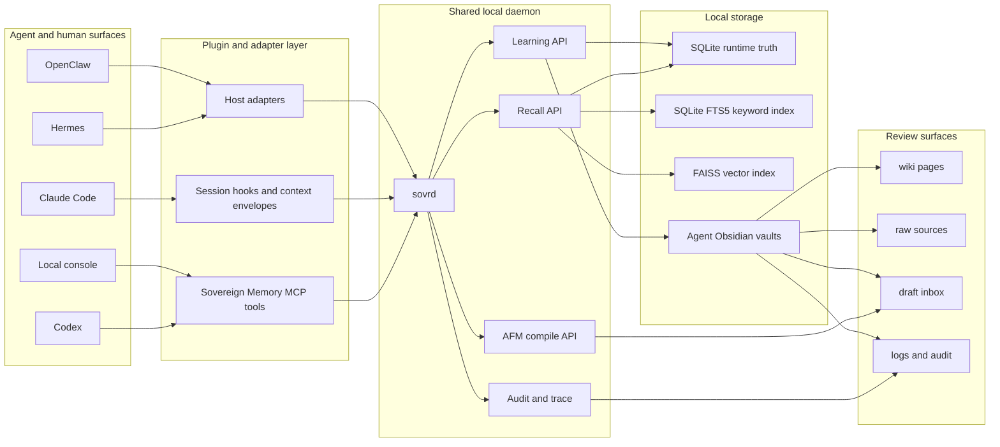

Sovereign Memory deliberately separates the visible memory surface from the
fast recall machinery.

The vault is where people and agents can inspect memory. SQLite, FTS5, and
FAISS are how the daemon finds the right parts quickly. The daemon is the
stable local service that keeps model loading, indexing, recall, learning, and
audit behavior in one place.

## Why It Exists

Most agent memory systems have one of two failure modes:

- They are too hidden. The agent "remembers" something, but the user cannot see
  where it came from, fix it, or decide whether it should exist.
- They are too blunt. A full history or giant note gets dumped into context,
  making the agent slow, noisy, or overconfident.

Sovereign Memory aims for a third shape: memory as a local, inspectable wiki
backed by retrieval infrastructure.

The design choices follow from that:

| Choice | Why it exists |
| --- | --- |
| Local-first storage | Keeps private sessions, vaults, adapters, and indexes on the machine by default. |
| Agent-owned vaults | Each agent has its own readable memory surface and write boundary. |
| Shared daemon | One resident service is cheaper and more consistent than one memory process per agent. |
| SQLite as runtime truth | Schema, provenance, lifecycle state, learnings, and events need reliable structured storage. |
| Obsidian-style wiki | Humans and agents can inspect, link, revise, and reason over durable notes. |
| Chunked retrieval | Agents get relevant slices instead of whole archives. |
| Whole-document identity | Identity/orientation is loaded intact so it does not become a random retrieved fragment. |
| Manual learning | Durable writes require explicit intent; automatic behavior is recall-first. |
| AFM drafts only | Backend organization can propose, but acceptance remains reviewable. |

## The Two-Layer System

Sovereign Memory separates agent hydration into two layers.

Layer 1 is identity and orientation. It is loaded as whole documents.

Layer 2 is knowledge and recall. It is retrieved from chunks, learnings, wiki
pages, and episodic context.

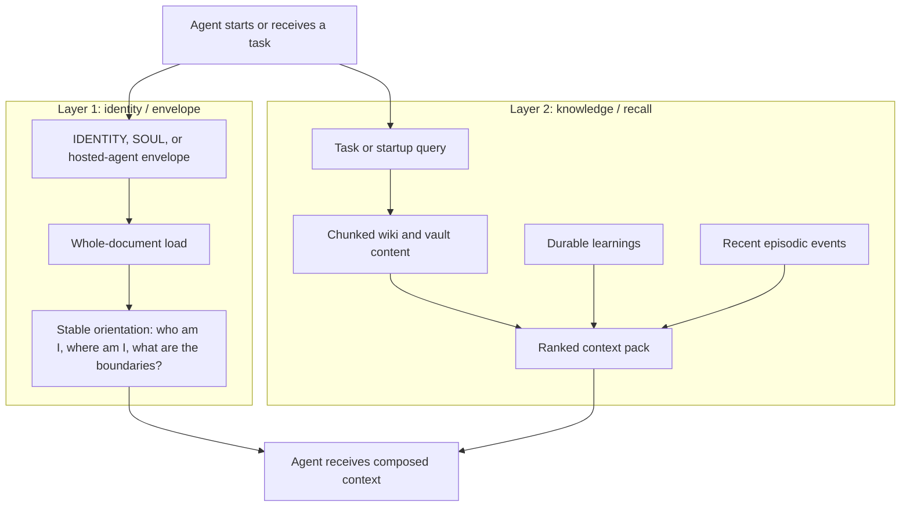

### Layer 1: Identity And Orientation

Layer 1 is the "do not make the agent rediscover the room" layer.

For owned agents, it can include identity documents such as `IDENTITY.md` and
`SOUL.md`. For hosted agents like Codex or Claude Code, it is better thought of
as an envelope: paths, boundaries, operating context, current project map, and
safe defaults.

Layer 1 is not chunked. The system stores it as a whole document and loads it
intact. That matters because identity fragments can become misleading if they
are retrieved out of order or mixed with ordinary knowledge. A boundary like
"this is orientation, not a personality override" needs to arrive as part of a
coherent document.

Layer 1 answers:

- Which agent surface is this?
- What local paths and projects matter?
- What are the safety and precedence boundaries?
- What memory tools should be used?
- What should never be treated as durable truth?

### Layer 2: Knowledge And Recall

Layer 2 is the working memory layer. It answers "what local context is relevant
to this task?" rather than "who is the agent?"

Layer 2 uses chunked retrieval, structured metadata, provenance, and ranking.
It includes wiki pages, sessions, decisions, procedures, artifacts, handoffs,
and learnings. Results should always be treated as evidence, not as absolute
instruction.

Layer 2 answers:

- Have we solved something like this before?
- What decision records exist?
- Which previous session has useful scar tissue?
- Which procedure or artifact is relevant?
- Who authored this memory and how trustworthy is it?

## Why Two Layers Instead Of One

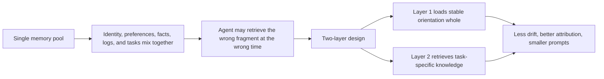

The split exists because identity and knowledge behave differently.

Identity should be coherent, stable, and loaded before task work. Knowledge
should be searchable, ranked, scoped, and allowed to age or be superseded.

If both live in one undifferentiated retrieval pool, the agent can get a
sentence from an identity document without the surrounding caveats, or receive
old session noise as if it were a current rule. The two-layer model reduces
that confusion.

## The Vault Model

Each agent can have its own vault. The vault is an Obsidian-style Markdown
workspace with predictable folders:

| Area | Purpose |
| --- | --- |
| `raw/` | Immutable source material, session extracts, original evidence. |
| `wiki/` | Agent-maintained synthesis: entities, concepts, decisions, procedures, sessions, artifacts, handoffs, syntheses. |
| `schema/` | Operating schema and instructions for how the vault should be shaped. |
| `inbox/` | Drafts waiting for review, including AFM proposals or pending learnings. |
| `outbox/` | Explicit handoff packets addressed to another agent or surface. |
| `logs/` and `log.md` | Transparent audit trail of memory operations. |
| `index.md` | Navigational index for the vault. |

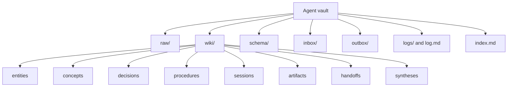

The vault is intentionally human-readable. That is the point. Hidden embeddings
are not enough; the system needs a visible place where an operator can inspect
what was remembered, why it exists, and whether it should be changed.

## The Wiki Layer

The `wiki/` folder is the synthesized memory surface. It is not a transcript
dump. It is closer to an agent-maintained knowledge base.

Wiki pages use page types because agents need to know what kind of thing they
are reading:

| Page type | Meaning |
| --- | --- |
| Entity | A person, project, daemon, repository, tool, or system. |
| Concept | A reusable idea or mental model. |
| Decision | A choice that was made, plus rationale and consequences. |
| Procedure | A repeatable way to do something. |
| Session | A compact record of a work session. |
| Artifact | A produced object, file, prompt, dataset, or design. |
| Handoff | A deliberate packet from one agent/session to another. |
| Synthesis | A higher-level summary compiled from several accepted sources. |

Wiki pages also carry status and privacy metadata. That gives the recall layer
a way to distinguish draft from accepted, safe from private, current from
superseded, and high-authority from merely nearby.

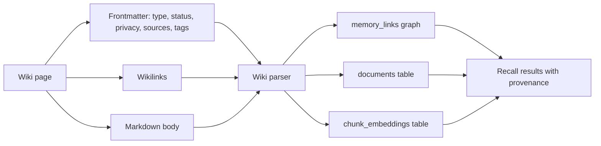

The wiki is therefore both a writing surface and a reasoning surface. The
Markdown is for humans and agents to inspect. The metadata, graph edges, and
chunks are for the retrieval engine.

## Chunking

Chunking is how large Markdown documents become retrievable without dumping
the whole file into context.

Sovereign Memory uses Markdown-aware chunking rather than blind character
splitting. It tries to preserve headings, paragraphs, lists, and code blocks as
meaningful units. The default target is about 512 tokens with overlap, and
chunks carry heading breadcrumbs so a recalled passage still knows where it
came from.

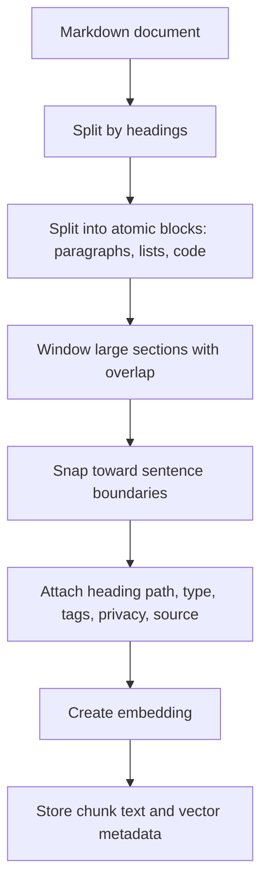

Chunking exists because agents need context at the right granularity.

If chunks are too large, recall wastes context and drags in unrelated material.
If chunks are too small, the agent gets fragments without enough meaning.
Markdown-aware chunks preserve the authorial structure of the page while still
making retrieval cheap and precise.

## Recall

Recall combines several signals:

- Keyword search through SQLite FTS5.
- Semantic search through FAISS vectors.
- Reciprocal rank fusion to merge keyword and vector candidates.
- Optional reranking for better precision.
- Token budgeting and progressive disclosure so results fit the prompt.
- Provenance metadata so the agent can see where the memory came from.

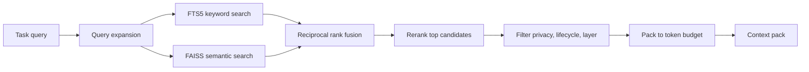

The important design point is that recall is not "search, paste, hope." It is a
ranked, budgeted, provenance-aware context builder.

## Learning

Learning is deliberately more conservative than recall.

Automatic behavior is recall-first. Durable learning should happen only when a
user or agent explicitly asks to remember, learn, save, update memory, or write
a durable checkpoint.

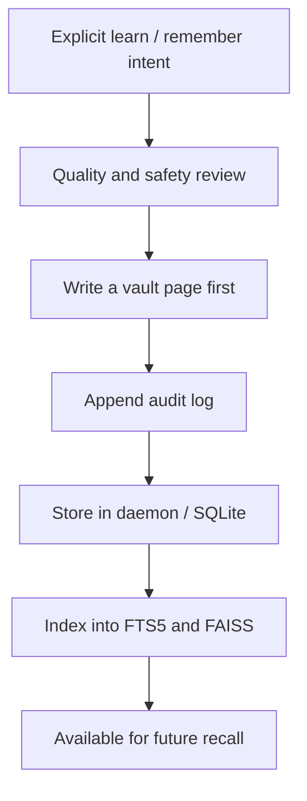

The "vault-first" rule matters. It means durable memory is not just an
invisible database row. There is a Markdown note that can be inspected,
linked, corrected, superseded, or rejected.

## Cross-Agent Memory

Sovereign Memory supports multiple agents using the same local recall spine.
The agents do not have to share a vault directory. They share the daemon and
the indexed recall pool.

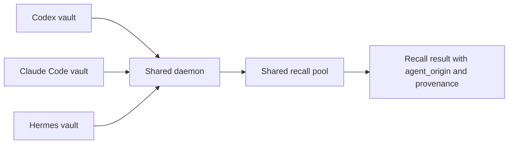

This is why provenance matters. A result should preserve who made it, where it
came from, what page type it is, and whether it is accepted, draft, private, or
superseded.

The consuming agent should treat recalled memory as evidence. A memory written
by another agent is useful, but load-bearing claims still need verification
against live files, commands, or the current application.

## The AFM Backend Loop

AFM here means a local Apple Foundation Models bridge used as an optional
backend assistant. It is not the source of truth. It is a compiler and organizer
that can propose better memory artifacts.

The AFM loop is opt-in. It produces drafts, inbox items, traces, and proposals.
It should not silently rewrite accepted knowledge.

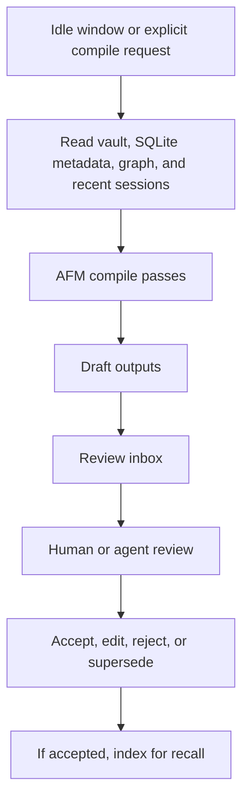

The main AFM-style passes are:

| Pass | What it tries to do | Why it exists |
| --- | --- | --- |
| Session distillation | Turn recent work into compact draft session notes. | Raw sessions are too long; future agents need the durable lesson, not every token. |
| Synthesis | Combine accepted pages into a higher-level synthesis. | Related notes accumulate; synthesis makes the memory graph easier to navigate. |
| Procedure extraction | Notice repeated patterns and draft reusable procedures. | Agents often rediscover workflows unless they are promoted into procedures. |
| Reorganization | Propose splits, merges, or orphan fixes in the wiki. | A wiki degrades over time unless someone tends structure. |
| Pruning | Propose lifecycle transitions for expired, superseded, or risky pages. | Memory should age and be governed without deleting evidence casually. |

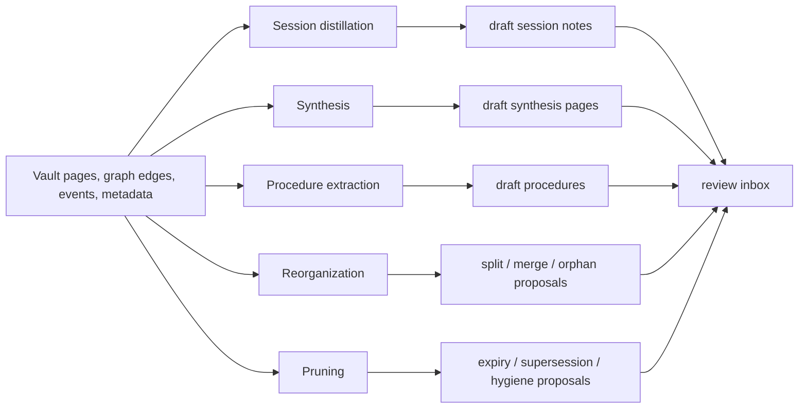

The AFM loop exists because memory quality is not only about storing more. It
is about compression, structure, contradiction handling, lifecycle, and
discoverability. A local model can help produce candidate organization, while
the review gate keeps it from becoming automatic authority.

## Data Flow: From Work To Future Recall

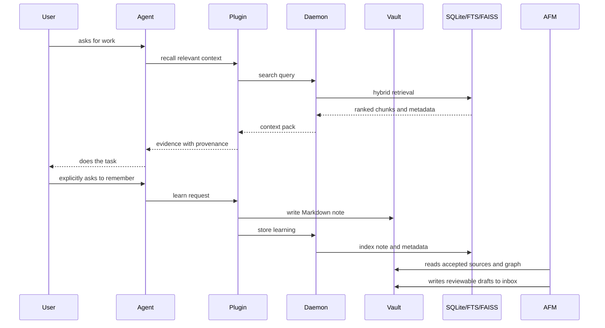

This flow is intentionally asymmetric:

- Recall is easy and frequent.
- Durable learning is explicit.
- AFM organization is draft-first.
- The vault remains visible.
- The database and vector index serve the vault; they do not replace it.

## What Counts As Truth

Sovereign Memory has several kinds of truth, and they should not be confused.

| Surface | Role |
| --- | --- |
| Live files and running apps | Operational truth for current work. |
| SQLite | Runtime memory truth: indexed documents, chunks, learnings, metadata, events. |
| Vault wiki | Reviewable durable knowledge surface. |
| Raw vault files | Evidence and historical source material. |
| Recall result | Ranked evidence, not instruction. |
| AFM draft | Proposed organization, not accepted memory. |
| Audit log | Transparency trail of what memory operations happened. |

This distinction keeps the system grounded. If recall says one thing and the
live repository says another, the live repository wins for current state. If an
AFM draft says something useful, it still needs review before becoming accepted
wiki knowledge.

## The Design In One Sentence

Sovereign Memory is a local, inspectable LLM wiki with a shared recall daemon:
Layer 1 gives an agent stable orientation, Layer 2 retrieves task-specific
knowledge, the vault keeps memory visible, chunking keeps recall precise, and
AFM backend agents help organize drafts without silently becoming authority.

